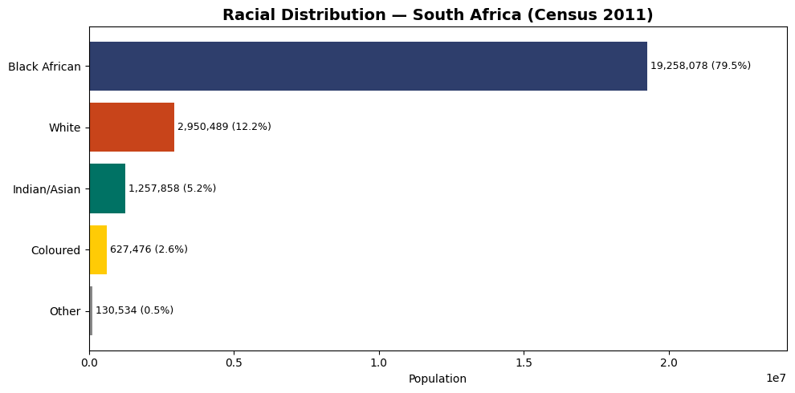
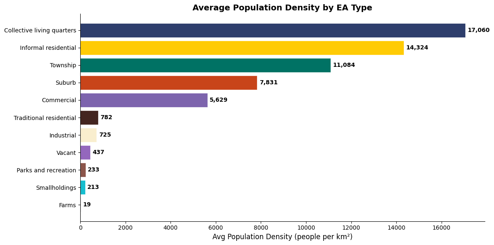
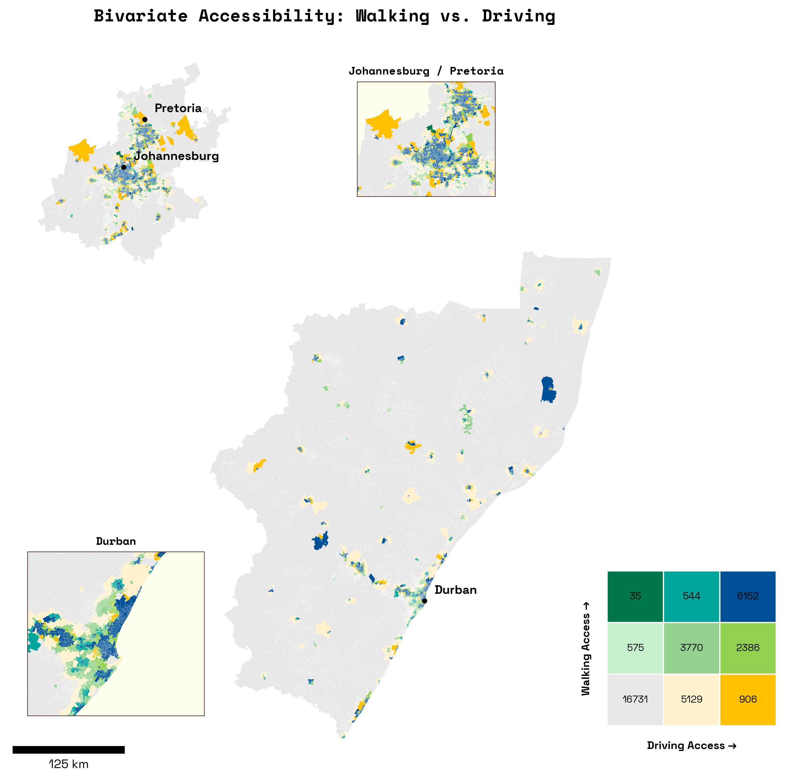
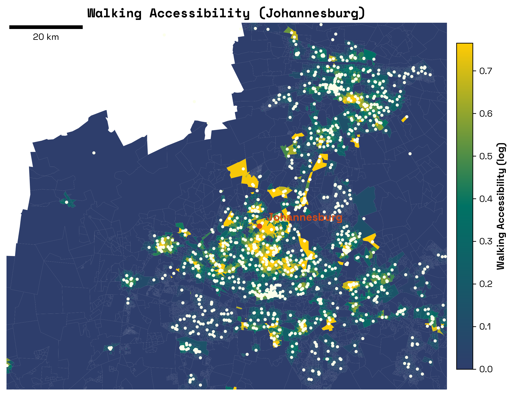
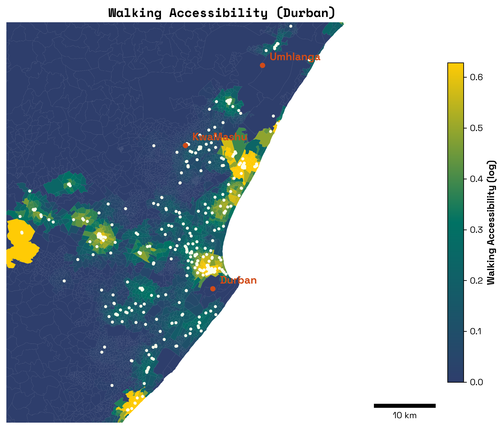
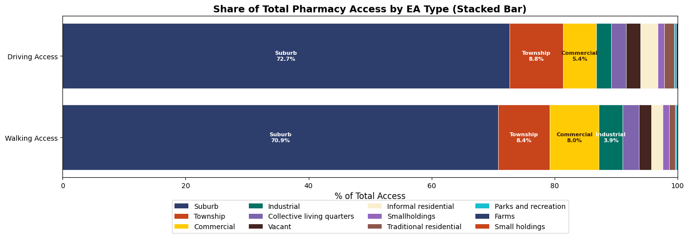
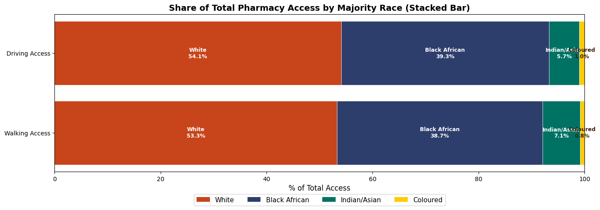

# Understanding the Geography of Healthcare Access in South Africa

## Evaluating Pharmacy Access in Gauteng and KwaZulu-Natal Under the National Health Insurance Act

**MUSA Smart Cities Practicum \| Spring 2026**

**Team:** Tess Anh Thu Vu, Joey Cahill, Jillian Kalman, Alex Stauffer

**Instructors:** Michael Fichman & Matthew Harris

**Client:** Distributed AI Research Institute (DAIR)\
Raesetje Sefala (Researcher) \| Nyalleng Moorosi (Research Fellow)

------------------------------------------------------------------------

## Background

### The National Health Insurance Act and Healthcare Access

The catalyst of this project starts with a new healthcare policy passed
by the South African parliament that intends to expand public healthcare
services, fixing what is currently an imbalanced system. Right now,
public and private medicine funding is split 50/50 by the government.
However, the public health system serves over 80% of the population,
whereas private pharmacies serve about 20% \[CITE\]. The inefficiency of
this system on the supply and demand of medicines has led to a number of
social repercussions like lower than average vaccination rates and
higher than average rates of communicable diseases \[CITE\]. This new
bill seeks to bridge the gap between private and public disparities by
making public health insurance acceptable in private pharmacies where
supply is at a surplus.

The National Health Insurance (NHI) Act of 2024 represents a landmark
transformation in South African healthcare policy, establishing a public
fund to subsidize the provision of care and medicines across the nation.
This legislation aims to address the profound inequalities in healthcare
access that persist nearly three decades after the end of apartheid,
creating a universal healthcare system that theoretically enables all
South Africans to receive quality healthcare services regardless of
their socioeconomic status (need citation).

The passage of the NHI Act has prompted critical questions about
implementation readiness, particularly regarding the spatial
distribution of pharmaceutical services. While the NHI creates funding
mechanisms for healthcare provision, its success depends fundamentally
on whether populations can physically access healthcare infrastructure,
including pharmacies where they can obtain prescribed medications. This
spatial dimension of healthcare access is not uniformly distributed
across South Africa and reflects historical patterns of development,
urbanization, and the enduring legacy of apartheid-era spatial planning.

### The Legacy of Apartheid Geography

The precursor of this pharmasocial imbalance is the persisent legacy of
Apartheid in South Africa that was officially stripped of use in the
1990s. During this relatively short period of time, political power was
consolidated to the white minority settlers who were motivated by racism
and hierarchy in how they ran the country. Native Black African
populations were stripped of voting rights, land ownership rights, and
the ability to hold office. While segregation is no longer written in
the South African constitution, the forced restructuring and separation
that Apartheid instilled has continued to influence infrastructural
development, the movement of people, and ideological beliefs to this
day. The activists and authors behind this new healthcare policy are
interested in expanding pharmaceutical access to the average South
African to improve both individual health outcomes and societal public
health outcomes.

With this, understanding healthcare access in contemporary South Africa
requires grappling with the historical geography of apartheid.
Crucially, the Group Areas Act of 1950 and subsequent legislation
systematically segregated residential areas by race, concentrating Black
African and Coloured populations in townships and homelands while
reserving well-serviced urban areas for white residents. As an intended
consequence, this spatial engineering created patterns of uneven
development that persist today as former township areas often lack the
commercial infrastructure, including pharmacies, that developed in
historically white areas (need citation).

The spatial mismatch between where people live and where services are
located represents a fundamental challenge for NHI's smooth
implementation. Populations in former township areas and informal
settlements may need to travel considerable distances to access pharmacy
services that creates barriers which are particularly acute for the
elderly, disabled, and those without private transportation. The
informal economy possesses a substantial portion of South Africa's
workforce, further compounds and complicates access patterns, as workers
may have limited time flexibility for healthcare visits (need citation).

### Research Motivation and Client Context

The Distributed AI Research Institute's (DAIR's) interest stems from
their broader research agenda examining how data-driven technologies can
be deployed to understand and address social inequalities rooted in
social ethics. The organization has previously conducted influential
research on spatial apartheid, developing datasets and analytical
frameworks for studying the persistent spatial inequalities in South
African settlements (Sefala et al., 2021).

This project builds on DAIR's established expertise while extending
their analytical framework to healthcare infrastructure. By creating a
well-documented, replicable methodology for two pilot provinces, the
research provides a foundation that DAIR, should they desire, could
expand and generalize to evaluate pharmacy access across all nine South
African provinces.

### Research Questions

The historical significance of South African society is what will be
used to inform the analysis and the features chosen for the final
product. The problem in its purest form is an inequitable access to
essential medicines asserted by unorthodox geospatial design and
privatized healthcare. This project measures and quanitfies
accessibility to pharmacies to answer the questions:

1.  What is the spatial distribution of pharmacies in Gauteng and
    KwaZulu-Natal?
2.  What populations have adequate access to pharmacy services, and what
    populations face access barriers?
3.  To what extent do patterns of pharmacy access correlate with
    historical geographies of apartheid?

The following report will detail how access to pharmacies are defined,
the methodology behind the metrics, the instruments used to deploy the
application, and the data that was collected to illustrate the findings.

------------------------------------------------------------------------

## Study Area

[](notebooks/images/locator_map.png)


### Gauteng Province

Gauteng, South Africa's smallest province by area but most populous
contains approximately 16 million residents representing roughly 26% of
the national population. The province encompasses the cities of
Johannesburg, Pretoria (Tshwane), and the East Rand (Ekurhuleni), which
forms the economic beating heart of South Africa and the broader
Southern African region.

The province's spatial structure reflects its mining and industrial
heritage as Johannesburg developed around gold mining operations with
segregated residential areas creating the townships of Soweto,
Alexandra, and numerous smaller settlements. Pretoria, which was
established as an administrative center, displays similar patterns of
racial residential segregation. The East Rand industrial corridor
connects these major centers while incorporating additional township
complexes.

Gauteng's economic centrality creates complex healthcare access dynamics
because while the province has relatively high pharmacy density overall,
the distribution is uneven. Historically white suburbs contain
concentrations of commercial pharmacy services, while township areas and
informal settlements often have limited pharmacy presence, requiring
residents to travel to commercial centers for pharmaceutical services.

### KwaZulu-Natal Province

KwaZulu-Natal, located on South Africa's eastern coast has approximately
12 million residents, making it the second most populous province. In
juxtaposition to Gauteng, this province displays greater geographic
diversity, encompassing coastal urban areas around Durban (eThekwini),
extensive rural areas, and former homeland territories that were
designated as independent states during apartheid (need citation).

The city of Durban serves as the provincial economic center and contains
South Africa's largest port. However, unlike Gauteng's concentrated
urbanization, KwaZulu-Natal has substantial rural populations, including
communities in former KwaZulu homeland areas where they face healthcare
access challenges that are distinct from urban townships, including
greater distances to healthcare infrastructure and limited
transportation options.

The contrast between Gauteng and KwaZulu-Natal provides methodological
advantages for this research. By developing approaches that work across
both a highly urbanized province and one with significant rural
populations, the methodology of measuring access to both of them
demonstrates generalized applicability, coupled with human
decision-making, to the diverse geographic contexts present across South
Africa.

### Administrative Geography

South Africa's administrative hierarchy structures the geographic
analysis. The nine provinces divide into either metropolitan
municipalities (for major urban areas) or district municipalities (for
other areas). District municipalities further subdivide into local
municipalities. For census purposes these administrative units contain
wards that serve as the smallest geographic unit for which 2023 Census
data are available.

Wards are population-scaled units, meaning that rural wards cover much
larger geographic areas than urban wards while containing similar
population counts. This creates analytical challenges in that rural
wards may encompass multiple dispersed settlements with varying access
to pharmacy services, while urban wards represent more spatially
concentrated populations.

Below the ward level, Small Area Layers (SALs) provide finer geographic
resolution but are only available from the 2011 Census. SALs contain
approximately 500 households each, providing a scale more appropriate
and granular for local accessibility analysis but requiring
methodological approaches to estimate current populations from
decade-old data.

------------------------------------------------------------------------

## Literature Review

### Spatial Accessibility in Healthcare Research

Clinicials and researchers have been measuring healthcare access for decades. Typically, researchers find that rural, low-income areas are the most vulnerable to being under-served in access to healthcare. This is because remoteness is working against them. Most research indicates a 20-30 minute commute for healthcare is considered reasonable, which is hard to acheive in rural areas. In countries where the cost of healthcare is increasing, this gap of access continues to increase, and is exaserbated by spatial context (Murphy and Rodis 2025). Healthcare accessibility is oftem simplified to 'living near health services', but this is been proven over time to be insufficient, especially when using Euclidean distance. Variables like supply and infastructure are overlooked in this method (McClaren et al. 2014). Overtime, researchers have developed a method called Enhanced Two-Step Floating Catchment Area method. This is a gravity-based model that measures acces through time-traveled, supply capacity, and the role of demand. This will be explored in the methodology. Accessibility to pharmacies is crucial for public health: it promotes medication adhernece, increases health education/awareness, and normalizes vaccination and testing behaviors (L Berenbrok 2022). 


### South African Spatial Research Context

Apartheid is rightfully at the center of spatial research in South Africa and the motiviation behind this research. Although near 40 years in the past, inequalities still persist on many fronts (Lowal 2025). With the work of DAIR, they seek to understand how apartheid has evolved over time into the mainstream culture and society of South Africa today. Because of the manufactured nature of apartheid, South Africa requires different classifications than just urban/subruban/rural that are often found around the world in some iteration. These concepts are present in SA, but are broken down into a more fine-grained subdivision based on their historical context that is not found anywhere else. Neighborhood types such as townships and informal residential have been introduced to this research using thousands of high resolution satellite imagery and integrated into detailed datasets by DAIR. They also collected spatial data on economic class (wealthy/non-wealthy), land use (industrial/commercial/residential), and building density. DAIR plans to continue this research to understand the standard of living and demographic make-up of South Africa as time goes forward (R Sefala 2024). 

### Pharmacy Regulation and Trade in South Africa

Pharmacies are regulated by the South African Pharmacy Council (SAPC), constituted of a 25-member collective of pharmaceutical professionals. SAPC is an independent, self-funded, statutory body mandated in terms of the Pharmacy Act, 53 of 1974 to regulate the pharmacy profession in the country with powers to register pharmacy professionals and pharmacies, control of pharmaceutical education, and ensuring good pharmacy practice. They maintain multiple committiees and allow you to search pharmacies or pharmacists that are recognized and approved by their regulations, including histories of inspections (pharmcouncil.co.za). Due to the gaps in the regulated pharmaceutical market, an illicit drug trade has emerged. Those who cannot access or are denied access to regulated medicine turn to illegal vendors and street markets to access things like antibiotics, contraceptives, and pain relievers. The consequences of widespread unregulated medicine include increased drug abuse/misuse, increased risk of adverse advents, and decreased rates of dosage adherance (Mutandiro 2025). 

------------------------------------------------------------------------

## Methodology

### Data Sources and Collection Strategy

The project assembles pharmacy location data from multiple sources,
reflecting the fragmented nature of pharmacy information in South
Africa, and unfortunately, no unified national database of pharmacies
exists, requiring data integration across heterogenous sources.

#### Raw Data Inventory

**Geographic Boundary Data:**

| Dataset | Source | Date | Columns | Records |
|---------------|---------------|---------------|---------------|---------------|
| South Africa Wards | South African Census | 2023 | 12 | 4,468 |
| South Africa Small Area Layers (SAL) | South African Census | 2011 | 60 | 39,177 |

**Reference Lookup Tables:**

| Dataset | Description | Columns | Records |
|------------------|------------------|------------------|------------------|
| `CITY_PROVINCE_LOOKUP` | Mapping table linking cities/suburbs to provinces and municipality hierarchies for Gauteng and KwaZulu-Natal | 6 | 290 |

The `CITY_PROVINCE_LOOKUP` table was created to help with handling
province assignment for pharmacy records lacking explicit province
information, which contains mappings from city/suburb names to their
corresponding PROVINCE, `LOCAL_MUNICIPALITY`, `DISTRICT_MUNICIPALITY`,
`METROPOLITAN_MUNICIPALITY`, and `CITY` values. This lookup supports the
multi-stage address matching process described in the data processing
pipeline.

**Environmental and Raster Data:**

| Dataset | Source | Resolution/Format | Description |
|------------------|------------------|------------------|------------------|
| Google Open Buildings | Google Research | Vector polygons | Machine-learning-detected building footprints for built environment analysis |
| OSMnx Pedestrian Network | OpenStreetMap via OSMnx | Vector network (nodes/edges) | Walkable street network for pedestrian accessibility calculations |

-   Google Open Buildings data is filtered to the study area geographic
    boundaries for building density and coverage calculations.
-   The OSMnx pedestrian network is extracted from OpenStreetMap for
    both provinces, enabling network-based walking distance calculations
    to pharmacies as specified by the client.

**Private Health Insurance Provider Networks:**

Private health insurance providers publish lists of pharmacies in their
preferred provider networks. These lists, while not comprehensive of all
pharmacies, provide extensive coverage of commercially operating
pharmacies:

| Dataset | Source URL | Date | Records |
|------------------|------------------|------------------|------------------|
| GEMS Gauteng Pharmacies | <https://www.gems.gov.za/Healthcare-Providers/GEMS-Network-of-Healthcare-Providers/Primary-Network/Pharmacy> | February 2026 | 890 |
| GEMS KZN Pharmacies | <https://www.gems.gov.za/Healthcare-Providers/GEMS-Network-of-Healthcare-Providers/Primary-Network/Pharmacy> | February 2026 | 571 |
| Wooltru Gauteng Pharmacies | <https://www.wooltruhealthcarefund.co.za/static-assets/siteFiles/WHF_Pharmacy_Network_list_2024_GAU.pdf> | January 2024 | 734 |
| Wooltru KZN Pharmacies | <https://www.wooltruhealthcarefund.co.za/static-assets/siteFiles/WHF_Pharmacy_Network_list_2024_KZN.pdf> | January 2024 | 403 |
| Momentum Gauteng Pharmacies | <https://www.multiply.co.za/engaged/independent-pharmacies/> | Undated | 169 |
| Momentum KZN Pharmacies | <https://www.multiply.co.za/engaged/independent-pharmacies/> | Undated | 109 |
| Vitality Wellness Pharmacies (All Provinces) | <https://www.discoveryhealthmedicalscheme.co.za/wcm/discoverycoza/assets/vitality/wellness-network/pharmacy-list.pdf> | Undated | 3,077 |
| SAMWUMED Pharmacies (All Provinces) | <https://www.samwumed.org/our-networks/samwumed-pharmacy-list/> | Undated | 3,161 |

**Total Raw Private Pharmacy Records:** 9,114

**Government Hospital Data:**

| Dataset             | Source                       | Date    | Records |
|---------------------|------------------------------|---------|---------|
| Hospital Pharmacies | DAIR Institute (pre-cleaned) | \[TBD\] | 272     |

Public hospitals contain pharmacies that dispense medications to
patients, and location data from government sources confirmed by the
DAIR Institute provides coordinates for these public pharmacy access
points, though not detailed address information—private pharmacies, on
the other hand, lack coordinates, but have detailed address information.

**Data Extraction Methods:**

-   **PDF Conversion:** GEMS, Wooltru, and Vitality pharmacy lists were
    converted from PDF to tabular format using Adobe Acrobat text
    extraction.
-   **HTML Table Copy:** Momentum pharmacy data was copied directly from
    the provider website where it was already displayed in table format.
-   **CSV Download:** SAMWUMED provided direct CSV download
    functionality from their website.

#### Final Transformed Data

| Dataset | Description | Records |
|------------------------|------------------------|------------------------|
| `PHARMACIES_COMBINED` | Unified pharmacy database for Gauteng and KwaZulu-Natal after cleaning, standardization, and province filtering | 5,436 |

The reduction from 9,114 raw private pharmacy records plus 272 hospital
records (9,386 total) to 5,436 combined records reflects the removal of
pharmacies outside Gauteng and KwaZulu-Natal provinces, deduplication of
pharmacies appearing across multiple insurance networks, and removal of
records with insufficient address information for geocoding.

**Data Source Limitations:**

-   **Network Participation Bias:** Pharmacies must participate in at
    least one of the insurance networks to appear in the dataset,
    meaning independent pharmacies serving primarily uninsured or
    cash-paying populations may be systematically underrepresented.
-   **Temporal Inconsistency:** Source data spans from January 2024 to
    February 2026 with some sources undated, so pharmacies may have
    opened, closed, or relocated during this period, creating potential
    staleness.
-   **PDF Extraction Errors:** Text extraction from PDF documents using
    Adobe Acrobat and Snowflake AI tools may introduce errors or
    formatting artifacts that could affect geocoding accuracy for
    example.
-   **Missing Identifiers:** Momentum and Vitality sources lack
    `PRACTICE_NUM` identifiers, preventing deduplication for
    approximately 1,500 records.
-   **Hospital Data Gaps:** Hospital records contain coordinates but
    lack street addresses, limiting cross-validation capabilities and
    preventing address-based quality checks.

**Validation Sources:**

-   **SAPC Registration Database:** The South African Pharmacy Council
    provides a searchable database for verifying pharmacy registration
    status (<https://pharmcouncil.co.za/Pharmacies_Overview>)
-   **Google Places API:** Provides geocoding services and place
    verification for pharmacy locations

### Data Processing Pipeline

Data processing occurs within Snowflake, a cloud data platform that
serves as the central workspace for assembling, cleaning, and validating
pharmacy data. The pipeline follows a structured workflow documented in
SQL scripts.

#### Database Structure

The Snowflake database follows a three-schema architecture separating
raw ingestion, intermediate processing, and final production tables:

```         
MUSA_DAIR_DB
├── RAW (source data as ingested)
│   ├── PHARMACIES_GEMS_GAUTENG
│   ├── PHARMACIES_GEMS_KZN
│   ├── PHARMACIES_MOMENTUM_GAUTENG
│   ├── PHARMACIES_MOMENTUM_KZN
│   ├── PHARMACIES_WOOLTRU_GAUTENG
│   ├── PHARMACIES_WOOLTRU_KZN
│   ├── PHARMACIES_SAMWUMED
│   ├── PHARMACIES_VITALITY_WELLNESS
│   ├── PHARMACIES_HOSPITALS
│   ├── SAL_POLYGON_2011
│   └── WARDS_POLYGON_2023
│
├── INTERMEDIATE (cleaned and joined data)
│   ├── PHARMACIES_COMBINED
│   ├── CITY_PROVINCE_LOOKUP
│   └── WARD_JOINED_SAL (to be created)
│
└── MART (final production tables for Mapbox GL)
    └── [final cleaned datasets for web application]
```

**RAW Schema:** Contains source data in its original structure with
minimal transformation. Each pharmacy source maintains a separate table
preserving the original column schema. Geographic boundary files (SAL
polygons from 2011, Ward polygons from 2023) are stored here after
initial import.

**INTERMEDIATE Schema:** Contains cleaned, standardized, and joined
datasets used during analysis. The `PHARMACIES_COMBINED` table
consolidates all pharmacy sources with harmonized schema. Lookup tables
and spatial join outputs reside here:

-   `WARD_JOINED_SAL`: Areal-weighted intersection of 2023 Wards with
    2011 SALs, containing weighted population allocations

**MART Schema:** Contains final, analysis-ready tables for the Mapbox GL
web map application, so tables in this schema are formatted for
efficient tile generation and frontend querying.

#### Processing Stages

**Stage 1: Source Ingestion (`01_combine_pharmacies.sql`)**

Raw pharmacy data from each source is ingested into Snowflake and
combined into a unified table structure. Each source has distinct column
schemas that were harmonized:

-   GEMS data includes `PROVINCE`, `CITY`, `SUBURB`, `ADDRESS`,
    `PRACTICE_NAME`, `PRACTICE_NUM`, `PHONE`
-   Momentum data includes `PRACTICE_NAME`, `ADDRESS`, `STREET`, `AREA`,
    `POSTAL`, `PHONE`, `FAX` (no `PRACTICE_NUM`)
-   Wooltru data includes `PRACTICE_NUM`, `PRACTICE_NAME`, `ADDRESS`,
    `CITY`, `PHONE`
-   SAMWUMED data includes `PRACTICE_NUM`, `PRACTICE_NAME`, `PHONE`,
    `EMAIL`, `ADDRESS`, `SUBURB`, `CITY`
-   Vitality data includes `PROVINCE`, `PRACTICE_TYPE`, `PRACTICE_NAME`,
    `ADDRESS`, `SUBURB`, `CITY`, `PHONE` (no `PRACTICE_NUM`)

The combination script standardizes naming conventions (`INITCAP`
formatting), cleans phone numbers (removing non-numeric characters,
standardizing to 10-digit format), and concatenates address components
into complete geocodable addresses.

*Stage 1 Limitations:* Schema harmonization requires assumptions about
field equivalence (e.g. treating `AREA`, `SUBURB`, and `CITY` as
interchangeable geographic descriptors), address concatenation order
affects geocoding performance and quality may vary by source, `INITCAP`
formatting may incorrectly case acronyms or non-English names.

**Stage 2: Province Population and Filtering
(`03_fill_gaps_pharmacies.sql`)**

Many source records lack explicit province information, so the
`CITY_PROVINCE_LOOKUP` table (n = 290) containing known cities and
suburbs within Gauteng and KwaZulu-Natal allows province inference from
address components. The lookup table maps city/suburb names to their
corresponding province and municipality hierarchy (local, district, or
metropolitan municipality) where the script applies multiple matching
strategies:

1.  Direct match on `CITY` column
2.  Match on last comma-separated address segment
3.  Match on second-to-last address segment
4.  Contains match for city names within address strings

Records that cannot be matched to either Gauteng or KwaZulu-Natal are
removed from the analysis scope. Province lookup updates
(`02_province_lookup_update.sql`) address gaps identified during manual
review of dropped records, ensuring that missing suburbs are added
before final filtering.

*Stage 2 Limitations:* Province inference relies on the completeness of
the lookup table, so missing suburb names result in false negatives
(legitimate GP/KZN pharmacies incorrectly dropped). However, the script
provides an opportunity for manual human checks, confirmation, and
potential revision before dropping the observations from the table. The
contains-match fallback may produce false positives for short city names
appearing as substrings in unrelated addresses, and municipality
hierarchy assignment depends on lookup table accuracy, which may not
reflect recent boundary changes or naming conventions.

**Stage 3: Deduplication (`04_deduplicate_pharmacies.sql`)**

The same pharmacy may appear across multiple insurance provider networks
with slightly varying information, so conservative deduplication uses
`PRACTICE_NUM` as the authoritative identifier where available,
aggregating within sources while preserving the most complete address
information.

Records without `PRACTICE_NUM` (notably Momentum and Vitality sources)
cannot be deduplicated using identifier-based methods and are retained
for post-geocoding spatial deduplication based on coordinate proximity
and fuzzy matching.

*Stage 3 Limitations:* Identifier-based deduplication assumes
`PRACTICE_NUM` uniquely identifies a physical location within their
respective pharmaceutical company, not across. However, a single
`PRACTICE_NUM` may be associated with multiple branch locations, or
different `PRACTICE_NUMs` may represent the same pharmacy under
different registrations. Records lacking `PRACTICE_NUM` (\~1,500) remain
as potential duplicates until spatial deduplication, which inflates
counts prior to final datasets. In addition, the longest address filter
for selecting the record assumes address length correlates with
geocoding quality.

**Stage 4: Hospital Integration (`05_add_hospitals.sql`)**

Public hospital records from government sources are appended to the
pharmacy database. Hospital records include geographic coordinates but
lack detailed address information, with `PRACTICE_TYPE` designated as
"Hospital" and `FUNDING` as "Public" to distinguish from private
pharmacies.

*Stage 4 Limitations:* Hospital coordinates may represent facility
points within the campus and not pharmacy-specific locations within
hospital campuses, it is also possible that not all hospitals contain
pharmacies and some may only have dispensaries with limited hours or
medication availability, and the dataset also may not capture
clinic-based pharmacies or community health centers that provide
pharmaceutical services.

### Population Data and Downscaling: Step-Down Methodology and Daysymetric Mapping 

This approach estimates small-area population counts for 2023 (SAL-level) using a combination of  
2011 SAL population data, 2023 ward-level projections, and spatial weighting.  
Using the Step Down Projection Method: It leverages population growth patterns and land weights to distribute ward-level counts to finer spatial units.

#### Data Preparation

2011 SAL census shapefile (ea_sal_kzn_gp.shp)  
Already filtered to just Gauteng and KZN


2023 Ward shapefile and population (SA_Wards2020.dbf and census_ward_2023_with_pop.csv)  
These were joined on 'WardId'
| Column     | Type           |   Count |   Unique |
|:-----------|:---------------|--------:|---------:|
| Province   | object         |    1430 |        2 |
| Municipali | object         |    1430 |       53 |
| CAT_B      | object         |    1430 |       53 |
| WardNo     | int64          |    1430 |      135 |
| District   | object         |    1430 |       16 |
| DistrictCo | object         |    1430 |       16 |
| Date       | datetime64[ms] |    1430 |        2 |
| WardID     | object         |    1430 |     1430 |
| WardLabel  | object         |    1430 |     1430 |
| geometry   | geometry       |    1430 |     1430 |
| Total      | object         |    1430 |     1430 |

#### Spatial Joining and Tabulation
Using ArcGis:  
Tabulate Intersection-->
Input Zone: 2011 SAL geometries 

Input Class: 2023 Ward Geometries

This table identifies the ward(s) that each SAL encompasses, the percentage of the area of the ward that the SAL takes up, and the area (m sq.).  
| EA_CODE        |  WardID        |AREA           | Percentage|     
|----------------|----------------|----------------|----------|
| 50310001      | 52103001         | 6967088.20     | 99.99|
| 50310001      |52106004          | 28.807487153359173  |0.0004|
| 50310001      | 52106014          | 43.38680092706605  |0.0003|


This is joined back to the SAL layer by EA_CODE --> Summarize Table --> AREA==Maximum

| EA_CODE        |  WardID        |AREA           | Province | district|  
|----------------|----------------|----------------|------------|---------------|
| 50310001      | 52103001         | 6967088     |    province| district|
| 58110038      |52606020          | 48373210  | province|    district|
| 76410132      | 74805033          | 15722398      | province| district|
| 53810017    |      52606020|     5720   |province |     district    | 


Limitations: SALs where the ward share is evenly split between one or more wards lose some spatial meaning when it gets paired with the highest share ward since it does not reflect where people actually livin inside the SAL/ward. This limitation is prerequisite to the building footprint analysis later in the report.    

#### Density Calculations for weighting

As indicated by DAIR, South Africa census has a history up undercounting populations.  
There were 2,084 SALs with a null population, so to avoid perpetuating further underestimation, housing counts ('houses2011') were used as a population proxy, which is then multiplied by three (average house size per SA census website). If the SAL had null/0 population and a house count of 0, their final population remained at 0.  

<p align="center">Density=  2011 population count/ SAL area (km sq.)</p>

#### Areal-Weighted Dasymetric Mapping 
We estimate ward-level 2011 counts by grouping at ward-level and summing SAL population counts. This is used to calculate the share of population the SAL contains within the ward 'share2011'. 

<p align="center">share2011=  SAL 2011 Population / Ward 2011 Total</p> 
 

Dasymetric mapping weights were implemented to produce SAL unit estimations for 2023: 
<p align="center"> Dasym weight= share2011 * density_log </p> 

   
The log of density was used to calculate the weight for several reasons. The spatial data was extremely skewed, with some SALs being the size of one apartment building and some being entire farming communities. The log was used to capture *relative* density to avoid extreme over estimation. This choice is justified below.    
Before calculating the final estimate with the weight, it is grouped by ward then normalized by the sum of SAL weights. This is to capture SAL population *relative* to its own Ward (our coarsest unit for which we have real counts). It avoids unrealistic overestimating in urban pockets and undue undercounting in rural areas.    

Finally, 2023 Ward population counts were used with the dasymetric weights to estimate 2023 SAL level population projections 
<p align="center"> SAL 2023 estimate= daysm weight * Ward 2023 population </p>  


| Variable        | Value        |
|-----------------|-------------|
| WardID          | 59500022    |
| EA_CODE         | 59913668    |
| sal2011_pop     | 1306.0      |
| PR_NAME           | KwaZulu-Natal |
| ward2011_sum    | 32132.0     |
| ward2023_pop    | 21793.913535|
| sal2023_est     | 1225.25738  |
| EA_GTYPE        | Urban       |
| EA_TYPE         | Township    |
| econ_status     | Non_Wealthy |
| houses2011      | 10.0        |
| area_km2        | 0.001971    |
| sal_dense       | 662594.713465|
| log_density     | 13.40392    |
| share2011       | 0.040645    |
| dasym_weight    | 0.05622     |
| growth_rate     | -0.005304   |    

This SAL is a pocket of land roughly the size of one small to mid-size apartment building with 1306 people, giving it a density of 662,594 people/ kmsq.: Impossibly dense, yet here it is in black and white. If we used the absolute density in the dasymetric calculation, the 2023 estimate would be ~26,000 for one apartment building. But when using the log density, the estimate sits at a modest 1,225: reflecting realistic counts and the ward level decline in growth, as well.       

#### Estimation Justification and Reinforcement

If the 2023 SAL estimates were properly dissolved into SAL zones, the difference between the 2023 Census ward counts and our SAL estimates should be extremely minimal; as demonstrated below. Our output for this equation is 0. 
<p align="center"> 2023 Ward Population Sum- 2023 SAL Estimate Sum </p>  

Building data is used to further justify that our estimates accurately place population and measure true density.
[text]


### Geocoding and Coordinate Assignment \[JOEY\]

Address strings require geocoding to assign geographic coordinates. The
project uses a dual-geocoding strategy for cost-efficiency:

-   **Google Places API:** *\[To be filled\]*
-   **\[Secondary Option\]:** *\[To be filled\]*

Geocoding workflow:

1.  Prepare address strings with standardized formatting
2.  First-pass geocoding using \[secondary option\] for all records
3.  Identify failed or low-confidence matches
4.  Submit failed records to Google Places in controlled batches
    (approximately 10-20 records per test)
5.  Review geocoding confidence scores and match types from both sources
6.  Manual review for persistent low-confidence matches

Records that fail geocoding from both sources or receive low-confidence
scores require manual review and potential address correction before
re-geocoding.

**Geocoding Limitations:**

-   **\[Secondary Option\] Coverage:** \[Secondary Option\] data quality
    varies by area, so informal settlements, newly developed areas, and
    rural regions may have incomplete or inaccurate address data,
    resulting in higher failure rates.
-   **Address Format Sensitivity:** South African addresses follow
    varied conventions (street numbers before/after names, informal
    locality descriptions, postal codes as location identifiers) and
    geocoders trained on international formats may misinterpret these
    patterns.
-   **Coordinate Precision:** Geocoding typically returns building or
    street-level coordinates, so for pharmacies in shopping centers or
    medical complexes, returned coordinates may be tens of meters from
    actual pharmacy entrances.
-   **API Budget Constraints:** The \$200 Google API budget limits the
    number of fallback geocoding requests, potentially leaving some
    failed matches unresolved or forcing acceptance of lower-confidence
    matches.
-   **Temporal Lag:** \[Secondary Option\] and Google databases may not
    reflect recent address changes, new developments, or demolished
    buildings, creating phantom locations or missing new pharmacies.

### Spatial Accessibility Calculation

Access metrics quantify the relationship between pharmacy locations and
population distribution and the project implements multiple
accessibility measures to allow for methodological comparison.

**Straight-Line Distance:** The simplest approach calculates
straight-line (Euclidean) distance from population centroids to the
nearest pharmacy, providing a baseline measure, but may poorly represent
actual travel distances, particularly in areas with transportation
barriers.

**Network Distance (Driving):** Network distance analysis calculates
travel distance along the road network, which better represents actual
travel requirements, but assumes private vehicle access that may not be
available to all populations. Driving network data can be extracted via
OSMnx using the "drive" network type.

**Network Distance (Walking):** Walking network distance provides
accessibility measures relevant for populations without vehicle access,
and this form of accessibility is particularly relevant for
understanding access barriers for lower-income populations. The OSMnx
"pedestrian" network type provides calculation of actual walking routes
from population centroids to pharmacy locations, accounting for the
street network topology rather than assuming straight-line travel.

**Catchment Area Methods:** Two-step floating catchment area methods
calculate accessibility as population-to-pharmacy ratios within defined
catchment thresholds, providing a supply-demand perspective rather than
purely distance-based measures.

**Accessibility Calculation Limitations:**

-   **Straight-Line Distance:** Assumes unobstructed travel in all
    directions, fails to account for barriers such as highways, rivers,
    railway lines, or fenced properties that may substantially increase
    actual travel distance. Also, urban areas with irregular street
    grids may have network distances that are much larger than
    straight-line distances.
-   **Network Distance (General):** Network quality depends on
    OpenStreetMap completeness, and informal roads, footpaths, and
    shortcuts common in township areas may be unmapped, overestimating
    travel distances for local residents.
-   **Driving Distance:** Assumes vehicle availability and ignores
    traffic congestion, parking availability, and fuel costs that affect
    real-world driving accessibility, and also fails to account for
    public transit options (minibus taxis) that may provide alternative
    access patterns.
-   **Walking Distance:** Standard walking speed assumptions (5 km/h)
    may not hold for elderly, disabled, or mobility-impaired
    populations, and also does not account for safety concerns, terrain
    difficulty, or weather conditions that may discourage walking in
    certain areas.
-   **Catchment Area Methods:** Threshold selection (e.g. 1km, 2km
    catchments) is inherently arbitrary, so different thresholds produce
    different accessibility patterns, meaning that a binary
    in/out-of-catchment assignment ignores that a pharmacy 1.01km away
    provides nearly equivalent access to one 0.99km away.
-   **Population Centroid Assumption:** All methods calculate distance
    from areal unit centroids, assuming populations are concentrated at
    geometric centers, so for irregularly shaped wards or SALs,
    substantial portions of the population may be far from the centroid,
    experiencing different accessibility than the centroid-based measure
    suggests.

### Environmental Context Variables

To contextualize pharmacy accessibility within broader environmental and
built environment characteristics, the project incorporates datasets
measuring greenness and urban development intensity.

**Greenness from DAIR:**

*\[To be filled\]*

**Built Environment from Google Open Buildings:**

Building footprint density and coverage are derived from Google's Open
Buildings dataset, which provides machine-learning-detected building
polygons across Africa derived from high-resolution satellite imagery.
This dataset offers more accurate built environment characterization
than spectral indices (e.g. NDBI), particularly in heterogeneous urban
environments common in South African cities.

Building metrics calculated per ward/SAL include:

-   Building count

-   Total building footprint area

-   Building density (buildings per hectare)

-   Percent land area covered by buildings

These environmental variables enable analysis of relationships between
pharmacy accessibility, vegetation coverage, and urban development
intensity, with potential connections to historical apartheid geography
where township areas may display distinct environmental signatures.

**Environmental Variable Limitations:**

-   **Greenery Seasonality:** *\[To be filled\]*
-   **Building Detection Accuracy:** Google Open Buildings detection
    performance varies by structure type, so informal housing, buildings
    with unusual roofing materials, and structures under tree canopy may
    be underdetected. As a result, detection confidence scores should
    inform uncertainty quantification.
-   **Building Dataset Currency:** The Open Buildings dataset represents
    a snapshot at time of imagery acquisition, so rapid development or
    demolition since acquisition creates a temporal mismatch with
    current conditions.
-   **Zonal Statistics Aggregation:** Summarizing raster values to
    ward/SAL boundaries obscures within-unit variation, meaning large
    wards with heterogeneous land cover will show averaged values that
    may not represent any actual location within the ward.

### Validation and Quality Assurance

Data quality assurance proceeds throughout the pipeline:

**Registration Validation:** *\[To be filled\]*

**Spatial Validation:** Geocoded coordinates are verified against
expected province boundaries where pharmacies geocoding outside Gauteng
or KwaZulu-Natal boundaries require manual review.

**Duplicate Detection:** Post-geocoding spatial analysis identifies
potential duplicates based on coordinate proximity (within 50-100
meters) combined with name similarity, addressing records that lack
`PRACTICE_NUM` for identifier-based deduplication.

**Outlier Review:** Accessibility metrics are examined for outliers that
may indicate data errors, like pharmacies in incorrect locations, or
genuine access deserts requiring policy attention.

**Validation Limitations:**

-   **SAPC Database Access:** The SAPC registration database requires
    manual searches, so bulk automated validation is not supported,
    limiting the number of records that can be verified and creating
    potential for human error in lookup processes.
-   **Registration Currency:** SAPC registration status reflects the
    time of query and pharmacies may have been registered when data was
    collected but subsequently deregistered, or vice versa.
-   **Spatial Proximity Thresholds:** The 50-100 meter threshold for
    duplicate detection is heuristic, so pharmacies in the same shopping
    center may legitimately be within this range, while geocoding errors
    may place duplicates further apart.
-   **Name Similarity Matching:** Fuzzy name matching for duplicate
    detection may produce false positives (different pharmacies with
    similar names) or false negatives (same pharmacy with variant name
    spellings across sources).
-   **Outlier Interpretation:** Extreme accessibility values may reflect
    genuine conditions (true access deserts or highly accessible areas)
    or data errors, and distinguishing these conditions require
    contextual investigation that may not be feasible at scale.

### Summary of Methodological Limitations

The methodology employed in this project involves multiple stages, each
introducing potential sources of error that may propagate through the
analysis pipeline. Key limitations are summarized below:

| Stage | Primary Limitation | Mitigation Strategy |
|----|----|----|
| Data Collection | Network participation bias, missing independent pharmacies | Cross-validation with Google Places API |
| PDF Extraction | OCR errors in addresses | Manual review of geocoding failures, iterative address cleaning |
| Province Inference | Lookup table incompleteness | Iterative refinement based on dropped record review |
| Deduplication | Missing `PRACTICE_NUM` for \~1,500 records | Post-geocoding spatial deduplication, conservative retention |
| Geocoding | Variable coverage, address format inconsistency | Dual-source geocoding, confidence score filtering |
| Areal Weighting | Homogeneous distribution assumption | Sensitivity analysis, comparison with WorldPop estimates |
| Step-Down Model | 11-year temporal gap, stationarity assumption | Multi-method comparison, flagging high-divergence areas |
| Accessibility Calculation | Centroid assumption, threshold arbitrariness | Multiple metric calculation, distance decay functions |
| Environmental Variables | Temporal mismatch, detection accuracy | Confidence filtering, seasonal composite imagery |

Users of this analysis should interpret results as indicative rather
than definitive, particularly in areas where multiple limitations may
compound. In this regard, policy decisions should be informed by but not
solely determined by these accessibility measures, with ground-truthing
recommended for priority intervention areas.

------------------------------------------------------------------------

## Exploratory Data Analysis \[TESS\]

### Pharmacy Distribution

*\[Section to be populated with analysis results including:\]*

-   *Total pharmacy counts by province and type (private/hospital)*
-   *Pharmacy density maps and kernel density estimation*
-   *Spatial clustering analysis (Moran's I, LISA clusters)*
-   *Distribution by insurance network source*
-   *`PRACTICE_NUM` completeness rates by source*
-   *Geocoding success rates and confidence distributions*

### Population Characteristics 

Age Group  | Population |   
0-4        | ██████████████████████████████████████████████████ 2,514,339    
5-9        | ████████████████████████████████████████▊          2,046,989    
10-14      | ██████████████████████████████████████▋            1,944,691    
15-19      | ██████████████████████████████████████████▉        2,155,410   
20-24      | ████████████████████████████████████████████████████▋ 2,641,740     
25-29      | █████████████████████████████████████████████████████ 2,652,951  ← peak    
30-34      | ██████████████████████████████████████████▏        2,115,559    
35-39      | ███████████████████████████████████▏               1,760,023    
40-44      | ████████████████████████████▌                      1,433,317    
45-49      | ████████████████████████▋                          1,236,491    
50-54      | ████████████████████▌                              1,031,983      
55-59      | ████████████████▋                                    833,315    
60-64      | ████████████▋                                        637,211    
65-69      | ████████▏                                            412,338     
70-74      | ██████                                               306,850     
75-79      | ███▊                                                 191,130     
80-84      | ██▌                                                  127,118  
85+        | █▉                                                    95,222       


[](notebooks/images/archive/racechart.png)


#### Projection Summarization

|       |   sal2023_est |   sal2011_pop |   ward2023_pop |   ward2011_sum |   growth_rate |   dasym_weight |   share2011 |   log_density |   sal_dense |
|:------|--------------:|--------------:|---------------:|---------------:|--------------:|---------------:|------------:|--------------:|------------:|
| count |    38,380.000 |    38,380.000 |     38,380.000 |     38,380.000 |    37,110.000 |     38,380.000 |  38,380.000 |    38,380.000 |  38,380.000 |
| mean  |       717.127 |       643.432 |     27,492.240 |     25,269.922 |        -0.004 |          0.037 |       0.037 |         7.408 |   7,094.106 |
| std   |       513.686 |       354.558 |     19,153.563 |     13,621.711 |         0.044 |          0.037 |       0.035 |         2.485 |  12,762.574 |
| min   |         0.000 |         0.000 |      1,443.660 |      2,349.000 |        -0.378 |          0.000 |       0.000 |         0.000 |       0.000 |
| 25%   |       351.649 |       451.000 |     11,208.619 |     10,734.000 |        -0.023 |          0.015 |       0.015 |         6.306 |     547.079 |
| 50%   |       664.610 |       623.000 |     23,592.523 |     27,252.000 |         0.005 |          0.024 |       0.025 |         8.107 |   3,315.586 |
| 75%   |       992.974 |       809.000 |     37,830.579 |     35,500.000 |         0.023 |          0.048 |       0.050 |         9.141 |   9,331.015 |
| max   |    14,387.065 |    11,717.000 |    126,727.517 |     69,618.000 |         0.178 |          0.592 |       0.600 |        13.404 | 662,594.713 |

By Province
| PR_NAME       |   sal2011_total |      sal2023_total |       avg_growth_rate |    absolute_growth |   pct_growth |
|:--------------|----------------:|-------------------:|----------------------:|-------------------:|-------------:|
| Gauteng       |      13490065.0 | 15099422           | -0.004                | 1609357             |     0.119299 |
| KwaZulu-Natal |      11204840.0 | 12423906           | -0.004                | 1219066            |     0.108798 |


By Land Type
| EA_TYPE                    |   sal2011_total |   sal2023_total |   avg_growth_rate |   absolute_growth | pct_growth   |
|:---------------------------|----------------:|----------------:|------------------:|------------------:|:-------------|
| Collective living quarters |         341,825 |         286,717 |            -0.029 |           -55,108 | -16.12%      |
| Commercial                 |         354,128 |         251,390 |            -0.041 |          -102,738 | -29.01%      |
| Farms                      |         464,324 |         239,163 |            -0.075 |          -225,161 | -48.49%      |
| Formal residential         |       8,060,534 |       7,759,042 |            -0.014 |          -301,492 | -3.74%       |
| Industrial                 |         206,049 |         142,473 |            -0.057 |           -63,576 | -30.85%      |
| Informal residential       |       1,849,126 |       2,486,816 |             0.021 |           637,690 | 34.49%       |
| Parks and recreation       |          21,996 |          11,009 |            -0.117 |           -10,987 | -49.95%      |
| Small holdings             |         281,723 |         221,944 |            -0.033 |           -59,779 | -21.22%      |
| Township                   |       7,677,887 |       9,898,540 |             0.018 |         2,220,653 | 28.92%       |
| Traditional residential    |       5,162,867 |       5,965,887 |             0.007 |           803,020 | 15.55%       |
| Vacant                     |         274,446 |         260,348 |            -0.079 |           -14,098 | -5.14%       |

### Mapping the Estimates
#### 2023 Count Estimates (SAL)
[](notebooks/images/archive/pop2023estimate.png)
#### 2023 Density Estimates (SAL)
[](notebooks/images/archive//popdensity.png)

#### Zooming into Johannesburg
[](notebooks/images/archive/gauteng_joburg_sidebyside_rect.png)

[](notebooks/images/ea_density_barchart.png)


#### Growth Rate
[](notebooks/images/archive/growth_rate_map.png)

### Accessibility Patterns

The following visuals present the most pertinent accessibility patterns within Gauteng and Kwa-Zulu Natal as it relates to spatial context.      
This bivariate map shows the relationship between walking accessibility, driving accessibility, and spatial patterning.    
[](notebooks/images/2sfca/bivariate_walk_drive.png)  

Walking Score Distribution  
[](notebooks/images/2sfca/A_i_johannesburg.png)  
[](notebooks/images/2sfca/A_i_durban.png)  

The following maps present accessibility as it relates to proximity vs. choice. The K=1 map shows the areas with reasonable access to at least 1 nearby pharmacy. The k=3 map shows how many of these areas have reasonable access to at least 3 pharmacies, reflecting accessibility based on pharmacy abundance and freedom of choice.   
[](notebooks/images/sal_pharmacy_distance/heatmap_gauteng_all_methods_k1.png)  
[](notebooks/images/sal_pharmacy_distance/heatmap_gauteng_all_methods_k3.png)  

[](notebooks/images/sal_pharmacy_distance/heatmap_kwazulu_natal_all_methods_k1.png)  
[](notebooks/images/sal_pharmacy_distance/heatmap_kwazulu_natal_all_methods_k3.png)  


Access Score Distribution by Province and Method
| **Province**    | **Method** | **Avg Access Score** | **Max Score** | **Avg K1 (km)** | **Max K1 (km)** |
|-----------------|------------|----------------------|---------------|------------------|------------------|
| Gauteng         | Walk       | 0.1653               | 42.70         | 2.03             | 41.52           |
| Gauteng         | Drive      | 0.1909               | 8.33          | 2.02             | 38.11           |
| KwaZulu-Natal   | Walk       | 0.0849               | 17.96         | 15.94            | 49.99           |
| KwaZulu-Natal   | Drive      | 0.0698               | 3.76          | 15.82            | 49.99           |

This score distribution is telling us a few things about accessibility within these provinces. Drivers in Gauteng have the easiest time accessing a pharmacy, but in Kwa-Zulu Natal, pedestrians have better access.  This means that in Gauteng, if you can walk to a pharmacy, you can also likely drive there. But you cannot say the same thing for Kwa-Zulu Natal, at least not to the same extent as Gauteng. This suggests that KwaZulu Natal may not have as much reliable road infastructure, or areas within their suburbs have private neighborhoods with private road networks that are not captured by OSM. For both provinces, their maximum walk score are extreme outliers. This suggests that pedestrian access is hyper-concentrated and drops off very quickly as one travels away from that area. Additionally, we see that the average distance from the nearest pharmacy in KwaZulu Natal is ~16km. This is 6 kilometers farther than what is considered reasonable travel distance for healthcare services (10km), suggesting remoteness is limiting their access here. 

### Correlations with Apartheid Geography
These two charts demonstrate the imbalance of access between neighborhood types and primary race. The suburbs maintain over 70% of all share of access, yet they only have 30% of the total population living there (7-8 million). Townships sit at ~8% of total access share, yet they are home to the most amount of people and the densest (~10 million). Spatial positioning is extremely important to ones level of access to pharmacies in South Africa. 

[](notebooks/images/ea_barchart.png)  

Here, the imbalance diminishes slightly between racial majority. Still, areas that are primarily white have over half of all access share despite being only 10% of the population. This suggests that the closer you are to white people, spatially, the better your access is, regardless of your own racial identity. 
[](notebooks/images/race_barchart.png)


------------------------------------------------------------------------

## Datasheets for Datasets \[TESS\]

*\[To be filled\]*

------------------------------------------------------------------------

## User Interface and User Experience \[ALEX\]

### Design Philosophy

The web application serves a journalistic function, allowing
non-technical users to understand healthcare access patterns in the
study area. The interface design prioritizes:

-   **Accessibility:** Clear visual hierarchy, appropriate color
    contrast, intuitive navigation
-   **Storytelling:** Narrative context explaining the significance of
    patterns
-   **Exploration:** Interactive tools for user-directed geographic
    investigation
-   **Transparency:** Documentation of methodology and data sources

### Technology Stack

-   **Frontend:** JavaScript, HTML5, CSS3
-   **Mapping Library:** Mapbox GL JS for interactive map rendering
-   **Data Processing:** Python (backend data preparation)
-   **Data Warehouse:** Snowflake (source of truth for pharmacy and
    population data)
-   **Spatial Analysis:** ArcGIS Pro for advanced geoprocessing
-   **Network Analysis:** OSMnx for pedestrian/driving network
    extraction and accessibility calculations
-   **Geocoding:** \[Secondary Source\], Google Geocoder API

### Application Structure

**Landing/Story Section:**

Initial view provides narrative context about the NHI Act, healthcare
access challenges, and the significance of pharmacy distribution.
Scrollytelling or map dashboard format guides users through key findings
before releasing them to free exploration.

**Interactive Map:**

Central map component enables:

-   Pharmacy location visualization (private vs. hospital, color-coded)

-   Population density overlays (toggle between estimation methods)

-   Accessibility metric choropleth mapping

-   User location input for personalized accessibility assessment

-   Layer controls for customizing visible information

**Statistics Dashboard:**

Side panel displays aggregate statistics:

-   Total pharmacies in view

-   Population served within access thresholds

-   Demographic breakdowns of accessible/inaccessible populations

-   Comparison metrics across administrative units

**Methodology Documentation:**

Accessible documentation explaining:

-   Data sources and collection methods

-   Population estimation approaches

-   Accessibility metric calculations

-   Limitations and caveats

### Use Cases

**Use Case 1: General Public Information Seeking**

A South African citizen wants to understand whether their area has
adequate pharmacy access relative to other areas where they can select
their ward/municipality to see local accessibility metrics compared to
provincial averages.

**Use Case 2: Policy Analysis**

A government official or NGO analyst wants to identify priority areas
for pharmacy infrastructure investment where they can view maps of
accessibility gaps, filter by demographic characteristics, and export
summary statistics for reporting.

**Use Case 3: Research Reference**

An academic researcher wants to understand the methodology for potential
replication in other contexts where they can access detailed
documentation and download source code for adaptation.

------------------------------------------------------------------------

## Acknowledgements

This research was conducted as part of the MUSA Smart Cities Practicum
at the University of Pennsylvania's Weitzman School of Design.

**Academic Guidance:**

-   Michael Fichman (Instructor)

-   Matthew Harris (Instructor)

**Client Organization:**

-   Distributed AI Research Institute (DAIR)

-   Raesetje Sefala (Researcher)

-   Nyalleng Moorosi (Research Fellow)

**Institutional Support:**

-   University of Pennsylvania Urban Spatial Analytics Program

-   Snowflake (sponsored student accounts)

**Data Providers:**

-   Statistics South Africa (Census data)

-   Municipal Demarcation Board (ward boundaries)

-   GEMS, Momentum, Wooltru, SAMWUMED, Discovery Vitality (pharmacy
    network listings)

-   Google (Places API)

**Methodological Foundations:**

This work builds on the established research of the DAIR team on spatial
apartheid in South Africa, as well as the broader scholarly literature
on healthcare accessibility, spatial analysis, and environmental
justice.

------------------------------------------------------------------------

## Code Appendix

### SQL Scripts

The data processing pipeline is implemented in Snowflake SQL across five
primary scripts:

**01_combine_pharmacies.sql**

Creates the unified `PHARMACIES_COMBINED` table from eight source
tables. Key operations include:

-   Schema standardization across varied source formats

-   Address concatenation from component fields

-   Phone number cleaning (numeric only, 10-digit standardization)

-   Practice name normalization (`INITCAP` formatting)

-   Source tracking via `COMPANY` column

-   Conservative deduplication using `PRACTICE_NUM`

**02_province_lookup_update.sql**

Updates the `PROVINCE_LOOKUP` reference table with missing suburbs
identified during processing review. Ensures comprehensive coverage of
Gauteng and KwaZulu-Natal geographic names.

**03_fill_gaps_pharmacies.sql**

Populates missing `PROVINCE` values using multi-stage matching against
the lookup table:

-   Primary match on `CITY` column

-   Secondary match on address last segment

-   Tertiary match on address second-to-last segment

-   Fallback contains match for city names within addresses

-   Province standardization and non-GP/KZN record deletion

**04_deduplicate_pharmacies.sql**

Creates `PHARMACIES_DEDUPLICATED` with cross-source deduplication:

-   Records with `PRACTICE_NUM` grouped by identifier and province

-   Longest address retained for geocoding quality

-   Source networks aggregated to `COMPANIES` column

-   Records without `PRACTICE_NUM` preserved for spatial deduplication

**05_add_hospitals.sql**

Appends public hospital records from government sources:

-   Sequential `PHARMACY_ID` continuation

-   Province mapping from source `PR_NAME`

-   Municipality mapping for metro vs. district areas

-   `PRACTICE_TYPE` set to "Hospital", `FUNDING` set to "Public"

-   Coordinate creation from X/Y fields using `ST_MAKEPOINT()`

### Python Scripts \[JILL, JOEY, TESS\]

*\[To be filled\]*

*\[Additional geocoding, analysis, and visualization scripts to be
populated\]*

### JavaScript Application \[ALEX\]

*\[To be populated with web application code\]*

------------------------------------------------------------------------

## References

*\[More to be entered\]*
 Berenbrok L, Tang S, Gabriel N ... Access to community pharmacies: A nationwide
     geographic information systems cross-sectional analysis Journal of the
     American Pharmacists Association, 2022; 62, 1816-1822.e2 
Gebru, T., Morgenstern, J., Vecchione, B., Vaughan, J. W., Wallach, H.,
    Daumé III, H., & Crawford, K. (2021). Datasheets for datasets.
    *Communications of the ACM*, 64(12), 86-92.   
Lawal, Shola. "South Africa: 30 years after apartheid, what has changed?" Al
     Jazeera, Al Jazeera Media Network, Apr. 2025, www.aljazeera.com/news/
     2024/4/27/south-africa-30-years-after-apartheid-what-has-changed.
McLaren, Z.M., Ardington, C. & Leibbrandt, M. Distance decay and persistent
     health care disparities in South Africa. BMC Health Serv Res 14, 541
     (2014). https://doi.org/10.1186/s12913-014-0541-1  
Murphy, Michael, and Jennifer Rodis. "The growing crisis of pharmacy deserts."
     College of Pharmacy, Ohio State University, 28 Apr. 2025,
     pharmacy.osu.edu/news/growing-crisis-pharmacy-deserts.    
Mutandiro, Kimberly. "A thriving black market for medicines has emerged in
     Joburg." GroundUp, Mar. 2025, groundup.org.za/article/
     a-thriving-black-market-for-medicine-has-emerged-in-joburg/.
Sefala, R. (2024). *The Legacy of Spatial Apartheid Dataset* (Version
    V3) \[dataset\]. Harvard Dataverse. https://doi.org/10.7910/DVN/JRYYNM  

 

 

https://www.pharmcouncil.co.za/