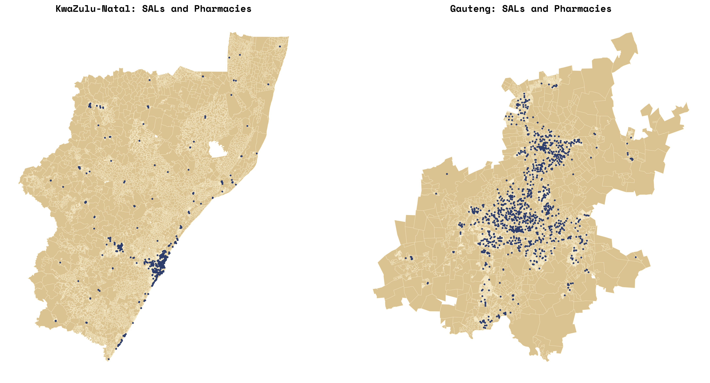

# Understanding the Geography of Healthcare Access in South Africa

## Evaluating Pharmacy Access in Gauteng and KwaZulu-Natal Under the National Health Insurance Act

**MUSA Smart Cities Practicum \| Spring 2026**

**Team:** Tess Anh Thu Vu, Joey Cahill, Jillian Kalman, Alex Stauffer

**Instructors:** Michael Fichman & Matthew Harris

**Client:** Distributed AI Research Institute (DAIR)\
Raesetje Sefala (Researcher) \| Nyalleng Moorosi (Research Fellow)

------------------------------------------------------------------------

## Background

### The National Health Insurance Act and Healthcare Access

The catalyst of this project starts with a new healthcare policy passed
by the South African parliament that intends to expand public healthcare
services, fixing what is currently an imbalanced system. Right now,
public and private medicine funding is split 50/50 by the government.
However, the public health system serves over 80% of the population,
whereas private pharmacies serve about 20% (Mkhize N.I., 2026). The inefficiency of
this system on the supply and demand of medicines has led to a number of
social repercussions like lower than average vaccination rates and
higher than average rates of communicable diseases (Aweeka 2025). This new
bill seeks to bridge the gap between private and public disparities by
making public health insurance acceptable in private pharmacies where
supply is at a surplus.

The National Health Insurance (NHI) Act of 2024 represents a landmark
transformation in South African healthcare policy, establishing a public
fund to subsidize the provision of care and medicines across the nation.
This legislation aims to address the profound inequalities in healthcare
access that persist nearly three decades after the end of apartheid,
creating a universal healthcare system that theoretically enables all
South Africans to receive quality healthcare services regardless of
their socioeconomic status (Ramaphosa 2024).

The passage of the NHI Act has prompted critical questions about
implementation readiness, particularly regarding the spatial
distribution of pharmaceutical services. While the NHI creates funding
mechanisms for healthcare provision, its success depends fundamentally
on whether populations can physically access healthcare infrastructure,
including pharmacies where they can obtain prescribed medications. This
spatial dimension of healthcare access is not uniformly distributed
across South Africa and reflects historical patterns of development,
urbanization, and the enduring legacy of apartheid-era spatial planning.

### The Legacy of Apartheid Geography

The precursor of this pharmasocial imbalance is the persisent legacy of
Apartheid in South Africa that was officially stripped of use in the
1990s. During this relatively short period of time, political power was
consolidated to the white minority settlers who were motivated by racism
and hierarchy in how they ran the country. Native Black African
populations were stripped of voting rights, land ownership rights, and
the ability to hold office. While segregation is no longer written in
the South African constitution, the forced restructuring and separation
that Apartheid instilled has continued to influence infrastructural
development, the movement of people, and ideological beliefs to this
day. The activists and authors behind this new healthcare policy are
interested in expanding pharmaceutical access to the average South
African to improve both individual health outcomes and societal public
health outcomes.

With this, understanding healthcare access in contemporary South Africa
requires grappling with the historical geography of apartheid.
Crucially, the Group Areas Act of 1950 and subsequent legislation
systematically segregated residential areas by race, concentrating Black
African and Coloured populations in townships and homelands while
reserving well-serviced urban areas for white residents. As an intended
consequence, this spatial engineering created patterns of uneven
development that persist today as former township areas often lack the
commercial infrastructure, including pharmacies, that developed in
historically white areas (need citation).

The spatial mismatch between where people live and where services are
located represents a fundamental challenge for NHI's smooth
implementation. Populations in former township areas and informal
settlements may need to travel considerable distances to access pharmacy
services that creates barriers which are particularly acute for the
elderly, disabled, and those without private transportation. The
informal economy possesses a substantial portion of South Africa's
workforce, further compounds and complicates access patterns, as workers
may have limited time flexibility for healthcare visits (need citation).

### Research Motivation and Client Context

The Distributed AI Research Institute's (DAIR's) interest stems from
their broader research agenda examining how data-driven technologies can
be deployed to understand and address social inequalities rooted in
social ethics. The organization has previously conducted influential
research on spatial apartheid, developing datasets and analytical
frameworks for studying the persistent spatial inequalities in South
African settlements (Sefala et al., 2021).

This project builds on DAIR's established expertise while extending
their analytical framework to healthcare infrastructure. By creating a
well-documented, replicable methodology for two pilot provinces, the
research provides a foundation that DAIR, should they desire, could
expand and generalize to evaluate pharmacy access across all nine South
African provinces.

### Research Questions

The historical significance of South African society is what will be
used to inform the analysis and the features chosen for the final
product. The problem in its purest form is an inequitable access to
essential medicines asserted by unorthodox geospatial design and
privatized healthcare. This project measures and quanitfies
accessibility to pharmacies to answer the questions:

1.  What is the spatial distribution of pharmacies in Gauteng and
    KwaZulu-Natal?
2.  What populations have adequate access to pharmacy services, and what
    populations face access barriers?
3.  To what extent do patterns of pharmacy access correlate with
    historical geographies of apartheid?

The following report will detail how access to pharmacies are defined,
the methodology behind the metrics, the instruments used to deploy the
application, and the data that was collected to illustrate the findings.

------------------------------------------------------------------------

## Study Area

[](notebooks/images/locator_map.png)


### Gauteng Province

Gauteng, South Africa's smallest province by area but most populous
contains approximately 16 million residents representing roughly 26% of
the national population. The province encompasses the cities of
Johannesburg, Pretoria (Tshwane), and the East Rand (Ekurhuleni), which
forms the economic beating heart of South Africa and the broader
Southern African region.

The province's spatial structure reflects its mining and industrial
heritage as Johannesburg developed around gold mining operations with
segregated residential areas creating the townships of Soweto,
Alexandra, and numerous smaller settlements. Pretoria, which was
established as an administrative center, displays similar patterns of
racial residential segregation. The East Rand industrial corridor
connects these major centers while incorporating additional township
complexes.

Gauteng's economic centrality creates complex healthcare access dynamics
because while the province has relatively high pharmacy density overall,
the distribution is uneven. Historically white suburbs contain
concentrations of commercial pharmacy services, while township areas and
informal settlements often have limited pharmacy presence, requiring
residents to travel to commercial centers for pharmaceutical services.

### KwaZulu-Natal Province

KwaZulu-Natal, located on South Africa's eastern coast has approximately
12 million residents, making it the second most populous province. In
juxtaposition to Gauteng, this province displays greater geographic
diversity, encompassing coastal urban areas around Durban (eThekwini),
extensive rural areas, and former homeland territories that were
designated as independent states during apartheid (need citation).

The city of Durban serves as the provincial economic center and contains
South Africa's largest port. However, unlike Gauteng's concentrated
urbanization, KwaZulu-Natal has substantial rural populations, including
communities in former KwaZulu homeland areas where they face healthcare
access challenges that are distinct from urban townships, including
greater distances to healthcare infrastructure and limited
transportation options.

The contrast between Gauteng and KwaZulu-Natal provides methodological
advantages for this research. By developing approaches that work across
both a highly urbanized province and one with significant rural
populations, the methodology of measuring access to both of them
demonstrates generalized applicability, coupled with human
decision-making, to the diverse geographic contexts present across South
Africa.

### Administrative Geography

South Africa's administrative hierarchy structures the geographic
analysis. The nine provinces divide into either metropolitan
municipalities (for major urban areas) or district municipalities (for
other areas). District municipalities further subdivide into local
municipalities. For census purposes these administrative units contain
wards that serve as the smallest geographic unit for which 2023 Census
data are available.

Wards are population-scaled units, meaning that rural wards cover much
larger geographic areas than urban wards while containing similar
population counts. This creates analytical challenges in that rural
wards may encompass multiple dispersed settlements with varying access
to pharmacy services, while urban wards represent more spatially
concentrated populations.

Below the ward level, Small Area Layers (SALs) provide finer geographic
resolution but are only available from the 2011 Census. SALs contain
approximately 500 households each, providing a scale more appropriate
and granular for local accessibility analysis but requiring
methodological approaches to estimate current populations from
decade-old data.

------------------------------------------------------------------------

## Literature Review

### Spatial Accessibility in Healthcare Research

Clinicials and researchers have been measuring healthcare access for decades. Typically, researchers find that rural, low-income areas are the most vulnerable to being under-served in access to healthcare. This is because remoteness is working against them. Most research indicates a 20-30 minute commute for healthcare is considered reasonable, which is hard to acheive in rural areas. In countries where the cost of healthcare is increasing, this gap of access continues to increase, and is exaserbated by spatial context (Murphy and Rodis 2025). Healthcare accessibility is oftem simplified to 'living near health services', but this is been proven over time to be insufficient, especially when using Euclidean distance. Variables like supply and infastructure are overlooked in this method (McClaren et al. 2014). Overtime, researchers have developed a method called Enhanced Two-Step Floating Catchment Area method. This is a gravity-based model that measures acces through time-traveled, supply capacity, and the role of demand. This will be explored in the methodology. Accessibility to pharmacies is crucial for public health: it promotes medication adhernece, increases health education/awareness, and normalizes vaccination and testing behaviors (L Berenbrok 2022). 


### South African Spatial Research Context

Apartheid is rightfully at the center of spatial research in South Africa and the motiviation behind this research. Although near 40 years in the past, inequalities still persist on many fronts (Lowal 2025). With the work of DAIR, they seek to understand how apartheid has evolved over time into the mainstream culture and society of South Africa today. Because of the manufactured nature of apartheid, South Africa requires different classifications than just urban/subruban/rural that are often found around the world in some iteration. These concepts are present in SA, but are broken down into a more fine-grained subdivision based on their historical context that is not found anywhere else. Neighborhood types such as townships and informal residential have been introduced to this research using thousands of high resolution satellite imagery and integrated into detailed datasets by DAIR. They also collected spatial data on economic class (wealthy/non-wealthy), land use (industrial/commercial/residential), and building density. DAIR plans to continue this research to understand the standard of living and demographic make-up of South Africa as time goes forward (R Sefala 2024). 

### Pharmacy Regulation and Trade in South Africa

Pharmacies are regulated by the South African Pharmacy Council (SAPC), constituted of a 25-member collective of pharmaceutical professionals. SAPC is an independent, self-funded, statutory body mandated in terms of the Pharmacy Act, 53 of 1974 to regulate the pharmacy profession in the country with powers to register pharmacy professionals and pharmacies, control of pharmaceutical education, and ensuring good pharmacy practice. They maintain multiple committiees and allow you to search pharmacies or pharmacists that are recognized and approved by their regulations, including histories of inspections (pharmcouncil.co.za). Due to the gaps in the regulated pharmaceutical market, an illicit drug trade has emerged. Those who cannot access or are denied access to regulated medicine turn to illegal vendors and street markets to access things like antibiotics, contraceptives, and pain relievers. The consequences of widespread unregulated medicine include increased drug abuse/misuse, increased risk of adverse advents, and decreased rates of dosage adherance (Mutandiro 2025). 

------------------------------------------------------------------------

## Methodology

### Data Sources and Collection Strategy

The project assembles pharmacy location data from multiple sources,
reflecting the fragmented nature of pharmacy information in South
Africa, and unfortunately, no unified national database of pharmacies
exists, requiring data integration across heterogenous sources.

#### Raw Data Inventory

**Geographic Boundary Data:**

| Dataset | Source | Date | Columns | Records |
|---------------|---------------|---------------|---------------|---------------|
| South Africa Wards | South African Census | 2023 | 12 | 4,468 |
| South Africa Small Area Layers (SAL) | South African Census | 2011 | 60 | 39,177 |

**Reference Lookup Tables:**

| Dataset | Description | Columns | Records |
|------------------|------------------|------------------|------------------|
| `CITY_PROVINCE_LOOKUP` | Mapping table linking cities/suburbs to provinces and municipality hierarchies for Gauteng and KwaZulu-Natal | 6 | 290 |

The `CITY_PROVINCE_LOOKUP` table was created to help with handling
province assignment for pharmacy records lacking explicit province
information, which contains mappings from city/suburb names to their
corresponding PROVINCE, `LOCAL_MUNICIPALITY`, `DISTRICT_MUNICIPALITY`,
`METROPOLITAN_MUNICIPALITY`, and `CITY` values. This lookup supports the
multi-stage address matching process described in the data processing
pipeline.

**Network Data:**

| Dataset | Source | Resolution/Format | Description |
|------------------|------------------|------------------|------------------|
| OSMnx Pedestrian Network | OpenStreetMap via OSMnx | Vector network (nodes/edges) | Walkable street network for pedestrian accessibility calculations |
| OSMnx Drive Network | OpenStreetMap via OSMnx | Vector network (nodes/edges) | Road network for driving accessibility calculations |

-   The OSMnx pedestrian and drive networks are extracted from
    OpenStreetMap for both provinces, enabling network-based distance
    calculations to pharmacies as specified by the client.

**Private Health Insurance Provider Networks:**

Private health insurance providers publish lists of pharmacies in their
preferred provider networks. These lists, while not comprehensive of all
pharmacies, provide extensive coverage of commercially operating
pharmacies:

| Dataset | Source URL | Date | Records |
|------------------|------------------|------------------|------------------|
| GEMS Gauteng Pharmacies | <https://www.gems.gov.za/Healthcare-Providers/GEMS-Network-of-Healthcare-Providers/Primary-Network/Pharmacy> | February 2026 | 890 |
| GEMS KZN Pharmacies | <https://www.gems.gov.za/Healthcare-Providers/GEMS-Network-of-Healthcare-Providers/Primary-Network/Pharmacy> | February 2026 | 571 |
| Wooltru Gauteng Pharmacies | <https://www.wooltruhealthcarefund.co.za/static-assets/siteFiles/WHF_Pharmacy_Network_list_2024_GAU.pdf> | January 2024 | 734 |
| Wooltru KZN Pharmacies | <https://www.wooltruhealthcarefund.co.za/static-assets/siteFiles/WHF_Pharmacy_Network_list_2024_KZN.pdf> | January 2024 | 403 |
| Momentum Gauteng Pharmacies | <https://www.multiply.co.za/engaged/independent-pharmacies/> | Undated | 169 |
| Momentum KZN Pharmacies | <https://www.multiply.co.za/engaged/independent-pharmacies/> | Undated | 109 |
| Vitality Wellness Pharmacies (All Provinces) | <https://www.discoveryhealthmedicalscheme.co.za/wcm/discoverycoza/assets/vitality/wellness-network/pharmacy-list.pdf> | Undated | 3,077 |
| SAMWUMED Pharmacies (All Provinces) | <https://www.samwumed.org/our-networks/samwumed-pharmacy-list/> | Undated | 3,161 |

**Total Raw Private Pharmacy Records:** 9,114

**Government Hospital Data:**

| Dataset             | Source                       | Date    | Records |
|---------------------|------------------------------|---------|---------|
| Hospital Pharmacies | DAIR Institute (pre-cleaned) | \[TBD\] | 272     |

Public hospitals contain pharmacies that dispense medications to
patients, and location data from government sources confirmed by the
DAIR Institute provides coordinates for these public pharmacy access
points, though not detailed address information—private pharmacies, on
the other hand, lack coordinates, but have detailed address information.

**SAPC Registry (Scraped):**

| Dataset | Source | Date | Records |
|---|---|---|---|
| SAPC Active Pharmacies — Gauteng | South African Pharmacy Council Registry | February 2026 | 1,961  |
| SAPC Active Pharmacies — KwaZulu-Natal | South African Pharmacy Council Registry | February 2026 | 894  |


The South African Pharmacy Council maintains a registry of all registered
pharmacies at pharmcouncil.co.za. Unlike the insurance network lists, which only
include pharmacies participating in specific provider agreements, the SAPC
registry represents the full population of legally registered pharmacies.
Records were collected programmatically via a trie-based web scraper that
submitted search queries for every 3-character alphabetical prefix within each
province and fetched detail pages for Active pharmacies to retrieve full
address, owner, responsible pharmacist, licence number, and inspection history.
Inactive and Erased records are retained with table-level data only. The process
is documented in `01_sapc_scraper.ipynb`.

*SAPC Source Limitations:* The registry reflects registration status at the time
of query, so pharmacies registered when the insurance network data was collected
may have subsequently been deregistered, or vice versa. Detail pages are only
accessible within the same browser session that executed the search, meaning the
scraper must fetch detail pages immediately during the search loop rather than
in a separate pass. Pharmacies with Inactive or Erased status are retained in
the raw output with table-level data only and are excluded during the master
file build. Additionally, the registry search has a minimum of 3-character
prefix enforcement, meaning pharmacies with very short names may require
multiple prefix expansions to be captured.


**Data Extraction Methods:**

-   **PDF Conversion:** GEMS, Wooltru, and Vitality pharmacy lists were
    converted from PDF to tabular format using Adobe Acrobat text
    extraction.
-   **HTML Table Copy:** Momentum pharmacy data was copied directly from
    the provider website where it was already displayed in table format.
-   **CSV Download:** SAMWUMED provided direct CSV download
    functionality from their website.
-   **Web Scrape:** SAPC records were accessed via a python scraper which queried
    a search function hosted on their website.  

#### Final Transformed Data

| Dataset | Description | Records |
|------------------------|------------------------|------------------------|
| `PHARMACIES_COMBINED` | Unified pharmacy database for Gauteng and KwaZulu-Natal after cleaning, standardization, and province filtering | 5,436 |
| `geocoded_with_sapc.csv` | Full geocoded pharmacy list with SAPC regulatory fields appended where a confident fuzzy match was found | ~5,400 |
| `sapc_needs_geocoding.csv` | SAPC records with no confident match to the geocoded list, routed to a standalone geocoding pass | ~1,200 |
| `PHARMACIES_MASTER_FINAL.csv` | Authoritative master pharmacy file combining SAPC-registered and Places-only records after spatial validation, deduplication, and column consolidation. This is the input to all accessibility analysis. | 2,152 |

The reduction from 9,114 raw private pharmacy records plus 272 hospital
records (9,386 total) to 5,436 combined records reflects the removal of
pharmacies outside Gauteng and KwaZulu-Natal provinces, deduplication of
pharmacies appearing across multiple insurance networks, and removal of
records with insufficient address information for geocoding.

The `PHARMACIES_MASTER_FINAL.csv` file is the primary output of the Python
geocoding pipeline and represents a different dataset from
`PHARMACIES_COMBINED`. Where `PHARMACIES_COMBINED` consolidates the insurance
network sources, the master file layers the SAPC registry on top of the geocoded
insurance list, adds coordinate data from the Places API and hospital shapefile,
removes records that fail spatial validation, and resolves duplicate records
through both identifier-based and coordinate-proximity deduplication. SAPC rows
take priority over Places-only rows in any collision on `place_id`. The master
file includes a `source` field (`sapc` or `places`) and a `spatial_check` field
(`ok`, `no_coords`, `outside_province`, `outside_sa`) that allow users to filter
to any confidence tier. A sequential `record_id` field (`PH00001` through
`PHnnnnn`) provides a stable primary key for joining to accessibility outputs.

**Data Source Limitations:**

-   **Network Participation Bias:** Pharmacies must participate in at
    least one of the insurance networks to appear in the dataset,
    meaning independent pharmacies serving primarily uninsured or
    cash-paying populations may be systematically underrepresented.
-   **Temporal Inconsistency:** Source data spans from January 2024 to
    February 2026 with some sources undated, so pharmacies may have
    opened, closed, or relocated during this period, creating potential
    staleness.
-   **PDF Extraction Errors:** Text extraction from PDF documents using
    Adobe Acrobat and Snowflake AI tools may introduce errors or
    formatting artifacts that could affect geocoding accuracy for
    example.
-   **Missing Identifiers:** Momentum and Vitality sources lack
    `PRACTICE_NUM` identifiers, preventing deduplication for
    approximately 1,500 records.
-   **Hospital Data Gaps:** Hospital records contain coordinates but
    lack street addresses, limiting cross-validation capabilities and
    preventing address-based quality checks.

**Validation Sources:**

-   **SAPC Registration Database:** The South African Pharmacy Council
    provides a searchable database for verifying pharmacy registration
    status (<https://pharmcouncil.co.za/Pharmacies_Overview>)
-   **Google Places API:** Provides geocoding services and place
    verification for pharmacy locations

### Data Processing Pipeline

Data processing occurs within Snowflake, a cloud data platform that
serves as the central workspace for assembling, cleaning, and validating
pharmacy data. The pipeline follows a structured workflow documented in
SQL scripts.

#### Database Structure

The Snowflake database follows a three-schema architecture separating
raw ingestion, intermediate processing, and final production tables:

```         
MUSA_DAIR_DB
├── RAW (source data as ingested)
│   ├── PHARMACIES_GEMS_GAUTENG
│   ├── PHARMACIES_GEMS_KZN
│   ├── PHARMACIES_MOMENTUM_GAUTENG
│   ├── PHARMACIES_MOMENTUM_KZN
│   ├── PHARMACIES_WOOLTRU_GAUTENG
│   ├── PHARMACIES_WOOLTRU_KZN
│   ├── PHARMACIES_SAMWUMED
│   ├── PHARMACIES_VITALITY_WELLNESS
│   ├── PHARMACIES_HOSPITALS
│   ├── SAL_POLYGON_2011
│   └── WARDS_POLYGON_2023
│
├── INTERMEDIATE (cleaned and joined data)
│   ├── PHARMACIES_COMBINED
│   ├── CITY_PROVINCE_LOOKUP
│   └── WARD_JOINED_SAL (to be created)
│
└── MART (final production tables for Mapbox GL)
    └── [final cleaned datasets for web application]
```

**RAW Schema:** Contains source data in its original structure with
minimal transformation. Each pharmacy source maintains a separate table
preserving the original column schema. Geographic boundary files (SAL
polygons from 2011, Ward polygons from 2023) are stored here after
initial import.

**INTERMEDIATE Schema:** Contains cleaned, standardized, and joined
datasets used during analysis. The `PHARMACIES_COMBINED` table
consolidates all pharmacy sources with harmonized schema. Lookup tables
and spatial join outputs reside here:

-   `WARD_JOINED_SAL`: Areal-weighted intersection of 2023 Wards with
    2011 SALs, containing weighted population allocations

**MART Schema:** Contains final, analysis-ready tables for the Mapbox GL
web map application, so tables in this schema are formatted for
efficient tile generation and frontend querying.

#### Processing Stages

**Stage 1: Source Ingestion (`01_combine_pharmacies.sql`)**

Raw pharmacy data from each source is ingested into Snowflake and
combined into a unified table structure. Each source has distinct column
schemas that were harmonized:

-   GEMS data includes `PROVINCE`, `CITY`, `SUBURB`, `ADDRESS`,
    `PRACTICE_NAME`, `PRACTICE_NUM`, `PHONE`
-   Momentum data includes `PRACTICE_NAME`, `ADDRESS`, `STREET`, `AREA`,
    `POSTAL`, `PHONE`, `FAX` (no `PRACTICE_NUM`)
-   Wooltru data includes `PRACTICE_NUM`, `PRACTICE_NAME`, `ADDRESS`,
    `CITY`, `PHONE`
-   SAMWUMED data includes `PRACTICE_NUM`, `PRACTICE_NAME`, `PHONE`,
    `EMAIL`, `ADDRESS`, `SUBURB`, `CITY`
-   Vitality data includes `PROVINCE`, `PRACTICE_TYPE`, `PRACTICE_NAME`,
    `ADDRESS`, `SUBURB`, `CITY`, `PHONE` (no `PRACTICE_NUM`)

The combination script standardizes naming conventions (`INITCAP`
formatting), cleans phone numbers (removing non-numeric characters,
standardizing to 10-digit format), and concatenates address components
into complete geocodable addresses.

*Stage 1 Limitations:* Schema harmonization requires assumptions about
field equivalence (e.g. treating `AREA`, `SUBURB`, and `CITY` as
interchangeable geographic descriptors), address concatenation order
affects geocoding performance and quality may vary by source, `INITCAP`
formatting may incorrectly case acronyms or non-English names.

**Stage 2: Province Population and Filtering
(`03_fill_gaps_pharmacies.sql`)**

Many source records lack explicit province information, so the
`CITY_PROVINCE_LOOKUP` table (n = 290) containing known cities and
suburbs within Gauteng and KwaZulu-Natal allows province inference from
address components. The lookup table maps city/suburb names to their
corresponding province and municipality hierarchy (local, district, or
metropolitan municipality) where the script applies multiple matching
strategies:

1.  Direct match on `CITY` column
2.  Match on last comma-separated address segment
3.  Match on second-to-last address segment
4.  Contains match for city names within address strings

Records that cannot be matched to either Gauteng or KwaZulu-Natal are
removed from the analysis scope. Province lookup updates
(`02_province_lookup_update.sql`) address gaps identified during manual
review of dropped records, ensuring that missing suburbs are added
before final filtering.

*Stage 2 Limitations:* Province inference relies on the completeness of
the lookup table, so missing suburb names result in false negatives
(legitimate GP/KZN pharmacies incorrectly dropped). However, the script
provides an opportunity for manual human checks, confirmation, and
potential revision before dropping the observations from the table. The
contains-match fallback may produce false positives for short city names
appearing as substrings in unrelated addresses, and municipality
hierarchy assignment depends on lookup table accuracy, which may not
reflect recent boundary changes or naming conventions.

**Stage 3: Deduplication (`04_deduplicate_pharmacies.sql`)**

The same pharmacy may appear across multiple insurance provider networks
with slightly varying information, so conservative deduplication uses
`PRACTICE_NUM` as the authoritative identifier where available,
aggregating within sources while preserving the most complete address
information.

Records without `PRACTICE_NUM` (notably Momentum and Vitality sources)
cannot be deduplicated using identifier-based methods and are retained
for post-geocoding spatial deduplication based on coordinate proximity
and fuzzy matching.

*Stage 3 Limitations:* Identifier-based deduplication assumes
`PRACTICE_NUM` uniquely identifies a physical location within their
respective pharmaceutical company, not across. However, a single
`PRACTICE_NUM` may be associated with multiple branch locations, or
different `PRACTICE_NUMs` may represent the same pharmacy under
different registrations. Records lacking `PRACTICE_NUM` (\~1,500) remain
as potential duplicates until spatial deduplication, which inflates
counts prior to final datasets. In addition, the longest address filter
for selecting the record assumes address length correlates with
geocoding quality.

**Stage 4: Hospital Integration (`05_add_hospitals.sql`)**

Public hospital records from government sources are appended to the
pharmacy database. Hospital records include geographic coordinates but
lack detailed address information, with `PRACTICE_TYPE` designated as
"Hospital" and `FUNDING` as "Public" to distinguish from private
pharmacies.

*Stage 4 Limitations:* Hospital coordinates may represent facility
points within the campus and not pharmacy-specific locations within
hospital campuses, it is also possible that not all hospitals contain
pharmacies and some may only have dispensaries with limited hours or
medication availability, and the dataset also may not capture
clinic-based pharmacies or community health centers that provide
pharmaceutical services.

### Population Data and Downscaling: Step-Down Methodology and Daysymetric Mapping 

This approach estimates small-area population counts for 2023 (SAL-level) using a combination of  
2011 SAL population data, 2023 ward-level projections, and spatial weighting.  
Using the Step Down Projection Method: It leverages population growth patterns and land weights to distribute ward-level counts to finer spatial units.

#### SAL Deduplication (Preprocessing)

The ArcGIS Pro spatial join that assigned SAL polygons to 2020 ward boundaries
produced multiple rows per SAL where join artifacts created identical copies. Of
39,177 input features, 37,610 EA_CODEs appear once, 748 appear twice, and 22
appear three or more times. Five diagnostic checks confirm all 770 duplicate
groups carry identical ward assignment, area, geometry, and all attribute values.
Deduplication via `drop_duplicates(subset="EA_CODE", keep="first")` produces
38,380 unique SAL records with no analytical information lost. This deduplicated
shapefile (`sal_w_ward_dedup.shp`, EPSG:32735) serves as the geometric
foundation for all downstream notebooks.

#### Data Preparation

2011 SAL census shapefile (ea_sal_kzn_gp.shp)  
Already filtered to just Gauteng and KZN


2023 Ward shapefile and population (SA_Wards2020.dbf and census_ward_2023_with_pop.csv)  
These were joined on 'WardId'
| Column     | Type           |   Count |   Unique |
|:-----------|:---------------|--------:|---------:|
| Province   | object         |    1430 |        2 |
| Municipali | object         |    1430 |       53 |
| CAT_B      | object         |    1430 |       53 |
| WardNo     | int64          |    1430 |      135 |
| District   | object         |    1430 |       16 |
| DistrictCo | object         |    1430 |       16 |
| Date       | datetime64[ms] |    1430 |        2 |
| WardID     | object         |    1430 |     1430 |
| WardLabel  | object         |    1430 |     1430 |
| geometry   | geometry       |    1430 |     1430 |
| Total      | object         |    1430 |     1430 |

#### Spatial Joining and Tabulation
Using ArcGis:  
Tabulate Intersection-->
Input Zone: 2011 SAL geometries 

Input Class: 2023 Ward Geometries

This table identifies the ward(s) that each SAL encompasses, the percentage of the area of the ward that the SAL takes up, and the area (m sq.).  
| EA_CODE        |  WardID        |AREA           | Percentage|     
|----------------|----------------|----------------|----------|
| 50310001      | 52103001         | 6967088.20     | 99.99|
| 50310001      |52106004          | 28.807487153359173  |0.0004|
| 50310001      | 52106014          | 43.38680092706605  |0.0003|


This is joined back to the SAL layer by EA_CODE --> Summarize Table --> AREA==Maximum

| EA_CODE        |  WardID        |AREA           | Province | district|  
|----------------|----------------|----------------|------------|---------------|
| 50310001      | 52103001         | 6967088     |    province| district|
| 58110038      |52606020          | 48373210  | province|    district|
| 76410132      | 74805033          | 15722398      | province| district|
| 53810017    |      52606020|     5720   |province |     district    | 


Limitations: SALs where the ward share is evenly split between one or more wards lose some spatial meaning when it gets paired with the highest share ward since it does not reflect where people actually live inside the SAL/ward.    

#### Density Calculations for weighting

As indicated by DAIR, South Africa census has a history up undercounting populations.  
There were 2,084 SALs with a null population, so to avoid perpetuating further underestimation, housing counts ('houses2011') were used as a population proxy, which is then multiplied by three (average house size per SA census website). If the SAL had null/0 population and a house count of 0, their final population remained at 0.  

<p align="center">Density=  2011 population count/ SAL area (km sq.)</p>

#### Areal-Weighted Dasymetric Mapping 
We estimate ward-level 2011 counts by grouping at ward-level and summing SAL population counts. This is used to calculate the share of population the SAL contains within the ward 'share2011'. 

<p align="center">share2011=  SAL 2011 Population / Ward 2011 Total</p> 
 

An earlier iteration of the model implemented dasymetric mapping weights that
combined population share with log-density:
<p align="center"> Dasym weight= share2011 * density_log </p> 

   
The log of density was used to calculate the weight for several reasons. The spatial data was extremely skewed, with some SALs being the size of one apartment building and some being entire farming communities. The log was used to capture *relative* density to avoid extreme over estimation.

**Final implementation:** In the cleaned pipeline (`tess_newpred_clean.ipynb`),
the dasymetric weight is set equal to `share2011` alone, without log-density
re-weighting. This change was made because both `share2011` and `log_density`
derive from `sal2011_pop`, and combining them would double-count the 2011
population signal. The ward share sums are validated to equal exactly 1.000000
for every ward (pycnophylactic constraint), ensuring mass preservation.

Before calculating the final estimate with the weight, it is grouped by ward then normalized by the sum of SAL weights. This is to capture SAL population *relative* to its own Ward (our coarsest unit for which we have real counts). It avoids unrealistic overestimating in urban pockets and undue undercounting in rural areas.    

Finally, 2023 Ward population counts were used with the dasymetric weights to estimate 2023 SAL level population projections 
<p align="center"> SAL 2023 estimate= daysm weight * Ward 2023 population </p>  


| Variable        | Value        |
|-----------------|-------------|
| WardID          | 59500022    |
| EA_CODE         | 59913668    |
| sal2011_pop     | 1306.0      |
| PR_NAME           | KwaZulu-Natal |
| ward2011_sum    | 32132.0     |
| ward2023_pop    | 21793.913535|
| sal2023_est     | 1225.25738  |
| EA_GTYPE        | Urban       |
| EA_TYPE         | Township    |
| econ_status     | Non_Wealthy |
| houses2011      | 10.0        |
| area_km2        | 0.001971    |
| sal_dense       | 662594.713465|
| log_density     | 13.40392    |
| share2011       | 0.040645    |
| dasym_weight    | 0.05622     |
| growth_rate     | -0.005304   |    

This SAL is a pocket of land roughly the size of one small to mid-size apartment building with 1306 people, giving it a density of 662,594 people/ kmsq.: Impossibly dense, yet here it is in black and white. If we used the absolute density in the dasymetric calculation, the 2023 estimate would be ~26,000 for one apartment building. But when using the log density, the estimate sits at a modest 1,225: reflecting realistic counts and the ward level decline in growth, as well.       

#### Estimation Justification and Reinforcement

If the 2023 SAL estimates were properly dissolved into SAL zones, the difference between the 2023 Census ward counts and our SAL estimates should be extremely minimal; as demonstrated below. Our output for this equation is 0. 
<p align="center"> 2023 Ward Population Sum- 2023 SAL Estimate Sum </p>  

Total estimated 2023 population across both provinces: 27,523,308. This exactly
matches the sum of ward-level 2022 Census totals, confirming mass preservation.
Mean SAL population: 717; median: 667; max: 13,852. There are 1,270 SALs with
zero estimated population (SALs that were vacant with no dwellings in 2011).


### Geocoding and Coordinate Assignment

Address strings assembled in `PHARMACIES_COMBINED` require geocoding to assign
geographic coordinates. The project uses the Google Places Text Search API as
its primary geocoding engine, submitting structured query strings for each
pharmacy and extracting the `place_id`, matched name, matched address, and
latitude/longitude from the top result.

**Query Construction**

Each record's query string is assembled by concatenating available address
components in the order: pharmacy name, street address, city, province, and the
fixed suffix "South Africa." This format was chosen because the Text Search API
performs best when the query resembles a natural language search rather than a
raw address string, and including the pharmacy name substantially improves match
precision in cases where multiple businesses share a building or street number.
Records missing one or more components are handled gracefully, with the
available fields concatenated and the missing ones omitted.

**API Execution**

Queries are submitted to the `place/textsearch/json` endpoint with a
`type=pharmacy` filter to bias results toward pharmaceutical establishments.
Each run is checkpoint-resumable: completed query strings are tracked in a
checkpoint CSV and skipped on subsequent runs, allowing the extraction to be
interrupted and restarted without re-querying completed records or incurring
redundant API costs. A 0.2-second sleep between requests respects API rate
limits. Progress is saved every 100 records. Each result is flagged with a
`needs_review` boolean if the API returned a non-OK status, returned no
`place_id`, or returned null coordinates.

**Hospital Coordinate Fill-In**

Pharmacies located within public hospital campuses frequently fail the Places
Text Search because the hospital's primary listing dominates the result. For
these records a name-based match is attempted against the government hospital
shapefile: pharmacy names and hospital names are both cleaned by lowercasing,
removing punctuation, and stripping generic institutional terms (hospital,
clinic, medical, centre), and a direct string match on the cleaned key transfers
the hospital's coordinates to any pharmacy with an otherwise-null location. This
fills a targeted subset of missing coordinates without requiring additional API
calls.

**SAPC Integration and Coordinate Transfer**

Following geocoding of the insurance-network list, SAPC-registered pharmacies
are fuzzy-matched to the geocoded records (described in detail under
Registration Validation). A significant portion of SAPC records that failed to
match are found to correspond to Places-only rows that were geocoded
successfully: the same pharmacy exists in both datasets but under slightly
different name spellings. In these cases the Places-derived coordinates are
transferred to the SAPC row and the redundant Places row is removed, preserving
the richer SAPC regulatory metadata while retaining the geocoded position.

**Spatial Validation**

All geocoded coordinates undergo a two-tier spatial check. The outer check flags
any coordinate falling outside a South Africa bounding box (approximately 22°S
to 35°S, 16°E to 33.5°E) as `outside_sa`. The inner check verifies that each
coordinate falls within a buffered bounding box for its expected province:
Gauteng (25.1°S–26.8°S, 27.4°E–29.2°E) and KwaZulu-Natal (26.7°S–31.2°S,
28.7°E–33.0°E), each expanded by approximately 5 miles to avoid discarding
genuine pharmacies near province boundaries. Records failing the inner check
receive a `outside_province` flag. Records with null coordinates are flagged as
`no_coords`. A 5-mile buffer was chosen as a balance between catching genuine
boundary pharmacies and excluding clearly mismatched geocodes.

**Re-Geocoding Passes**

Records flagged as `outside_province`, `outside_sa`, or `no_coords` undergo up
to two re-geocoding attempts. The first pass applies a simplified query using
only name, city, and province — omitting the street address, which is the most
frequent source of geocoding errors for South African addresses — and applies
the spatial checks again to any returned result before accepting it. The second
pass targets SAPC rows that emerged from the fuzzy match with no coordinates at
all, using SAPC-specific field names. Both passes apply the spatial validation
before updating the master record, ensuring that a re-geocoded result outside
South Africa does not overwrite a previously null coordinate.

**Geocoding Limitations:**

- **Address Format Sensitivity:** South African addresses follow varied
  conventions including informal locality descriptors, postal codes used as
  location identifiers, and non-English place names. The Places Text Search
  interprets these inconsistently, and the top result may match to the correct
  suburb rather than the specific street address, resulting in centroid-level
  rather than building-level precision.
- **Same-Name Province Mismatch:** A common failure mode is a query returning a
  pharmacy in the correct chain but in the wrong province — for example, a
  Dis-Chem in Gauteng being returned for a KwaZulu-Natal query because the name
  match is stronger than the geographic signal. Spatial validation catches these
  cases, but the underlying record is left with null coordinates after
  re-geocoding unless the simplified query resolves it.
- **API Budget Constraints:** Google Places API billing limits the total number
  of queries feasible within the project budget. The checkpoint system and
  skip-on-resume pattern minimize redundant calls, but records that exhaust
  re-geocoding attempts without a valid in-province result remain in the master
  file with null coordinates and a `no_coords` spatial flag.
- **Coordinate Precision:** The Text Search API returns a single representative
  point per place, which for pharmacies in shopping centers or medical complexes
  may represent the complex entrance rather than the pharmacy unit. This
  introduces sub-block positional uncertainty that is generally acceptable for
  ward-level accessibility analysis but would affect any fine-grained network
  routing.
- **Hospital Name Matching Sensitivity:** The hospital coordinate fill-in relies
  on cleaned name string equality. Pharmacies with names that diverge
  substantially from their hospital's official name — for example, a private
  dispensary within a public hospital using a branded name — will not be
  captured by this method.

### Spatial Accessibility Calculation

Access metrics quantify the relationship between pharmacy locations and
population distribution. The project implements multiple accessibility
measures to allow for methodological comparison and dual-metric
diagnostics, where each metric serves as a check on the other's failure
modes. All spatial computations use EPSG:32735 (UTM zone 35S, meters).
Pharmacy coordinates originate in WGS84 (EPSG:4326) and are projected for
distance calculations.

#### Distance Metrics

**Straight-Line Distance (Euclidean):** The simplest approach calculates
straight-line distance from population centroids to the nearest pharmacy
using a scipy `cKDTree` built from projected pharmacy coordinates,
providing a lower-bound baseline that ignores road networks entirely.

**Network Distance (Walking):** Walking network distance provides
accessibility measures relevant for populations without vehicle access.
The OSMnx "pedestrian" network type provides calculation of actual
walking routes from SAL centroids to pharmacy locations, accounting for
street network topology rather than assuming straight-line travel. This
form of accessibility is particularly relevant for understanding access
barriers for lower-income populations.

**Network Distance (Driving):** Network distance analysis calculates
travel distance along the road network, which better represents actual
travel requirements but assumes private vehicle access. Driving network
data is extracted via OSMnx using the "drive" network type. Drive graphs
are converted to undirected for Dijkstra routing, which slightly
underestimates true drive distances in areas with one-way constraints,
primarily affecting dense urban cores.

#### Enhanced Two-Step Floating Catchment Area (E2SFCA)

The project implements the Enhanced Two-Step Floating Catchment Area
method with network-based routing and negative exponential distance decay,
providing a supply-demand perspective that captures competition between
pharmacies and populations rather than purely distance-based measures.

**Distance decay function.** Negative exponential decay with β = 0.0003:

```
f(d) = exp(-0.0003 × d)
```

This produces weight 1.000 at 0 m, 0.741 at 1 km, 0.549 at 2 km, 0.407
at 3 km, 0.223 at 5 km, and 0.050 at 10 km. The parameter was selected
to produce meaningful distance discrimination within the catchment range.
An earlier version used β = 0.0001, which produced almost no decay (37%
weight at 10 km) and was replaced.

**Step 1: Supply ratio (Rj).** For each pharmacy, single-source Dijkstra
traversal outward on the road network up to the catchment cutoff
identifies all reachable SAL centroids. The decay-weighted population of
reachable centroids is summed, and the supply ratio is computed as:

```
Rj = 1000 / max(weighted_pop, MIN_WEIGHTED_POP)
```

where `MIN_WEIGHTED_POP = 50` prevents runaway ratios from pharmacies in
sparsely populated catchments. The factor of 1000 is a scaling constant
for readability. Without the population floor, a pharmacy with 3 people
in its catchment produced Rj = 333, creating scores 5,000x the mean.

**Step 2: Accessibility score ($A_{i}$).** For each SAL, single-source
Dijkstra traversal outward on the road network sums the decay-weighted
Rj values from all reachable pharmacies:

```
Ai = Σ (Rj × f(d_ij))
```

where the sum is over all pharmacies j reachable from SAL i within the
catchment cutoff.

**Province-specific catchment distances:**

| Province | Walk cutoff | Drive cutoff | Rationale |
|---|---|---|---|
| Gauteng | 2 km | 5 km | Dense, urban |
| KwaZulu-Natal | 3 km | 10 km | Sparse, mixed rural-urban; ~7x larger than Gauteng |

The walk and drive networks for each province are run separately,
producing four province-mode combinations.

**Bug fixes applied during implementation:** (1) The original code used
`.set_index("node")` to build the population lookup, silently dropping
populations when multiple SALs snapped to the same road network node; the
fix uses `.groupby("node").sum()` to aggregate all populations at shared
nodes. (2) The MIN_WEIGHTED_POP = 50 floor was added to cap maximum Rj
at 20, preventing extreme outlier scores.

#### Snap Distance Analysis

When a SAL centroid snaps to a distant network node, the Dijkstra routing
starts from a displaced origin, introducing systematic measurement error
into both the 2SFCA and k-nearest distance results. To quantify this
effect, the Euclidean distance between each SAL centroid and its nearest
network node is computed for all four province-mode combinations.

| Province | Mode | Median (m) | Mean (m) | P95 (m) | Max (m) | Flagged >500m (%) |
|---|---|---|---|---|---|---|
| Gauteng | Walk | 57 | 83 | 223 | 25,702 | 232 (1.1%) |
| Gauteng | Drive | 67 | 101 | 290 | 26,962 | 398 (1.9%) |
| KZN | Walk | 83 | 226 | 985 | 9,951 | 2,149 (12.3%) |
| KZN | Drive | 102 | 302 | 1,318 | 8,435 | 2,884 (16.5%) |

Farm SALs in KZN have 59.9% flagged at the 500m threshold; Traditional
SALs in KZN have 20.4%; Urban SALs in either province have less than 1%.
This directly quantifies the differential quality of OpenStreetMap road
network coverage across settlement types. SALs with snap distance
exceeding 500m receive a binary flag in the final dataset, allowing
downstream analysts to filter or weight results by data quality
confidence.

#### K-Nearest Pharmacy Distance

The k-nearest distance metric captures absolute physical reachability
rather than supply-demand competition. Distances from each SAL centroid to
the 3 nearest pharmacies are computed using Euclidean, pedestrian network,
and drive network methods.

k=1 captures basic reachability (can the community reach any pharmacy);
k=2 captures redundancy (is there a fallback if the nearest pharmacy
closes); k=3 captures choice (does a functioning local market exist rather
than a single dependency point).

**Network routing:** Single-source Dijkstra from each pharmacy node
individually, with a 50 km cutoff. For each SAL centroid (snapped to its
nearest network node), the distances from all pharmacy sources are
collected, sorted, and the 3 shortest are retained as k=1, k=2, k=3.

**Circuity ratio:** The ratio of network distance to Euclidean distance
for k=1 is computed as a diagnostic. Values of 1.2–1.5 are typical for
urban grids; values exceeding 3.0 suggest network data gaps or physical
barriers (rivers, highways, rail lines). Gauteng walk median circuity is
~1.38, drive ~1.36, both consistent with international benchmarks.

**NaN handling:** 4,931 SALs (12.8%) have NaN walk distance at k=1 (no
path within 50 km on the walk network); 5,001 SALs (13.0%) have NaN drive
distance at k=1. These SALs are either genuinely isolated or in areas
with sparse OSM coverage. NaN distances are treated as exceeding all
thresholds in downstream analysis.

#### Distance Threshold Exceedance

Binary policy thresholds answer: what proportion of SALs (and people)
cannot reach their k-th nearest pharmacy within a given distance? This
provides a policy-legible metric that avoids decay functions and
provincial quantile comparisons.

For each combination of k level (1, 2, 3), transport mode (walk, drive),
and threshold distance, a binary flag indicates whether the SAL exceeds
the threshold.

**Thresholds applied:**

| Mode | Thresholds (km) |
|---|---|
| Walk | 1, 2, 3, 5 |
| Drive | 5, 10, 15, 20 |
| Euclidean | 1, 3, 5, 10 |

Exceedance rates are computed as both SAL-count proportions and
population-weighted proportions (using `sal2023_est`). Cross-tabulations
are produced by province, settlement type (EA_GTYPE), and economic status
(econ_status).

**Policy reference thresholds (k=1):**

| Province | Mode | Threshold | % SALs Exceeding | % Population Exceeding |
|---|---|---|---|---|
| Gauteng | Walk | 3 km | 16.5% | 15.8% |
| KZN | Walk | 3 km | 61.3% | 62.7% |
| Gauteng | Drive | 10 km | 1.9% | 1.2% |
| KZN | Drive | 10 km | 35.6% | 35.7% |

#### Combined Access Table and Access Typology

The three analytical streams (2SFCA scores, k-nearest distances, threshold
flags) are merged into a single SAL-level dataset. EA_CODE alignment is
verified across all source tables (38,380 intersection, 0 orphans).

**Access typology suggestion:** A six-category classification combining k=1
distance, k=3 redundancy, Ai score, and snap flag to produce a single
policy-legible label per SAL:

| Category | k=1 distance | k=3 / options | Ai score | Snap flag | Meaning |
|---|---|---|---|---|---|
| Well-served | < 3 km | Gap < 5 km | Above median (nonzero) | No | Pharmacy nearby, alternatives exist, not overwhelmed |
| Overcrowded | < 3 km | Gap < 5 km | Bottom tercile (nonzero) or zero despite proximity | No | Pharmacy nearby with options, but demand outstrips supply |
| Fragile | < 3 km | Gap ≥ 5 km or k=3 NaN | Any | No | One pharmacy nearby but no meaningful alternatives |
| Underserved | 3–10 km | Any | Any | No | Requires transport to reach any pharmacy |
| Pharmacy desert | ≥ 10 km or NaN | Any | Any | No | Effectively no access |
| Data-uncertain | Any | Any | Any | Yes | High measurement uncertainty due to OSM gaps |

The classification is evaluated top-to-bottom: the snap flag check for
Data-uncertain is applied first to separate measurement artifacts from
genuine access conditions. Among the remaining SALs, the k=1 distance
determines the primary tier (nearby, reachable, or absent), then k=3
redundancy and Ai score refine the diagnosis within the "nearby" tier.
Tercile and median boundaries are computed from nonzero Ai values within
each province-mode combination to prevent zero-inflation from distorting
the classification. The typology is computed for both walk and drive modes.

#### Accessibility Calculation Limitations

-   **Straight-Line Distance:** Assumes unobstructed travel in all
    directions, fails to account for barriers such as highways, rivers,
    railway lines, or fenced properties that may substantially increase
    actual travel distance. Urban areas with irregular street grids may
    have network distances much larger than straight-line distances.
-   **Network Distance (General):** Network quality depends on
    OpenStreetMap completeness, and informal roads, footpaths, and
    shortcuts common in township areas may be unmapped, overestimating
    travel distances for local residents.
-   **Driving Distance:** Assumes vehicle availability and ignores
    traffic congestion, parking availability, and fuel costs. Also fails
    to account for public transit options (minibus taxis) that may provide
    alternative access patterns. The dominant transport mode for the
    populations most likely to face pharmacy access barriers (low-income,
    non-vehicle-owning households in townships and traditional areas) is
    the minibus taxi, which is captured by neither the walk nor drive
    network.
-   **Walking Distance:** Standard walking speed assumptions (5 km/h)
    may not hold for elderly, disabled, or mobility-impaired
    populations, and also does not account for safety concerns, terrain
    difficulty, or weather conditions.
-   **2SFCA Zero-Inflation:** Walking $A_{i}$ is exactly zero for 53.2% of
    Gauteng SALs and 74.3% of KZN SALs. Not all zeros represent genuine
    pharmacy deserts: many arise from centroid-to-node snap displacement
    and catchment boundary edge effects. For Gauteng walk, 53.2% of SALs
    have zero $A_{i}$ but only 24.6% exceed 3 km to the nearest pharmacy; the
    28-point gap quantifies the artifact fraction. The k-nearest distance
    metric serves as the diagnostic check on this failure mode.
-   **Uniform Supply Assumption:** All pharmacies are treated as having
    equal capacity (Sj = 1). A high-volume chain pharmacy with multiple
    pharmacists is weighted identically to a single-pharmacist dispensary.
    Pharmacy capacity data (staffing, dispensing volume, hours of
    operation) are not available.
-   **Province-Level Catchment Thresholds:** Catchment distances are set
    by province rather than by settlement type, creating a discontinuity
    at the province boundary: SALs on the KZN side receive larger
    catchments than adjacent SALs in Gauteng's East Rand despite
    comparable urbanization. A variable-catchment approach assigning
    thresholds by EA_GTYPE (Urban, Traditional, Farms) is the documented
    upgrade path.
-   **Decay Parameter:** β = 0.0003 was selected for analytical
    discrimination but is not empirically calibrated to South African
    travel behavior. Calibration would require observed pharmacy
    utilization data (patient origin-destination patterns).
-   **Threshold Arbitrariness:** Policy thresholds (3 km walk, 10 km
    drive) are reference points, not natural discontinuities. A SAL at
    3.1 km is classified differently from one at 2.9 km despite
    near-identical access. The multi-threshold approach (four thresholds
    per mode at three k levels) mitigates this by showing the full
    exceedance curve.
-   **Population Centroid Assumption:** All methods calculate distance
    from geometric (unweighted) SAL centroids. For compact urban SALs,
    this closely approximates the population center. For large, irregular
    rural SALs (some exceeding 600 km² in KZN), the geometric centroid
    may fall in uninhabited terrain, introducing systematic measurement
    error that propagates through the entire pipeline.
-   **Province Boundary Truncation:** Road networks are downloaded by
    province and terminate at the provincial edge. SALs near province
    boundaries have their networks artificially truncated, forcing
    Dijkstra routing into within-province detours even if a pharmacy
    across the border is closer. In a national-scale deployment, this
    boundary effect disappears.

### Validation and Quality Assurance

Data quality assurance proceeds throughout the pipeline:

**Registration Validation:** SAPC registration status is validated through a fuzzy matching process that
links each SAPC-registered pharmacy to its corresponding record in the Google
Places-derived geocoded list. This matching serves two purposes: confirming that
a pharmacy appearing in the insurance network lists is also registered with the
SAPC (supporting legitimacy), and enriching geocoded records with regulatory
metadata including Y-number, owner, responsible pharmacist, licence number,
registration date, and inspection history that the insurance sources do not
contain.

Matching is performed at the province level: each SAPC record is compared only
against geocoded candidates in the same province to reduce false positive risk.
This restriction is enforced through a province normalization step that maps all
province field variants (including abbreviations such as KZN and name fragments
such as "Natal") to a canonical lowercase form before grouping.

The match score for each candidate pair is a weighted combination of name
similarity and address similarity. Name similarity uses token sort ratio, which
reorders tokens alphabetically before comparison to handle word-order variation
(e.g. "Clicks Pharmacy Sandton" versus "Sandton Clicks"). Address similarity
uses token set ratio, which identifies the common token subset and is more
tolerant of partial address matches. These two scores are combined as:

`combined_score = 0.6 × name_score + 0.4 × address_score`

The 60/40 weighting reflects that name similarity is generally a stronger
discriminator than address similarity for South African pharmacy records, where
address formatting is inconsistent across sources. Both scores are computed on
cleaned text with punctuation removed, all characters lowercased, and generic
pharmacy-related terms stripped (pharmacy, pharm, chemist, apteek, dispensary,
medical, clinic, and related variants) to prevent these ubiquitous words from
inflating similarity scores between unrelated records.

A chain guard short-circuits matching to a score of zero for records belonging
to confirmed but different retail chains. A curated list of major pharmacy
chains (Dis-Chem, Clicks, Medirite, Alpha Pharm, Mopani, and others) is checked
against both records before scoring. If both records are identified as chain
pharmacies but under different chain names, the pair cannot be a match
regardless of name similarity, preventing cross-chain false positives that would
otherwise achieve high scores on generic words like "pharmacy" and "store."

Three confidence tiers are applied:

| Tier | Score Range | Disposition |
|---|---|---|
| `auto_match` | ≥ 80 | SAPC regulatory fields appended to geocoded record automatically |
| `review` | 70–79 | Record flagged for human inspection; treated as unmatched for master file build |
| `no_match` | < 70 | SAPC record routed to separate geocoding pass (`04_sapc_geocode_unmatched.ipynb`) |

The `match_type` field is preserved in all output files as an audit trail,
allowing downstream users to filter to only automatically matched records or to
inspect the borderline cases. The lowest-scoring auto-matches are surfaced in a
preview table during the notebook run to support threshold calibration before
export.

*Registration Validation Limitations:* The fuzzy match is sensitive to threshold
selection. The auto-match threshold of 80 was chosen conservatively to minimize
false positives at the cost of routing more records to the re-geocoding pass.
Lowering the threshold would increase SAPC coverage but risk linking unrelated
pharmacies. The province-constraint assumption that a pharmacy will have
consistent province assignment across both the SAPC registry and the insurance
network sources may not hold for pharmacies near province boundaries or for
records with missing province data that were inferred through the city lookup
table. Matching is also performed on a single best candidate per SAPC record: if
the correct geocoded match is not in the top-scoring position due to address
formatting, the record is routed to geocoding rather than matched.

**Spatial Validation:** Geocoded coordinates are verified against
expected province boundaries where pharmacies geocoding outside Gauteng
or KwaZulu-Natal boundaries require manual review.

**Duplicate Detection:** Post-geocoding spatial analysis identifies
potential duplicates based on coordinate proximity (within 50-100
meters) combined with name similarity, addressing records that lack
`PRACTICE_NUM` for identifier-based deduplication.

**Outlier Review:** Accessibility metrics are examined for outliers that
may indicate data errors, like pharmacies in incorrect locations, or
genuine access deserts requiring policy attention.

**Validation Limitations:**

-   **Registration Currency:** SAPC registration status reflects the
    time of query and pharmacies may have been registered when data was
    collected but subsequently deregistered, or vice versa.
-   **Spatial Proximity Thresholds:** The 50-100 meter threshold for
    duplicate detection is heuristic, so pharmacies in the same shopping
    center may legitimately be within this range, while geocoding errors
    may place duplicates further apart.
-   **Name Similarity Matching:** Fuzzy name matching for duplicate
    detection may produce false positives (different pharmacies with
    similar names) or false negatives (same pharmacy with variant name
    spellings across sources).
-   **Outlier Interpretation:** Extreme accessibility values may reflect
    genuine conditions (true access deserts or highly accessible areas)
    or data errors, and distinguishing these conditions require
    contextual investigation that may not be feasible at scale.

### Summary of Methodological Limitations

The methodology employed in this project involves multiple stages, each
introducing potential sources of error that may propagate through the
analysis pipeline. Key limitations are summarized below:

| Stage | Primary Limitation | Mitigation Strategy |
|----|----|----|
| Data Collection | Network participation bias, missing independent pharmacies | Cross-validation with Google Places API and SAPC registry |
| PDF Extraction | OCR errors in addresses | Manual review of geocoding failures, iterative address cleaning |
| Province Inference | Lookup table incompleteness | Iterative refinement based on dropped record review |
| Deduplication | Missing `PRACTICE_NUM` for \~1,500 records | Post-geocoding spatial deduplication, conservative retention |
| Geocoding | Variable coverage, address format inconsistency | Dual-source geocoding, confidence score filtering, re-geocoding passes |
| Population Step-Down | Frozen 2011 distribution assumption; 1,270 SALs with zero population regardless of post-2011 development | Multi-method comparison, flagging high-divergence areas |
| Centroid Placement | Geometric centroids in large rural SALs may fall in uninhabited terrain | Documented upgrade path: building-footprint-weighted centroids for SALs above 75th percentile in area |
| Network Coverage | OSM completeness varies by settlement type; province boundary truncation forces within-province detours | Snap distance diagnostic flags; national-scale deployment eliminates boundary effects |
| Transport Mode | No minibus taxi mode; walk overestimates difficulty, drive overestimates ease for target population | True access picture lies between walk and drive metrics; transit integration via GTFS is the upgrade path |
| 2SFCA Methodology | Province-level catchment thresholds create boundary discontinuity; uniform pharmacy capacity; uncalibrated decay parameter | Variable-catchment by EA_GTYPE (code exists, commented out); MIN_WEIGHTED_POP = 50 floor applied |
| Pharmacy Data Coverage | Private-sector and government-employee sources only; clinic dispensaries and mobile units excluded | Conservative (pessimistic) view of access; actual medication access points likely higher |
| Threshold Analysis | Binary cut at policy thresholds ignores near-threshold equivalence | Multi-threshold approach (four thresholds per mode at three k levels) shows full exceedance curve |

Users of this analysis should interpret results as indicative rather
than definitive, particularly in areas where multiple limitations may
compound. In this regard, policy decisions should be informed by but not
solely determined by these accessibility measures, with ground-truthing
recommended for priority intervention areas.

------------------------------------------------------------------------

## Exploratory Data Analysis

### Pharmacy Distribution

| Province         | Count |
|:-----------------|------:|
| Gauteng          | 1,453 |
| KwaZulu-Natal    |   699 |
| **Total**        | **2,152** |  

Pharmacy Distribution
[](notebooks/images/2sfca_province_preview.png)  

| Franchise                   | Count |
|:------------------------|------:|
| Other Independent       | 1,264 |
| Clicks                  |   380 |
| Independent/Unknown     |   156 |
| Dis-Chem                |   155 |
| Department of Health  (Public)  |    72 |
| Shoprite Checkers       |    58 |
| Netcare                 |    27 |
| Life Pharmacy           |    15 |
| Pure Pharmacy           |    13 |
| Cornerstone Pharmacies  |     5 |
| Magoveni Health Group   |     4 |
| Thakeng Group           |     3 |
| **Total**               | **2,152** |

### Population Characteristics 

Age Group  | Population |   
0-4        | ██████████████████████████████████████████████████ 2,514,339    
5-9        | ████████████████████████████████████████▊          2,046,989    
10-14      | ██████████████████████████████████████▋            1,944,691    
15-19      | ██████████████████████████████████████████▉        2,155,410   
20-24      | ████████████████████████████████████████████████████▋ 2,641,740     
25-29      | █████████████████████████████████████████████████████ 2,652,951  ← peak    
30-34      | ██████████████████████████████████████████▏        2,115,559    
35-39      | ███████████████████████████████████▏               1,760,023    
40-44      | ████████████████████████████▌                      1,433,317    
45-49      | ████████████████████████▋                          1,236,491    
50-54      | ████████████████████▌                              1,031,983      
55-59      | ████████████████▋                                    833,315    
60-64      | ████████████▋                                        637,211    
65-69      | ████████▏                                            412,338     
70-74      | ██████                                               306,850     
75-79      | ███▊                                                 191,130     
80-84      | ██▌                                                  127,118  
85+        | █▉                                                    95,222       


[](notebooks/images/archive/racechart.png)


#### Projection Summarization

|       |   sal2023_est |   sal2011_pop |   ward2023_pop |   ward2011_sum |   growth_rate |   dasym_weight |   share2011 |   log_density |   sal_dense |
|:------|--------------:|--------------:|---------------:|---------------:|--------------:|---------------:|------------:|--------------:|------------:|
| count |    38,380.000 |    38,380.000 |     38,380.000 |     38,380.000 |    37,110.000 |     38,380.000 |  38,380.000 |    38,380.000 |  38,380.000 |
| mean  |       717.127 |       643.432 |     27,492.240 |     25,269.922 |        -0.004 |          0.037 |       0.037 |         7.408 |   7,094.106 |
| std   |       513.686 |       354.558 |     19,153.563 |     13,621.711 |         0.044 |          0.037 |       0.035 |         2.485 |  12,762.574 |
| min   |         0.000 |         0.000 |      1,443.660 |      2,349.000 |        -0.378 |          0.000 |       0.000 |         0.000 |       0.000 |
| 25%   |       351.649 |       451.000 |     11,208.619 |     10,734.000 |        -0.023 |          0.015 |       0.015 |         6.306 |     547.079 |
| 50%   |       664.610 |       623.000 |     23,592.523 |     27,252.000 |         0.005 |          0.024 |       0.025 |         8.107 |   3,315.586 |
| 75%   |       992.974 |       809.000 |     37,830.579 |     35,500.000 |         0.023 |          0.048 |       0.050 |         9.141 |   9,331.015 |
| max   |    14,387.065 |    11,717.000 |    126,727.517 |     69,618.000 |         0.178 |          0.592 |       0.600 |        13.404 | 662,594.713 |

By Province
| PR_NAME       |   sal2011_total |      sal2023_total |       avg_growth_rate |    absolute_growth |   pct_growth |
|:--------------|----------------:|-------------------:|----------------------:|-------------------:|-------------:|
| Gauteng       |      13490065.0 | 15099422           | -0.004                | 1609357             |     11.9% |
| KwaZulu-Natal |      11204840.0 | 12423906           | -0.004                | 1219066            |     10.8% |


By Land Type
| EA_TYPE                    |   sal2011_total |   sal2023_total |   avg_growth_rate |   absolute_growth | pct_growth   |
|:---------------------------|----------------:|----------------:|------------------:|------------------:|:-------------|
| Collective living quarters |         341,825 |         286,717 |            -0.029 |           -55,108 | -16.12%      |
| Commercial                 |         354,128 |         251,390 |            -0.041 |          -102,738 | -29.01%      |
| Farms                      |         464,324 |         239,163 |            -0.075 |          -225,161 | -48.49%      |
| Formal residential         |       8,060,534 |       7,759,042 |            -0.014 |          -301,492 | -3.74%       |
| Industrial                 |         206,049 |         142,473 |            -0.057 |           -63,576 | -30.85%      |
| Informal residential       |       1,849,126 |       2,486,816 |             0.021 |           637,690 | 34.49%       |
| Parks and recreation       |          21,996 |          11,009 |            -0.117 |           -10,987 | -49.95%      |
| Small holdings             |         281,723 |         221,944 |            -0.033 |           -59,779 | -21.22%      |
| Township                   |       7,677,887 |       9,898,540 |             0.018 |         2,220,653 | 28.92%       |
| Traditional residential    |       5,162,867 |       5,965,887 |             0.007 |           803,020 | 15.55%       |
| Vacant                     |         274,446 |         260,348 |            -0.079 |           -14,098 | -5.14%       |

### Mapping the Estimates
#### 2023 Count Estimates (SAL)
[](notebooks/images/archive/pop2023estimate.png)
#### 2023 Density Estimates (SAL)
[](notebooks/images/archive//popdensity.png)

#### Zooming into Johannesburg
[](notebooks/images/archive/gauteng_joburg_sidebyside_rect.png)

[](notebooks/images/ea_density_barchart.png)


#### Growth Rate
[](notebooks/images/archive/growth_rate_map.png)

### Accessibility Patterns

The following visuals present the most pertinent accessibility patterns within Gauteng and Kwa-Zulu Natal as it relates to spatial context.      
This bivariate map shows the relationship between walking accessibility, driving accessibility, and spatial patterning.    
[](notebooks/images/2sfca/bivariate_walk_drive.png)  

Walking Score Distribution  
[](notebooks/images/2sfca/A_i_johannesburg.png)  
[](notebooks/images/2sfca/A_i_durban.png)  

The following maps present accessibility as it relates to proximity vs. choice. The K=1 map shows the areas with reasonable access to at least 1 nearby pharmacy. The k=3 map shows how many of these areas have reasonable access to at least 3 pharmacies, reflecting accessibility based on pharmacy abundance and freedom of choice.   
[](notebooks/images/sal_pharmacy_distance/heatmap_gauteng_all_methods_k1.png)  
[](notebooks/images/sal_pharmacy_distance/heatmap_gauteng_all_methods_k3.png)  

[](notebooks/images/sal_pharmacy_distance/heatmap_kwazulu_natal_all_methods_k1.png)  
[](notebooks/images/sal_pharmacy_distance/heatmap_kwazulu_natal_all_methods_k3.png)  


Access Score Distribution by Province and Method
| **Province**    | **Method** | **Avg Access Score** | **Max Score** | **Avg K1 (km)** | **Max K1 (km)** |
|-----------------|------------|----------------------|---------------|------------------|------------------|
| Gauteng         | Walk       | 0.1653               | 42.70         | 2.03             | 41.52           |
| Gauteng         | Drive      | 0.1909               | 8.33          | 2.02             | 38.11           |
| KwaZulu-Natal   | Walk       | 0.0849               | 17.96         | 15.94            | 49.99           |
| KwaZulu-Natal   | Drive      | 0.0698               | 3.76          | 15.82            | 49.99           |

This score distribution is telling us a few things about accessibility within these provinces. Drivers in Gauteng have the easiest time accessing a pharmacy, but in Kwa-Zulu Natal, pedestrians have better access.  This means that in Gauteng, if you can walk to a pharmacy, you can also likely drive there. But you cannot say the same thing for Kwa-Zulu Natal, at least not to the same extent as Gauteng. This suggests that KwaZulu Natal may not have as much reliable road infastructure, or areas within their suburbs have private neighborhoods with private road networks that are not captured by OSM. For both provinces, their maximum walk score are extreme outliers. This suggests that pedestrian access is hyper-concentrated and drops off very quickly as one travels away from that area. Additionally, we see that the average distance from the nearest pharmacy in KwaZulu Natal is ~16km. This is 6 kilometers farther than what is considered reasonable travel distance for healthcare services (10km), suggesting remoteness is limiting their access here. 

#### Zero-Inflation and the Dual-Metric Diagnostic

The 2SFCA zero-inflation (53–74% of SALs scoring exactly zero on walking) is the single most important analytical caveat. The k-nearest distance metric serves as the diagnostic check: when a zero-$A_{i}$ SAL has a short absolute distance to the nearest pharmacy (under 3 km), the zero is likely a snap artifact or catchment boundary edge effect, not a genuine pharmacy desert. When a zero-$A_{i}$ SAL has a long absolute distance (over 10 km), it is a genuine pharmacy desert. The gap between the $A_{i}$ desert rate and the distance exceedance rate quantifies the artifact fraction. This dual-metric approach — combining 2SFCA with distance — is a genuine analytical strength of the pipeline, as each metric serves as a diagnostic check on the other's failure modes.

The snap distance cross-tabulation with access typology reveals that 36.3% of drive-network "Pharmacy desert" SALs are snap-flagged (>500m snap distance), compared to 1.1% of "Well-served" SALs. This concentration means some pharmacy desert classifications may partially reflect OSM road data gaps rather than genuine pharmacy absence. However, areas with poor OSM coverage are also areas with poor road infrastructure, so the two effects reinforce rather than contradict each other.

#### The Redundancy Dimension (k=1 vs. k=3)

The gap between k=1 and k=3 exceedance rates reveals access fragility. A SAL that passes the 3 km walk threshold at k=1 (has one pharmacy within 3 km) but fails at k=3 (does not have three pharmacies within 3 km) depends on a single facility. If that pharmacy closes, stocks out, or is overcrowded, the community loses access entirely. In Gauteng, the k=1 to k=3 gap at 3 km walk is 22.6 percentage points (16.5% to 39.1%), indicating widespread fragile access even in the more urbanized province.

#### Settlement Type and Economic Breakdown

At the 3 km walk threshold (k=1), the intersection of settlement type, economic status, and distance produces the strongest equity signal:

| Category | % SALs Exceeding 3 km Walk |
|---|---|
| Non_Wealthy KZN SALs | 74.9% |
| Wealthy KZN SALs | 39.6% |
| Non_Wealthy Gauteng SALs | 29.8% |
| Wealthy Gauteng SALs | 17.6% |

The Non_Wealthy/Traditional KZN combination is the most underserved, connecting directly to apartheid-era spatial planning, which concentrated Black African populations in peripheral homeland areas (now Traditional settlement SALs) deliberately distant from commercial infrastructure.

### Correlations with Apartheid Geography
These two charts demonstrate the imbalance of access between neighborhood types and primary race. The suburbs maintain over 70% of all share of access, yet they only have 30% of the total population living there (7-8 million). Townships sit at ~8% of total access share, yet they are home to the most amount of people and the densest (~10 million). Spatial positioning is extremely important to ones level of access to pharmacies in South Africa. 

[](notebooks/images/ea_barchart.png)  

Here, the imbalance diminishes slightly between racial majority. Still, areas that are primarily white have over half of all access share despite being only 10% of the population. This suggests that the closer you are to white society, spatially, the better your access is, regardless of your own racial identity. 
[](notebooks/images/race_barchart.png)


------------------------------------------------------------------------

## Datasheets for Datasets

*\[To be filled\]*

------------------------------------------------------------------------

## User Interface and User Experience

### Design Philosophy

The web application serves a journalistic function, allowing
non-technical users to understand healthcare access patterns in the
study area. The interface design prioritizes:

-   **Accessibility:** Clear visual hierarchy, appropriate color
    contrast, intuitive navigation
-   **Storytelling:** Narrative context explaining the significance of
    patterns
-   **Exploration:** Interactive tools for user-directed geographic
    investigation
-   **Transparency:** Documentation of methodology and data sources

### Technology Stack

-   **Frontend:** JavaScript, HTML5, CSS3
-   **Mapping Library:** Mapbox GL JS for interactive map rendering
-   **Data Processing:** Python (backend data preparation)
-   **Data Warehouse:** Snowflake (source of truth for pharmacy and
    population data)
-   **Spatial Analysis:** ArcGIS Pro for advanced geoprocessing
-   **Network Analysis:** OSMnx for pedestrian/driving network
    extraction and accessibility calculations
-   **Geocoding:** \[Secondary Source\], Google Geocoder API

### Application Structure

**Landing/Story Section:**

Initial view provides narrative context about the NHI Act, healthcare
access challenges, and the significance of pharmacy distribution.
Scrollytelling or map dashboard format guides users through key findings
before releasing them to free exploration.

**Interactive Map:**

Central map component enables:

-   Pharmacy location visualization (private vs. hospital, color-coded)

-   Population density overlays (toggle between estimation methods)

-   Accessibility metric choropleth mapping

-   User location input for personalized accessibility assessment

-   Layer controls for customizing visible information

**Statistics Dashboard:**

Side panel displays aggregate statistics:

-   Total pharmacies in view

-   Population served within access thresholds

-   Demographic breakdowns of accessible/inaccessible populations

-   Comparison metrics across administrative units

**Methodology Documentation:**

Accessible documentation explaining:

-   Data sources and collection methods

-   Population estimation approaches

-   Accessibility metric calculations

-   Limitations and caveats

### Use Cases

**Use Case 1: General Public Information Seeking**

A South African citizen wants to understand whether their area has
adequate pharmacy access relative to other areas where they can select
their ward/municipality to see local accessibility metrics compared to
provincial averages.

**Use Case 2: Policy Analysis**

A government official or NGO analyst wants to identify priority areas
for pharmacy infrastructure investment where they can view maps of
accessibility gaps, filter by demographic characteristics, and export
summary statistics for reporting.

**Use Case 3: Research Reference**

An academic researcher wants to understand the methodology for potential
replication in other contexts where they can access detailed
documentation and download source code for adaptation.

------------------------------------------------------------------------

## Acknowledgements

This research was conducted as part of the MUSA Smart Cities Practicum
at the University of Pennsylvania's Weitzman School of Design.

**Academic Guidance:**

-   Michael Fichman (Instructor)

-   Matthew Harris (Instructor)

**Client Organization:**

-   Distributed AI Research Institute (DAIR)

-   Raesetje Sefala (Researcher)

-   Nyalleng Moorosi (Research Fellow)

**Institutional Support:**

-   University of Pennsylvania Urban Spatial Analytics Program

-   Snowflake (sponsored student accounts)

**Data Providers:**

-   Statistics South Africa (Census data)

-   Municipal Demarcation Board (ward boundaries)

-   GEMS, Momentum, Wooltru, SAMWUMED, Discovery Vitality (pharmacy
    network listings)

-   Google (Places API)

**Methodological Foundations:**

This work builds on the established research of the DAIR team on spatial
apartheid in South Africa, as well as the broader scholarly literature
on healthcare accessibility, spatial analysis, and environmental
justice.

------------------------------------------------------------------------

## Code Appendix

### SQL Scripts

The data processing pipeline is implemented in Snowflake SQL across five
primary scripts:

**01_combine_pharmacies.sql**

Creates the unified `PHARMACIES_COMBINED` table from eight source
tables. Key operations include:

-   Schema standardization across varied source formats

-   Address concatenation from component fields

-   Phone number cleaning (numeric only, 10-digit standardization)

-   Practice name normalization (`INITCAP` formatting)

-   Source tracking via `COMPANY` column

-   Conservative deduplication using `PRACTICE_NUM`

**02_province_lookup_update.sql**

Updates the `PROVINCE_LOOKUP` reference table with missing suburbs
identified during processing review. Ensures comprehensive coverage of
Gauteng and KwaZulu-Natal geographic names.

**03_fill_gaps_pharmacies.sql**

Populates missing `PROVINCE` values using multi-stage matching against
the lookup table:

-   Primary match on `CITY` column

-   Secondary match on address last segment

-   Tertiary match on address second-to-last segment

-   Fallback contains match for city names within addresses

-   Province standardization and non-GP/KZN record deletion

**04_deduplicate_pharmacies.sql**

Creates `PHARMACIES_DEDUPLICATED` with cross-source deduplication:

-   Records with `PRACTICE_NUM` grouped by identifier and province

-   Longest address retained for geocoding quality

-   Source networks aggregated to `COMPANIES` column

-   Records without `PRACTICE_NUM` preserved for spatial deduplication

**05_add_hospitals.sql**

Appends public hospital records from government sources:

-   Sequential `PHARMACY_ID` continuation

-   Province mapping from source `PR_NAME`

-   Municipality mapping for metro vs. district areas

-   `PRACTICE_TYPE` set to "Hospital", `FUNDING` set to "Public"

-   Coordinate creation from X/Y fields using `ST_MAKEPOINT()`

### Python Scripts

#### Spatial Analysis Pipeline \[TESS\]

The spatial analysis pipeline is implemented across eight notebooks that execute
in strict sequential order. Each notebook reads one or more upstream outputs and
produces files consumed by downstream notebooks. No notebook can be run out of
order without data dependency failures.

**`sal_w_ward_deduplication.ipynb`**

Resolves duplicate EA_CODE records introduced by the ArcGIS Pro spatial join
(`sal_w_ward`), which assigned SAL polygons to 2020 ward boundaries. The
spatial join produced multiple rows per SAL where join artifacts created
identical copies. Of 39,177 input features, 797 excess rows are identified and
removed via five diagnostic checks confirming all duplicates carry identical
ward assignment, area, geometry, and attribute values. Output:
`sal_w_ward_dedup.shp` (38,380 rows, EPSG:32735).

**`tess_newpred_clean.ipynb`**

Estimates 2023 SAL-level population by distributing ward-level 2022 Census
population to SALs using each SAL's proportional share of its parent ward's 2011
population. The `dasym_weight` is set equal to `share2011` without log-density
re-weighting, because both `share2011` and `log_density` derive from
`sal2011_pop`, and combining them would double-count the 2011 population signal.
Ward share sums are validated to equal exactly 1.000000 for every ward
(pycnophylactic constraint). Total estimated 2023 population across both
provinces: 27,523,308, exactly matching the sum of ward-level 2022 Census
totals. Output: `pop_pred_final.csv` (38,380 rows).

**`osmnx_network_download.ipynb`**

Downloads pedestrian and drive road network graphs for each province from
OpenStreetMap via OSMnx and computes Euclidean distances from SAL centroids to
the nearest pharmacy as a baseline. Four graphs are cached as `.graphml` files:
Gauteng walk (443,832 nodes), Gauteng drive (279,004 nodes), KZN walk (541,204
nodes), KZN drive (311,426 nodes). Download times range from 26 to 88 minutes
per graph.

**`tess_2sfca_clean.ipynb`**

Computes a pharmacy accessibility score for every SAL using the Enhanced
Two-Step Floating Catchment Area (E2SFCA) method with network-based routing and
negative exponential distance decay (β = 0.0003). Province-specific catchment
distances: Gauteng walk 2 km / drive 5 km; KZN walk 3 km / drive 10 km.
Includes two bug fixes: node collision aggregation and MIN_WEIGHTED_POP = 50
floor to prevent outlier Rj values. Output: `tess_all_access.csv` (38,380 rows).

**`snap_distance_append.ipynb`**

Quantifies the centroid-to-network-node snapping gap for each SAL across all
four province-mode combinations. This serves as a data quality diagnostic:
SALs with large snap distances (>500m) have displaced Dijkstra origins that
introduce systematic measurement error. Appends `walk_snap_dist_m` and
`drive_snap_dist_m` columns. Output: `tess_all_access_w_snap.csv` (38,380 rows).

**`sal_pharmacy_distance_k3.ipynb`**

Computes the distance from each SAL centroid to the 3 nearest pharmacies using
Euclidean, pedestrian network, and drive network methods. Uses single-source
Dijkstra from each pharmacy node with a 50 km cutoff. Checkpoint-resumable with
intermediate results saved every 50 pharmacies. Includes circuity ratio
(network/Euclidean) as a diagnostic. Outputs: `sal_pharmacy_distances_k3.csv`
and backward-compatible `sal_pharmacy_distances.csv` (38,380 rows each).

**`network_threshold.ipynb`**

Applies binary policy thresholds to k-nearest distances across walk (1, 2, 3, 5
km), drive (5, 10, 15, 20 km), and Euclidean (1, 3, 5, 10 km) for k=1 through
k=3. Exceedance rates are computed as both SAL-count proportions and
population-weighted proportions. Cross-tabulations by province, settlement type,
and economic status. Outputs: `sal_threshold_flags_k3.csv` (38,380 rows, 51
columns) and `threshold_summary_k3.csv`.

**`combine_access_score_network_threshold.ipynb`**

Merges the three analytical streams (2SFCA scores, k-nearest distances,
threshold flags) into a single SAL-level dataset with access typology
classification, snap distance quality flags, and age band aggregations. EA_CODE
alignment is verified across all source tables (38,380 intersection, 0 orphans).
Exports as both CSV and shapefile for downstream mapping and app integration.
Output: `sal_combined_access.csv` and `sal_combined_access_shp/` (38,380 rows).

#### Pharmacy Geocoding and Source Enhancement

The Python geocoding and spatial analysis pipeline is implemented across six
notebooks that execute sequentially. Each notebook is checkpoint-resumable and
produces intermediate CSV outputs that serve as inputs to the following stage.

**`01_sapc_scraper.ipynb`**

Scrapes the SAPC pharmacy registry for Gauteng and KwaZulu-Natal. Implements a
trie-based search strategy: every possible 3-character alphabetical prefix is
submitted as a search query for each province, paginating through results and
expanding any prefix that returns a capped result count without pagination (a
signal of server-side truncation). For each Active pharmacy returned by a
search, the detail page is fetched within the same session to retrieve full
address data. Inactive and Erased pharmacies are retained with table-level data
only, as their detail pages return server errors. Detail fetches are
parallelized across 10 concurrent workers per search batch to reduce total
runtime. The scraper checkpoints every 100 new records and resumes from the
checkpoint if interrupted. Output: `sapc_raw.csv`.

**`02_google_places_extract.ipynb`**

Loads `PHARMACIES_COMBINED.csv`, deduplicates on `PRACTICE_NUM` using a
group-level merge that retains the first occurrence where addresses are
identical or share the same leading characters, and saves
`PHARMACIES_FINAL_DEDUPED.csv`. Queries the Google Places Text Search API for
each record using a structured query string of pharmacy name, address
components, and the fixed suffix "South Africa." Results are checkpointed every
100 records and the run skips query strings already present in any existing
results file, allowing the full extraction to be resumed after interruption or
split across multiple sessions. Following extraction, records with null
coordinates are filled from the government hospital shapefile through a cleaned
name match. Configuring `PILOT_N` to an integer limits the run to that many
records for pipeline validation before committing to the full extraction.
Output: `PHARMACIES_places_full_results.csv`.

**`03_sapc_pharma_join.ipynb`**

Fuzzy-matches SAPC-registered pharmacies from `sapc_raw.csv` to the geocoded
list in `PHARMACIES_places_full_results.csv`. Matching is province-constrained
and uses a weighted combination of token sort ratio (name) and token set ratio
(address) with a chain guard that prevents cross-chain false positives. Records
scoring at or above 80 are automatically matched and have SAPC regulatory fields
appended. Records scoring between 70 and 79 are flagged for review. Records
scoring below 70 are classified as unmatched and exported for geocoding.
Outputs: `geocoded_with_sapc.csv` (full geocoded list with SAPC fields appended
where matched) and `sapc_needs_geocoding.csv` (unmatched SAPC records).

**`04_sapc_geocode_unmatched.ipynb`**

Geocodes SAPC pharmacies that received no confident match in the join step,
using the same Google Places Text Search pattern as
`02_google_places_extract.ipynb` but with query strings built from SAPC-specific
field names (`sapc_name`, `sapc_address`, `sapc_city`, `sapc_province`). The
output schema is intentionally aligned with `PHARMACIES_places_full_results.csv`
so both files can be stacked for the master build. Checkpoint-resumable.
Successfully geocoded records are appended to `geocoded_with_sapc.csv` to
produce `geocoded_with_sapc_complete.csv`. Output: `SAPC_places_results.csv`.

**`05_final_master_pharma.ipynb`**

Builds the authoritative master pharmacy file from `sapc_raw.csv`,
`SAPC_places_results.csv`, and `PHARMACIES_places_full_results.csv`. Steps are:
(1) filter SAPC base to Active records and deduplicate on Y-number; (2) attach
geocoordinates from the SAPC geocoding run; (3) clean and deduplicate the Places
file; (4) stack SAPC and Places records with SAPC rows taking priority in any
`place_id` collision; (5) identify Places-only rows that correspond to SAPC
records missing coordinates, transfer the coordinates, and remove the redundant
Places row; (6) run spatial validation using province bounding boxes with a
5-mile buffer and flag failures; (7) re-geocode records flagged as `no_coords`,
`outside_province`, or `outside_sa`; (8) perform a final deduplication and
remove records that cannot be spatially resolved; (9) consolidate column names
across the two source schemas and assign sequential `record_id` values. Output:
`PHARMACIES_MASTER_FINAL.csv`.

**`places_poi_search.ipynb`**

Conducts a systematic grid-based Nearby Search across Gauteng and KwaZulu-Natal
for points of interest associated with informal or illicit pharmaceutical
activity. Generates a grid of search points at approximately 8km spacing,
retaining only points that fall inside the province boundary polygon, and
queries each point with a 5km radius for six keywords: `pharmacy`, `muti shop`,
`chemist`, `health shop`, `traditional medicine`, and `medicine shop`.
Pagination is handled automatically via `next_page_token`. Results across all
keywords are accumulated in memory and grouped by `place_id` at the end of the
run, collapsing the keyword field to a comma-separated list for places appearing
under multiple search terms. Output: `poi_pharmacies_google.csv`.

#### Point-of-Interest Search for Illicit Pharmacy Indicators

The insurance network and SAPC registry sources capture the formal, registered
pharmaceutical sector. They do not capture unlicensed vendors, traditional
medicine sellers, or informal dispensaries that may serve as de facto pharmacy
substitutes for populations without access to registered services. To map this
informal layer, a systematic point-of-interest search was conducted across both
provinces using the Google Places Nearby Search API with a set of keywords
associated with informal and potentially illicit pharmaceutical activity. NOTE:
The illicit pharmacy layer was not included in the access analysis or website
map layers. This was due to inability to confirm current registered pharmacies
beyond shadow of a doubt. This methodology is for reference in future studies.

**Coverage Strategy**

Full geographic coverage is achieved through a grid-based search rather than
address-driven queries. A regular grid of search points is generated at
approximately 8km spacing (0.08 degrees) across the bounding box of each
province, and points that fall outside the actual province boundary polygon are
discarded. Each retained grid point is queried with a 5km search radius, and the
overlapping circles ensure continuous coverage with no gaps. All grid points
that fall inside the province boundary are queried for each keyword, producing
complete and systematic spatial coverage independent of address quality.

**Keywords**

Six keywords are searched in sequence across both provinces: `pharmacy`, `muti
shop`, `chemist`, `health shop`, `traditional medicine`, and `medicine shop`.
The `pharmacy` keyword recovers formal establishments that may not appear in the
insurance network lists, while `muti shop`, `traditional medicine`, and
`medicine shop` target the traditional and informal medicine sector specifically
identified in the literature as a source of unregulated pharmaceutical products.
`Chemist` is an alternate common term for pharmacies in southern Africa that
yields additional coverage of both formal and informal establishments.

**Result Structure**

Pagination is handled automatically: if a search at a given grid point returns a
`next_page_token`, the subsequent pages are fetched with a mandatory 2-second
delay (required by the Google API before the token activates). Each result
captures `place_id`, name, vicinity address, coordinates, rating, user ratings
total, business status, and Google-assigned place types.

Places that appear under multiple keywords are not duplicated. All results
across all keywords are accumulated in memory and then grouped by `place_id`,
with the `keyword` field collapsed to a comma-separated list of all keywords
under which that place was returned (for example, `chemist, pharmacy`). This
keyword tag is analytically useful: a place tagged under both `pharmacy` and
`muti shop` warrants a different interpretation than one tagged under `muti
shop` alone.

**Output**

`poi_pharmacies_google.csv` — one row per unique `place_id` across both
provinces and all keywords, with a combined keyword field. Province is assigned
based on which province's grid generated the first match for that `place_id`.

*POI Search Limitations:* The Nearby Search API returns at most 60 results per
grid point (3 pages of 20), so densely packed areas may have establishments
beyond that cap that are not captured. The 8km grid spacing with a 5km radius
provides overlapping coverage that partially mitigates this, as the same
establishment may be captured from an adjacent grid point, but in extremely
dense commercial areas some establishments may still be missed. Keyword matching
relies on how businesses have self-described or been described by Google users
in their listing, so a pharmacy operating under a trade name that contains none
of the six keywords will not appear. The `business_status` field from the API
reflects current operational status and may have changed since the date of the

### JavaScript Application

This application examines disparities in pharmacy access shaped by South Africa's apartheid-era spatial geography. It combines a scroll-driven narrative (Story page) with an interactive map dashboard (Map page) to communicate access gaps across different settlement types primarily in Gauteng and KwaZulu-Natal provinces.

The two main views:

Story page (/): Linear scrollytelling narrative that flies the map through spatial context, apartheid geography, township deep dives (Olievenhoutbosch and KwaMashu), and province-level comparisons.
Map page (/map): Interactive dashboard where users toggle access layers, context overlays, and province views independently.

## How Story Sections Interact with Map Layers

Each scrollable story section (`N2`, `N4`, `N5Parallel`) initializes its own Mapbox map instance and uses **Scrollama** to react to scroll position.

**General pattern**

```jsx
// Inside a story section component (simplified)
const scroller = scrollama()
scroller
  .setup({ step: '.section .step-card', offset: 0.8, progress: true })
  .onStepEnter(({ index }) => {
    map.current.flyTo({ center, zoom, duration: 3500 })
    // Show or hide layers based on which step is active
    map.current.setLayoutProperty('layer-name', 'visibility', 'visible')
  })
  .onStepProgress(({ index, progress }) => {
    // Trigger chart or overlay at a scroll threshold
    if (progress > 0.75) setShowChart(true)
  })
```

The map container is sticky (`position: sticky`) while step cards scroll past it. Scrollama fires `onStepEnter` when a `.step-card` element crosses the configured offset (80% down the viewport).

#### Section summary

| Component | What it shows | Map behavior | Visualization |
|---|---|---|---|
| `N2` | Spatial context: EA types and population density by province | Flies between Gauteng and KZN; toggles EA-type and population layers | D3 stacked bar: racial composition by settlement type |
| `N3` | Apartheid geography context | No map — CSS fade-in triggered by IntersectionObserver | None |
| `N4` | Township deep dive | Side-by-side Olievenhoutbosch (Gauteng) and KwaMashu (KZN) maps; layers toggle per step | D3 stacked bar: comparison between townships |
| `N5Parallel` | Province-level access comparison | Parallel maps with ward boundaries and pharmacy dots | Visual comparison only |

#### StepCard

`StepCard.jsx` is the reusable scroll target element. Scrollama watches `.step-card` elements and fires events as they cross the scroll offset threshold. Each section creates an array of step configs (with `fly` coordinates and which layers to toggle) and maps them to `<StepCard>` instances.


#### Map Layer Reference

All layers are defined and added in `src/pages/MapPage.jsx`. Paint and filter expressions live in `src/constants/Layerexpressions.js`. Colors and legend metadata are in `src/constants/mapStyles.js`.

**Layer stack (bottom to top)**

| Layer ID | Type | Data source | Purpose |
|---|---|---|---|
| `sa` | fill | vector tileset | Neutral base fill for all SAL polygons |
| `walk-typology` | fill | vector tileset | 6-category access typology choropleth |
| `walk-dist-k1` | fill | vector tileset | Continuous ramp: distance to nearest pharmacy |
| `walk-dist-k3` | fill | vector tileset | Continuous ramp: distance to 3rd nearest (fragility indicator) |
| `drive-typology` | fill | vector tileset | Drive-mode access typology |
| `ea-type` | fill | vector tileset | Settlement type overlay |
| `pct-black-african` | fill | vector tileset | Racial composition ramp |
| `econ-status` | fill | vector tileset | Economic classification overlay |
| `pop-density` | fill | vector tileset | Population density ramp |
| `exceeds-walk-3km` | fill | vector tileset | Binary: >3km walk to nearest pharmacy |
| `transport-gap` | fill | vector tileset | Bivariate: walk desert + drive served |
| `walk-snap-flag` | fill | vector tileset | Orange wash for uncertain pharmacy snaps (>500m) |
| `sal-outline` | line | vector tileset | SAL polygon outlines |
| `pharmacy-dots` | circle | GeoJSON | Pharmacy point locations (clickable) |

#### Layer groups and toggle behavior

**Access layers** — radio group, one visible at a time:
`walk-typology`, `walk-dist-k1`, `walk-dist-k3`, `drive-typology`

**Overlays** — stack freely on top of whichever access layer is active:
`pharmacy-dots`, `exceeds-walk-3km`, `transport-gap`, `walk-snap-flag`

**Context layers** — toggle individually:
`ea-type`, `pct-black-african`, `econ-status`, `pop-density`

`MapSidebar.jsx` manages toggle state and calls `map.setLayoutProperty(layerId, 'visibility', value)`.

#### Adding a new story chapter

1. **Create the component** `src/components/N6.jsx` (and `n6.css`). Model on `N2.jsx` for scroll-triggered behavior or `N3.jsx` for a static section.

2. **Initialize a Mapbox map** inside a `useEffect` with `mapboxgl.Map({ container, style, center, zoom })`. Use `useRef` to hold the map instance so it persists across renders.

3. **Set up Scrollama** to watch `.step-card` elements inside your section and call `map.flyTo` and `setLayoutProperty` in the handlers.

4. **Register steps** as an array of config objects (center, zoom, which layers to show/hide) and map each to a `<StepCard>`.

5. **Add to `StoryPage.jsx`**:
   ```jsx
   import N6 from '../components/N6'
   // Insert at the appropriate position in the render tree
   <N6 />
   ```

6. **Add a nav anchor** in `NavBar.jsx` if the section needs direct linking.

**More:**

The web application is available at [astauf03.github.io/dair-pharmacy-app](url). 
Source code: [github.com/astauf03/dair-pharmacy-app](https://github.com/astauf03/dair-pharmacy-app)

------------------------------------------------------------------------

## Output Dataset Documentation

The final analytical output is `sal_combined_access.csv` (38,380 rows), which
merges all three analytical streams into a single SAL-level record. The
corresponding shapefile (`sal_combined_access_shp/`) contains the same data
with SAL polygon geometry for GIS visualization (column names truncated to 10
characters due to DBF format). Key column groups are documented below.

**Identifiers and geography:**

| Column | Type | Description |
|---|---|---|
| `EA_CODE` | Int64 | SAL identifier (8-digit Stats SA code) |
| `PR_NAME` | str | Province name |
| `WardID` | str | Ward identifier (8-digit Stats SA code) |
| `MN_NAME` | str | Municipality name |
| `DC_NAME` | str | District council name |

**Population:**

| Column | Type | Description |
|---|---|---|
| `sal2023_est` | float | Modeled 2023 SAL population |
| `pop_total_2011` | int | 2011 Census total population (sum of racial group columns) |
| `pct_black_african` | float | Percent Black African (from 2011 Census) |
| `pop_0_14` through `pop_65plus` | int | Age band populations (2011 Census) |

**Settlement and economic classification:**

| Column | Type | Description |
|---|---|---|
| `EA_GTYPE` | str | Geographic type (Urban, Traditional, Farms) |
| `EA_TYPE` | str | Settlement type (e.g., Township, Formal residential, Traditional residential) |
| `econ_status` | str | Economic classification (Wealthy, Non_Wealthy, Non_Residential) |
| `area_km2` | float | SAL area in square kilometers |

**2SFCA accessibility scores:**

| Column | Type | Description |
|---|---|---|
| `Ai_walk` | float | Walking E2SFCA accessibility score |
| `Ai_drive` | float | Driving E2SFCA accessibility score |

**K-nearest pharmacy distances:**

| Column | Type | Description |
|---|---|---|
| `euclidean_dist_k{1,2,3}_km` | float | Euclidean distance to k-th nearest pharmacy (km) |
| `walk_dist_k{1,2,3}_km` | float | Walk network distance to k-th nearest pharmacy (km) |
| `drive_dist_k{1,2,3}_km` | float | Drive network distance to k-th nearest pharmacy (km) |
| `walk_circuity_k1` | float | Walk network / Euclidean distance ratio (k=1) |
| `drive_circuity_k1` | float | Drive network / Euclidean distance ratio (k=1) |

**Snap distance (data quality):**

| Column | Type | Description |
|---|---|---|
| `walk_snap_dist_m` | float | Euclidean distance from centroid to nearest walk-network node (meters) |
| `drive_snap_dist_m` | float | Euclidean distance from centroid to nearest drive-network node (meters) |
| `walk_snap_flagged` | bool | True if walk snap distance exceeds 500m |
| `drive_snap_flagged` | bool | True if drive snap distance exceeds 500m |

**Threshold exceedance flags:**

| Column pattern | Type | Description |
|---|---|---|
| `exceeds_{mode}_k{k}_{t}km` | bool | True if k-th nearest pharmacy exceeds t km by the given mode |

**Access typology:**

| Column | Type | Description |
|---|---|---|
| `walk_access_type` | str | Walking access typology: Pharmacy desert, Connectivity gap, Demand overcrowding, Access gap, Well-served, Artifact zone |
| `drive_access_type` | str | Driving access typology (same categories) |

------------------------------------------------------------------------

## Future Improvements

1. **Variable-catchment 2SFCA** by settlement type (EA_GTYPE) rather than province, eliminating the province-boundary discontinuity. Code exists in commented-out form in `tess_2sfca_clean.ipynb`.
2. **Gaussian decay calibration** with sensitivity analysis across β values to quantify score sensitivity to the decay parameter.
3. **Building-footprint-weighted centroids** for large SALs (above 75th percentile in area), with sensitivity analysis comparing geometric and weighted centroid results.
4. **Transit mode integration** via GTFS data for formal BRT/rail and crowdsourced GPS traces for minibus taxis.
5. **Pharmacy capacity weighting** if staffing or dispensing volume data become available.
6. **National-scale deployment** eliminating province boundary effects by including all provinces in a single road network graph.
7. **Temporal sensitivity analysis** comparing 2011 proportional step-down with building-footprint-based dasymetric interpolation to quantify the frozen-distribution assumption's impact.
8. **Place_id-based deduplication** leveraging the Google Places `place_id` field as a stronger deduplication signal in the Python pipeline.

------------------------------------------------------------------------

## Reproducibility

**Software versions:** Python (environment managed via miniforge/conda), OSMnx 2.1.0, NetworkX 3.6.1, GeoPandas, scipy, tqdm, matplotlib, mapclassify.

**CRS:** EPSG:32735 (UTM zone 35S, meters) for all spatial computations. WGS84 (EPSG:4326) for pharmacy source coordinates and OSMnx queries.

**Hardware:** Notebooks were executed on a local Windows machine. Graph downloads required 26–88 minutes per graph. 2SFCA computation required approximately 2 minutes per province-mode run. k=3 single-source Dijkstra required several hours per graph.

**Data dependencies:** All file paths are centralized in configuration cells at the top of each notebook. Updating paths for a different machine requires editing only the configuration cell. The eight spatial analysis notebooks execute in strict sequential order; no notebook can be run out of order without data dependency failures.

**Network graph statistics:**

| Graph | Nodes | Edges |
|---|---|---|
| Gauteng walk | 443,832 | 1,219,312 |
| Gauteng drive | 279,004 | 730,792 |
| KZN walk | 541,204 | 1,356,318 |
| KZN drive | 311,426 | 749,194 |

------------------------------------------------------------------------

## References

Aweeka, Piper. "Addressing Diseases Impacting South Africa." The Borgen Project,
     8 Aug. 2025, borgenproject.org/diseases-impacting-south-africa-2/.  

 Berenbrok L, Tang S, Gabriel N ... Access to community pharmacies: A nationwide
     geographic information systems cross-sectional analysis Journal of the
     American Pharmacists Association, 2022; 62, 1816-1822.e2 

Gray, A., Riddin, J., & Jugathpal, J. (2016). Health care and pharmacy practice
     in south africa. The Canadian Journal of Hospital Pharmacy, 69(1).
     https://doi.org/10.4212/cjhp.v69i1.1521

Gebru, T., Morgenstern, J., Vecchione, B., Vaughan, J. W., Wallach, H.,
    Daumé III, H., & Crawford, K. (2021). Datasheets for datasets.
    *Communications of the ACM*, 64(12), 86-92.

Johnson-Castle, P. (2014, December 19). The Group Areas Act of 1950. South
     African History Online. https://sahistory.org.za/article/
     group-areas-act-1950

Lawal, Shola. "South Africa: 30 years after apartheid, what has changed?" Al
     Jazeera, Al Jazeera Media Network, Apr. 2025, www.aljazeera.com/news/
     2024/4/27/south-africa-30-years-after-apartheid-what-has-changed.   

McLaren, Z.M., Ardington, C. & Leibbrandt, M. Distance decay and persistent
     health care disparities in South Africa. BMC Health Serv Res 14, 541
     (2014). https://doi.org/10.1186/s12913-014-0541-1     

Murphy, Michael, and Jennifer Rodis. "The growing crisis of pharmacy deserts."
     College of Pharmacy, Ohio State University, 28 Apr. 2025,
     pharmacy.osu.edu/news/growing-crisis-pharmacy-deserts.        

Mutandiro, Kimberly. "A thriving black market for medicines has emerged in
     Joburg." GroundUp, Mar. 2025, groundup.org.za/article/
     a-thriving-black-market-for-medicine-has-emerged-in-joburg/.   

Ramaphosa, Cyril. "Signing of National Health Insurance Bill." Union Buildings,
     15 May 2025, Tshwane. Speech.  

     
Sefala, R. (2024). *The Legacy of Spatial Apartheid Dataset* (Version
    V3) \[dataset\]. Harvard Dataverse. https://doi.org/10.7910/DVN/JRYYNM

South African Government. (2011). Sustainable Human Settlements - Breaking new
     ground. South African Government. https://www.gov.za/about-government/
     sustainable-human-settlements-breaking-new-ground

South African Health Products Regulatory Authority. (2026, April). Active Pharma
     Licenced Establishments. South African Health Products Regulatory
     Authority. https://www.sahpra.org.za/approved-licences/

South African History Online. (2014, January 31). KwaMashu. 
     South African History Online. https://sahistory.org.za/place/kwamashu

South African Pharmacy Council. (2026, April). Pharmacists By Province.
     Statistics. https://interns.pharma.mm3.co.za/Statistics/
     PersonsByPharmacistRoleProvince?class=btn%20btn-primary

Ulwazi Programme. (n.d.). History of KwaMashu. Ulwazi Sharing Indigenous
     Knowledge. https://www.ulwaziprogramme.org/history-of-kwamashu/

 
 Mkhize N. I. (2026). Critical assessment of health financing indicators and
    expenditure in South Africa. Health SA = SA Gesondheid, 31, 3142.
    https://doi.org/10.4102/hsag.v31i0.3142


https://www.pharmcouncil.co.za/
