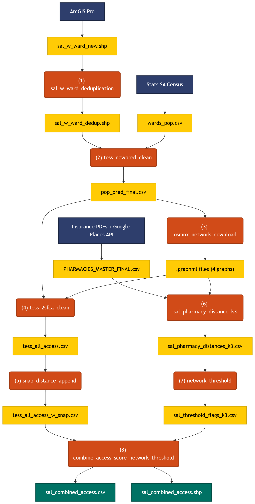

# DAIR Pharmacy Accessibility Pipeline Documentation

## Spatial Analysis of Pharmacy Access in Gauteng and KwaZulu-Natal, South Africa

**MUSA Smart Cities Practicum, University of Pennsylvania Weitzman School of Design**

**Tess Vu** | Spring 2026

**Client:** Distributed AI Research Institute (DAIR) — Raesetje Sefala, Nyalleng Moorosi

**Instructors:** Michael Fichman, Matthew Harris

---

## PROJECT OVERVIEW

This pipeline quantifies pharmacy accessibility for approximately 38,380 Small Area Layers (SALs) across Gauteng and KwaZulu-Natal provinces, South Africa. The analysis is motivated by the National Health Insurance Act of 2024, which created a public fund to subsidize care and medicines. The central question is whether populations, particularly historically marginalized communities shaped by apartheid-era spatial planning, can physically reach registered pharmacies.

The pipeline produces two complementary metrics: a Two-Step Floating Catchment Area (2SFCA) accessibility score capturing supply-demand competition, and a k-nearest pharmacy distance metric capturing absolute physical reachability. These are combined into a unified SAL-level dataset with policy-relevant threshold exceedance flags, an access typology, and diagnostic columns for data quality assessment.

All spatial computations use EPSG:32735 (UTM zone 35S, meters). Pharmacy coordinates originate in WGS84 (EPSG:4326) and are projected for distance calculations.

---

## PIPELINE SEQUENCE

The eight notebooks execute in strict sequential order. Each notebook reads one or more upstream outputs and produces files consumed by downstream notebooks. No notebook can be run out of order without data dependency failures.

<p align="center">
  
</p>

---

## NOTEBOOK 1: SAL DEDUPLICATION

**File:** `sal_w_ward_deduplication.ipynb`

**Author:** Tess Vu

**Purpose:** Resolve duplicate EA_CODE records introduced by Jill's ArcGIS Pro spatial join (`sal_w_ward`), which assigned SAL polygons to 2020 ward boundaries. The spatial join produced multiple rows per SAL where polygon fragments straddled ward boundaries or where join artifacts created identical copies.

### Input

| File | Description | Source |
|------|-------------|--------|
| `data/sal_w_ward_new/sal_w_ward_new.shp` | SAL polygons spatially joined to 2020 ward boundaries | ArcGIS Pro spatial join (Jill) |
| `data/pop_pred_final.csv` | Population estimates (used for ward-match validation only) | Notebook 2 (circular dependency resolved by running validation post-hoc) |

### Processing

The notebook performs five pre-deduplication diagnostic checks before applying the deduplication rule.

**Check 1: Duplicate structure.** Of 39,177 input features, 37,610 EA_CODEs appear once, 748 appear twice, and 22 appear three or more times. The 797 excess rows are candidates for removal.

**Check 2: Ward assignment consistency.** All 770 duplicate groups carry identical `census_war` (ward) values within each group. Zero groups have different wards across duplicates. This confirms the duplicates are data artifacts from the join process, not genuine SAL-to-ward boundary overlaps.

**Check 3: Area tie detection.** All 770 duplicate groups have tied `AREA` values. The deduplication rule (sort descending by AREA, keep first) is therefore arbitrary for tied cases, but because all attribute values are identical within each group, arbitrary selection produces correct results.

**Check 4: Geometry consistency.** Zero duplicate groups show geometry area differences exceeding 1%. All duplicate pairs carry identical polygon geometry.

**Check 5: Ward match against pop_pred_final.** After simulated deduplication, 770/770 retained WardIDs match the corresponding WardID in the population estimates file. Zero mismatches.

**Deduplication rule:** Sort descending by `AREA`, then `drop_duplicates(subset="EA_CODE", keep="first")`. Because all duplicates are identical, the "dominant ward" logic is technically unnecessary but produces correct results regardless.

### Output

| File | Rows | Description |
|------|------|-------------|
| `data/sal_w_ward_dedup/sal_w_ward_dedup.shp` | 38,380 | Deduplicated SAL polygons with ward assignments, CRS EPSG:32735, 70 columns |

### Key finding

The duplicates are pure data artifacts (identical ward, area, geometry, and all attributes across copies) rather than SAL-boundary-straddling cases. No analytical information is lost in deduplication.

---

## NOTEBOOK 2: POPULATION STEP-DOWN MODEL

**File:** `tess_newpred_clean.ipynb`

**Author:** Tess Vu (derived from Jill's `newpred.ipynb`)

**Purpose:** Estimate 2023 SAL-level population by distributing ward-level 2022 Census population to SALs using each SAL's proportional share of its parent ward's 2011 population.

### Input

| File | Description | Source |
|------|-------------|--------|
| `data/2011_census/2011_Census/ea_sal_kzn_gp.shp` | 2011 Census SAL boundaries with population and demographic columns | Stats SA |
| `data/2023_census/2023_census/SA_Wards2020.shp` | 2020 ward boundaries | Stats SA |
| `data/2023_census/wards_pop.csv` | 2022 Census ward-level population totals | Stats SA Community Survey |
| `data/sal_w_ward_dedup/sal_w_ward_dedup.shp` | Deduplicated SAL-ward join | Notebook 1 |

### Processing

**Ward population merge.** The 2022 Census ward totals (`wards_pop.csv`) are merged onto the ward boundary shapefile by `WardID`, then filtered to Gauteng and KwaZulu-Natal.

**SAL-ward alignment.** The deduplicated SAL-ward shapefile is renamed (`census_war` → `WardID`) and joined with the 2011 SAL shapefile to assemble a table containing each SAL's 2011 population, its parent ward's 2022 population, and settlement type attributes.

**Weight construction.** The proportional step-down weight is computed as:

```
ward2011_sum = sum of sal2011_pop within each WardID
share2011 = sal2011_pop / ward2011_sum
dasym_weight = share2011
```

The ward share sums are validated to equal exactly 1.000000 for every ward (pycnophylactic constraint). The `dasym_weight` is set equal to `share2011` without log-density re-weighting, because both `share2011` and `log_density` derive from `sal2011_pop`, and combining them would double-count the 2011 population signal.

**Population estimation.** The 2023 SAL population estimate is:

```
sal2023_est = dasym_weight × ward2023_pop
```

**Growth rate.** The compound annual growth rate over the 12-year period (2011-2023) is computed as:

```
growth_rate = (sal2023_est / sal2011_pop)^(1/12) - 1
```

### Output

| File | Rows | Description |
|------|------|-------------|
| `data/pop_pred_final.csv` | 38,380 | SAL-level population estimates with settlement type, economic status, and demographic breakdowns |

### Column definitions: pop_pred_final.csv

| Column | Type | Description |
|--------|------|-------------|
| `WardID` | str | 2020 ward boundary identifier (8-digit Stats SA code) |
| `EA_CODE` | Int64 | Small Area Layer identifier (8-digit Stats SA code) |
| `sal2011_pop` | float | 2011 Census population count for this SAL |
| `ward2023_pop` | int | 2022 Census total population for the parent ward |
| `EA_GTYPE` | str | Geographic type: Urban, Traditional, or Farms |
| `EA_TYPE` | str | Settlement type: Formal residential, Informal residential, Township, Traditional residential, Farms, Vacant, etc. |
| `econ_status` | str | Economic classification: Wealthy, Non_Wealthy, or Non_Residential |
| `houses2011` | float | Number of residential structures enumerated in 2011 |
| `Black_Afri` | int | 2011 Black African population count |
| `White` | int | 2011 White population count |
| `Coloured` | int | 2011 Coloured population count |
| `Indian_or` | int | 2011 Indian or Asian population count |
| `Other` | int | 2011 Other population count |
| `area_km2` | float | SAL area in square kilometers |
| `sal_dense` | float | 2011 population density (population / area_km2) |
| `log_density` | float | Natural log of (1 + sal_dense), used for EDA only |
| `ward2011_sum` | float | Sum of 2011 SAL populations within the parent ward |
| `share2011` | float | SAL's proportional share of ward 2011 population |
| `dasym_weight` | float | Step-down weight (equals share2011) |
| `sal2023_est` | float | Estimated 2023 SAL population |
| `growth_rate` | float | Compound annual growth rate, 2011-2023 |

### Key findings

Total estimated 2023 population across both provinces: 27,523,308. This exactly matches the sum of ward-level 2022 Census totals, confirming mass preservation. Mean SAL population: 717; median: 667; max: 13,852. There are 1,270 SALs with zero estimated population (SALs that were vacant with no dwellings in 2011).

---

## NOTEBOOK 3: OSMnx NETWORK DOWNLOAD

**File:** `osmnx_network_download.ipynb`

**Author:** Tess Vu

**Purpose:** Download pedestrian (walk) and drive road network graphs for each province from OpenStreetMap via OSMnx, compute Euclidean (straight-line) distances from SAL centroids to the nearest pharmacy as a baseline, and cache the network graphs as `.graphml` files for reuse by downstream notebooks.

### Input

| File | Description | Source |
|------|-------------|--------|
| `data/sal_w_ward_dedup/sal_w_ward_dedup.shp` | Deduplicated SAL polygons | Notebook 1 |
| `data/pop_pred_final.csv` | Population estimates | Notebook 2 |
| `data/PHARMACIES_MASTER_FINAL.csv` | Geocoded pharmacy locations (LAT/LNG columns, WGS84) | Geocoding pipeline (Joey) |

### Processing

**SAL centroid computation.** SAL polygons are projected to EPSG:32735 and geometric centroids are computed. Centroid coordinates are extracted in both projected CRS (meters, for Euclidean distance) and WGS84 (for OSMnx node snapping).

**Pharmacy loading.** 2,241 geocoded pharmacy records are loaded, converted to a GeoDataFrame in WGS84, and projected to EPSG:32735.

**Euclidean distance.** A scipy `cKDTree` built from projected pharmacy coordinates is queried for the nearest pharmacy to each SAL centroid (k=1). This produces a lower-bound distance that ignores road networks entirely.

**Network download.** Four OSMnx graphs are downloaded via `ox.graph_from_place()`: Gauteng walk (443,832 nodes), Gauteng drive (279,004 nodes), KZN walk (541,204 nodes), KZN drive (311,426 nodes). Each graph is saved as `.graphml` for reuse. Download times range from 26 to 88 minutes per graph.

### Output

| File | Description |
|------|-------------|
| `data/networks/network_gauteng_walk.graphml` | Pedestrian network graph, Gauteng |
| `data/networks/network_gauteng_drive.graphml` | Drive network graph, Gauteng |
| `data/networks/network_kwazulu_natal_walk.graphml` | Pedestrian network graph, KZN |
| `data/networks/network_kwazulu_natal_drive.graphml` | Drive network graph, KZN |

The Euclidean distance outputs from this notebook are superseded by notebook 6, which re-computes all Euclidean and network distances for k=1, 2, 3 on the deduplicated dataset.

### Network graph statistics

| Graph | Nodes | Edges |
|-------|-------|-------|
| Gauteng walk | 443,832 | 1,219,312 |
| Gauteng drive | 279,004 | 730,792 |
| KZN walk | 541,204 | 1,356,318 |
| KZN drive | 311,426 | 749,194 |

---

## NOTEBOOK 4: TWO-STEP FLOATING CATCHMENT AREA (2SFCA)

**File:** `tess_2sfca_clean.ipynb`

**Author:** Tess Vu (derived from Jill's `2sfca.ipynb`)

**Purpose:** Compute a pharmacy accessibility score for every SAL using the Enhanced Two-Step Floating Catchment Area (E2SFCA) method with network-based routing and negative exponential distance decay.

### Input

| File | Description | Source |
|------|-------------|--------|
| `data/pop_pred_final.csv` | SAL population estimates | Notebook 2 |
| `data/PHARMACIES_MASTER_FINAL.csv` | Geocoded pharmacy locations | Geocoding pipeline |
| `data/sal_w_ward_dedup/sal_w_ward_dedup.shp` | SAL polygon boundaries | Notebook 1 |
| `data/networks/network_*.graphml` | Road network graphs (4 files) | Notebook 3 |

### Processing

**Pharmacy assignment.** Pharmacies are spatially joined to provincial SAL boundaries: 1,453 in Gauteng, 699 in KZN.

**Distance decay function.** Negative exponential decay with β = 0.0003:

```
f(d) = exp(-0.0003 × d)
```

This produces weight 1.000 at 0 m, 0.741 at 1 km, 0.549 at 2 km, 0.407 at 3 km, 0.223 at 5 km, and 0.050 at 10 km. The parameter was selected to produce meaningful distance discrimination within the catchment range. The previous version used β = 0.0001, which produced almost no decay (37% weight at 10 km).

**Step 1: Supply ratio ($R_{j}$).** For each pharmacy, single-source Dijkstra traversal outward on the road network up to the catchment cutoff. The decay-weighted population of all reachable SAL centroids is summed. The supply ratio is computed as:

```
Rj = 1000 / max(weighted_pop, MIN_WEIGHTED_POP)
```

where `MIN_WEIGHTED_POP = 50` prevents runaway ratios from pharmacies in sparsely populated catchments. The factor of 1000 is a scaling constant for readability.

**Bug fix 1: Node collision.** The original code used `.set_index("node")` to build the population lookup, silently dropping populations when multiple SALs snapped to the same road network node. The fix uses `.groupby("node").sum()` to aggregate all populations at shared nodes.

**Bug fix 2: $R_{j}$ outlier cap.** Without the population floor, a pharmacy with 3 people in its catchment produced $R_{j}$ = 333, creating scores 5,000x the mean. The MIN_WEIGHTED_POP = 50 floor caps maximum $R_{j}$ at 20.

**Step 2: Accessibility score ($A_{i}$).** For each SAL, single-source Dijkstra traversal outward on the road network. The $A_{i}$ score is the sum of decay-weighted $R_{j}$ values from all reachable pharmacies:

```
Ai = Σ (Rj × f(d_ij))
```

where the sum is over all pharmacies j reachable from SAL i within the catchment cutoff.

**Four runs.** Walk and drive networks for each province, with province-specific catchment distances:

| Province | Walk cutoff | Drive cutoff | Rationale |
|----------|------------|--------------|-----------|
| Gauteng | 2 km | 5 km | Dense, urban |
| KwaZulu-Natal | 3 km | 10 km | Sparse, mixed rural-urban; ~7x larger than Gauteng |

### Output

| File | Rows | Description |
|------|------|-------------|
| `data/tess_all_access.csv` | 38,380 | SAL-level 2SFCA scores (Ai_walk, Ai_drive) with population, settlement type, ward, and demographic attributes |

### Key column definitions: tess_all_access.csv

| Column | Type | Description |
|--------|------|-------------|
| `EA_CODE` | Int64 | SAL identifier |
| `PR_NAME` | str | Province name |
| `WardID` | str | Ward identifier |
| `sal2023_est` | float | Estimated 2023 population |
| `EA_GTYPE` | str | Geographic type (Urban, Traditional, Farms) |
| `EA_TYPE` | str | Settlement type |
| `econ_status` | str | Economic classification |
| `Ai_walk` | float | Walking accessibility score (E2SFCA) |
| `Ai_drive` | float | Driving accessibility score (E2SFCA) |
| `node` | int | OSM network node ID that the centroid snapped to |

### Key findings from the 2SFCA

**Zero-inflation is severe.** The walking $A_{i}$ score is exactly zero for 53.2% of Gauteng SALs and 74.3% of KZN SALs. The driving $A_{i}$ score is zero for 38.7% of Gauteng SALs and 58.8% of KZN SALs. These zeros indicate that no pharmacy is reachable within the catchment radius on the road network from those SALs.

**Distribution is heavily right-skewed.** The maximum Ai_walk in KZN is 17.96 (mean 0.085, 99th percentile 0.96). Extreme values are driven by pharmacies in low-population catchments (industrial areas, sparsely populated rural zones).

**Gap between $A_{i}$ desert rate and distance exceedance rate.** For Gauteng walk, 53.2% of SALs have zero $A_{i}$ but only 24.6% exceed 3 km to the nearest pharmacy. The 28-point gap is largely attributable to centroid-to-node snap displacement and catchment boundary edge effects. For KZN drive, the gap narrows to 20 points (58.8% vs. 38.5%), indicating more genuinely isolated SALs.

---

## NOTEBOOK 5: SNAP DISTANCE APPEND

**File:** `snap_distance_append.ipynb`

**Author:** Tess Vu

**Purpose:** Quantify the centroid-to-network-node snapping gap for each SAL. When a SAL centroid snaps to a distant network node, the Dijkstra routing starts from a displaced origin, introducing systematic measurement error into both the 2SFCA and k-nearest distance results. This notebook appends snap distance as a data quality diagnostic.

### Input

| File | Description | Source |
|------|-------------|--------|
| `data/tess_all_access.csv` | 2SFCA scores | Notebook 4 |
| `data/sal_w_ward_dedup/sal_w_ward_dedup.shp` | SAL polygons for centroid computation | Notebook 1 |
| `data/networks/network_*.graphml` | Road network graphs (4 files) | Notebook 3 |

### Processing

For each of the four province-mode combinations (Gauteng walk, Gauteng drive, KZN walk, KZN drive):

1. Load the `.graphml` graph and project to EPSG:32735.
2. Extract node coordinates from the projected graph.
3. Snap each SAL centroid to its nearest network node using `ox.nearest_nodes()`.
4. Compute the Euclidean distance (meters) between the SAL centroid and the snapped node.

No Dijkstra routing is performed. The computation uses a KDTree internal to `ox.nearest_nodes()` and is effectively instant after the graph loading step.

### Output

| File | Rows | Description |
|------|------|-------------|
| `data/tess_all_access_w_snap.csv` | 38,380 | All columns from `tess_all_access.csv` plus `walk_snap_dist_m` and `drive_snap_dist_m` |

### Key column definitions: appended columns

| Column | Type | Description |
|--------|------|-------------|
| `walk_snap_dist_m` | float | Euclidean distance (meters) from SAL centroid to nearest walk-network node |
| `drive_snap_dist_m` | float | Euclidean distance (meters) from SAL centroid to nearest drive-network node |

### Key findings from snap distance analysis

| Province | Mode | Median | Mean | P95 | Max | Flagged >500m (%) |
|----------|------|--------|------|-----|-----|-------------------|
| Gauteng | Walk | 57 | 83 | 223 | 25,702 | 232 (1.1%) |
| Gauteng | Drive | 67 | 101 | 290 | 26,962 | 398 (1.9%) |
| KZN | Walk | 83 | 226 | 985 | 9,951 | 2,149 (12.3%) |
| KZN | Drive | 102 | 302 | 1,318 | 8,435 | 2,884 (16.5%) |

**Cross-tab by settlement type (walk snap >500m).** Farm SALs in KZN have 59.9% flagged; Traditional SALs in KZN have 20.4% flagged; Urban SALs in either province have less than 1% flagged. This directly quantifies the differential quality of OSM road network coverage across settlement types.

---

## NOTEBOOK 6: K-NEAREST PHARMACY DISTANCE

**File:** `sal_pharmacy_distance_k3.ipynb`

**Author:** Tess Vu

**Purpose:** Compute the distance from each SAL centroid to the 3 nearest pharmacies using Euclidean, pedestrian network, and drive network methods. k=1 captures basic reachability; k=2 captures redundancy (fallback if the nearest pharmacy closes); k=3 captures choice (a functioning local market rather than a single dependency point).

### Input

| File | Description | Source |
|------|-------------|--------|
| `data/sal_w_ward_dedup/sal_w_ward_dedup.shp` | Deduplicated SAL polygons | Notebook 1 |
| `data/pop_pred_final.csv` | Population estimates | Notebook 2 |
| `data/PHARMACIES_MASTER_FINAL.csv` | Geocoded pharmacy locations | Geocoding pipeline |
| `data/networks/network_*.graphml` | Road network graphs (4 files) | Notebook 3 |

### Processing

**Euclidean (k=3).** scipy `cKDTree` query with k=3 returns the three nearest pharmacies and their straight-line distances in projected CRS (meters).

**Network distance (k=3).** Single-source Dijkstra from each pharmacy node individually, with a 50 km cutoff. For each SAL centroid (snapped to its nearest network node), the distances from all pharmacy sources are collected, sorted, and the 3 shortest are retained as k=1, k=2, k=3. Drive graphs are converted to undirected before routing.

**Checkpointing.** Intermediate results are saved every 50 pharmacies to allow interrupted runs to resume without losing progress. Checkpoint files are removed after successful completion.

**Circuity.** The ratio of network distance to Euclidean distance for k=1 is computed as a diagnostic. Values of 1.2-1.5 are typical for urban grids; values exceeding 3.0 suggest network data gaps or physical barriers (rivers, highways, rail lines).

### Output

| File | Rows | Description |
|------|------|-------------|
| `data/networks/sal_pharmacy_distances_k3.csv` | 38,380 | k=1, k=2, k=3 distances for Euclidean, walk, drive methods plus circuity |
| `data/networks/sal_pharmacy_distances.csv` | 38,380 | Backward-compatible k=1 only, with original column names |

### Column definitions: sal_pharmacy_distances_k3.csv

| Column | Type | Description |
|--------|------|-------------|
| `EA_CODE` | Int64 | SAL identifier |
| `PR_NAME` | str | Province name |
| `WardID` | str | Ward identifier |
| `sal2023_est` | float | Estimated 2023 population |
| `centroid_lat` | float | SAL centroid latitude (WGS84) |
| `centroid_lng` | float | SAL centroid longitude (WGS84) |
| `euclidean_dist_k{1,2,3}_m` | float | Euclidean distance to k-th nearest pharmacy (meters) |
| `euclidean_dist_k{1,2,3}_km` | float | Euclidean distance to k-th nearest pharmacy (km) |
| `walk_dist_k{1,2,3}_m` | float | Pedestrian network distance to k-th nearest pharmacy (meters); NaN if unreachable within 50 km |
| `walk_dist_k{1,2,3}_km` | float | Pedestrian network distance to k-th nearest pharmacy (km) |
| `drive_dist_k{1,2,3}_m` | float | Drive network distance to k-th nearest pharmacy (meters); NaN if unreachable within 50 km |
| `drive_dist_k{1,2,3}_km` | float | Drive network distance to k-th nearest pharmacy (km) |
| `walk_circuity_k1` | float | Ratio of walk network distance to Euclidean distance (k=1) |
| `drive_circuity_k1` | float | Ratio of drive network distance to Euclidean distance (k=1) |

### Key findings from k-nearest distances

**Euclidean k=1.** Mean 4.47 km, median 1.35 km, max 44.85 km. 75th percentile at 4.27 km. The distribution is right-skewed, with a long tail driven by rural KZN.

**NaN rates.** 4,931 SALs (12.8%) have NaN walk distance at k=1 (no path within 50 km on the walk network); 5,001 SALs (13.0%) have NaN drive distance at k=1. These SALs are either genuinely isolated or in areas with sparse OSM coverage.

---

## NOTEBOOK 7: DISTANCE THRESHOLD EXCEEDANCE

**File:** `network_threshold.ipynb`

**Author:** Tess Vu

**Purpose:** Apply binary policy thresholds to the k-nearest distances to answer: what proportion of SALs (and people) cannot reach their k-th nearest pharmacy within a given distance? This provides a policy-legible metric that avoids decay functions and provincial quantiles.

### Input

| File | Description | Source |
|------|-------------|--------|
| `data/networks/sal_pharmacy_distances_k3.csv` | k-nearest distances | Notebook 6 |
| `data/pop_pred_final.csv` | Population with settlement type | Notebook 2 |

### Processing

For each combination of k level (1, 2, 3), transport mode (walk, drive), and threshold distance, a binary flag is created indicating whether the SAL exceeds the threshold. NaN distances (unreachable within 50 km) are treated as exceeding all thresholds.

**Thresholds applied:**

| Mode | Thresholds (km) |
|------|-----------------|
| Walk | 1, 2, 3, 5 |
| Drive | 5, 10, 15, 20 |
| Euclidean | 1, 3, 5, 10 |

Exceedance rates are computed as both SAL-count proportions and population-weighted proportions (using `sal2023_est`). Cross-tabulations are produced by province, settlement type (EA_GTYPE), and economic status (econ_status).

### Output

| File | Rows | Description |
|------|------|-------------|
| `data/networks/sal_threshold_flags_k3.csv` | 38,380 | Distance columns plus binary exceedance flags for all threshold-mode-k combinations (51 columns) |
| `data/networks/threshold_summary_k3.csv` | varies | Policy summary table with SAL and population exceedance rates |

### Column definitions: exceedance flag naming convention

Flags follow the pattern `exceeds_{mode}_k{k}_{threshold}km` where mode is `walk`, `drive`, or `euclidean`, k is 1-3, and threshold is the distance in kilometers. Example: `exceeds_walk_k1_3km` is True when the nearest pharmacy (k=1) is more than 3 km away by walking network distance.

### Key findings from threshold exceedance

**Policy reference thresholds (k=1):**

| Province | Mode | Threshold | % SALs Exceeding | % Population Exceeding |
|----------|------|-----------|-------------------|------------------------|
| Gauteng | Walk | 3 km | 16.5% | 15.8% |
| KZN | Walk | 3 km | 61.3% | 62.7% |
| Gauteng | Drive | 10 km | 1.9% | 1.2% |
| KZN | Drive | 10 km | 35.6% | 35.7% |

**Redundancy deficit (k=1 vs. k=3 at 3 km walk):** In Gauteng, 16.5% of SALs fail k=1 but 39.1% fail k=3, which is a 22.6 percentage point gap indicating fragile access dependent on a single pharmacy. In KZN, 61.3% fail k=1 and 43.8% fail k=3 (the k=3 rate is lower because much of KZN has no pharmacy at all, so there is no gap to expose).

**Settlement type breakdown (k=1, 3 km walk):** Non_Wealthy KZN SALs show 74.9% exceedance; Wealthy KZN SALs show 39.6%; Non_Wealthy Gauteng SALs show 29.8%; Wealthy Gauteng SALs show 17.6%. The Non_Wealthy/Traditional KZN combination produces the strongest equity signal, connecting directly to apartheid-era spatial planning.

---

## NOTEBOOK 8: COMBINED ACCESS TABLE

**File:** `combine_access_score_network_threshold.ipynb`

**Author:** Tess Vu

**Purpose:** Merge the three analytical streams (2SFCA scores, k-nearest distances, threshold flags) into a single SAL-level dataset with an access typology classification, data quality flags, and age band aggregations. Export as both CSV and shapefile for downstream mapping and app integration.

### Input

| File | Description | Source |
|------|-------------|--------|
| `data/tess_all_access_w_snap.csv` | 2SFCA scores with snap distances | Notebook 5 |
| `data/networks/sal_pharmacy_distances_k3.csv` | k-nearest distances | Notebook 6 |
| `data/networks/sal_threshold_flags_k3.csv` | Threshold exceedance flags | Notebook 7 |
| `data/sal_w_ward_dedup/sal_w_ward_dedup.shp` | SAL geometry for shapefile export | Notebook 1 |

### Processing

**EA_CODE alignment.** All four source tables are verified to have identical EA_CODE sets (38,380 intersection, 0 orphans in any direction).

**Merge.** The three analytical tables are joined on EA_CODE using left joins. Duplicate columns are resolved by preferring the population-model version of `sal2023_est` and settlement type attributes from `pop_pred_final.csv`.

**Access typology.** A 2×2 classification combining $A_{i}$ score tier with distance threshold:

| | Distance < threshold (pharmacy nearby) | Distance ≥ threshold (pharmacy far) |
|---|---|---|
| **$A_{i}$ = 0** | Connectivity gap, pharmacy exists nearby but is road-network unreachable. Likely OSM completeness issue or catchment boundary edge case. | True pharmacy desert, no pharmacy reachable on the network and nearest is also far in absolute terms. Primary NHI infrastructure target. |
| **$A_{i}$ low (bottom tercile, nonzero)** | Demand overcrowding, pharmacy nearby but supply-to-demand ratio poor. Candidate for NHI capacity investment at existing site. | Access gap, far from pharmacy and that pharmacy is also under-supplied. Secondary infrastructure target. |
| **$A_{i}$ high (top tercile)** | Well-served, pharmacy nearby and supply-to-demand ratio favorable. | Artifact zone, high $A_{i}$ mechanically driven by low local demand (industrial, sparse rural). Distance is the primary indicator. |

Tercile boundaries are computed from nonzero $A_{i}$ values within each province-mode combination, preventing zero-inflation from distorting the classification.

**Snap distance flags.** Binary flags are created for SALs with walk or drive snap distance exceeding 500m, indicating high measurement uncertainty.

**Age band aggregation.** The 17 single-year age columns (F0_4 through F85_) are collapsed into 5 bands: 0-14, 15-34, 35-49, 50-64, 65+.

**Derived columns.** 2011 total population computed from racial group columns; percent Black African; population density from 2023 estimate; SAL area in km2.

### Output

| File | Rows | Description |
|------|------|-------------|
| `data/combined/sal_combined_access.csv` | 38,380 | Full combined table, all columns |
| `data/combined/sal_combined_access_shp/` | 38,380 | Shapefile export for GIS visualization (column names truncated to 10 chars due to DBF format) |

### Key column definitions: sal_combined_access.csv

**Identifiers and geography:**

| Column | Type | Description |
|--------|------|-------------|
| `EA_CODE` | Int64 | SAL identifier |
| `PR_NAME` | str | Province |
| `WardID` | str | Ward identifier |
| `MN_NAME` | str | Municipality name |
| `DC_NAME` | str | District council name |

**Population:**

| Column | Type | Description |
|--------|------|-------------|
| `sal2023_est` | float | Modeled 2023 SAL population |
| `pop_total_2011` | int | 2011 Census total population (sum of racial group columns) |
| `pct_black_african` | float | Percent Black African (from 2011 Census) |
| `pop_0_14` | int | Population aged 0-14 (2011 Census) |
| `pop_15_34` | int | Population aged 15-34 |
| `pop_35_49` | int | Population aged 35-49 |
| `pop_50_64` | int | Population aged 50-64 |
| `pop_65plus` | int | Population aged 65+ |

**Settlement and economic classification:**

| Column | Type | Description |
|--------|------|-------------|
| `EA_GTYPE` | str | Geographic type (Urban, Traditional, Farms) |
| `EA_TYPE` | str | Settlement type (e.g. Township, Formal residential, Traditional residential) |
| `econ_status` | str | Economic classification (Wealthy, Non_Wealthy, Non_Residential) |
| `area_km2` | float | SAL area in square kilometers |

**2SFCA accessibility scores:**

| Column | Type | Description |
|--------|------|-------------|
| `Ai_walk` | float | Walking E2SFCA accessibility score |
| `Ai_drive` | float | Driving E2SFCA accessibility score |

**k-nearest pharmacy distances:**

| Column | Type | Description |
|--------|------|-------------|
| `euclidean_dist_k{1,2,3}_km` | float | Euclidean distance to k-th nearest pharmacy (km) |
| `walk_dist_k{1,2,3}_km` | float | Walk network distance to k-th nearest pharmacy (km) |
| `drive_dist_k{1,2,3}_km` | float | Drive network distance to k-th nearest pharmacy (km) |
| `walk_circuity_k1` | float | Walk network / Euclidean distance ratio (k=1) |
| `drive_circuity_k1` | float | Drive network / Euclidean distance ratio (k=1) |

**Snap distance (data quality):**

| Column | Type | Description |
|--------|------|-------------|
| `walk_snap_dist_m` | float | Euclidean distance from centroid to nearest walk-network node (meters) |
| `drive_snap_dist_m` | float | Euclidean distance from centroid to nearest drive-network node (meters) |
| `walk_snap_flagged` | bool | True if walk snap distance exceeds 500m |
| `drive_snap_flagged` | bool | True if drive snap distance exceeds 500m |

**Threshold exceedance flags:**

| Column pattern | Type | Description |
|----------------|------|-------------|
| `exceeds_{mode}_k{k}_{t}km` | bool | True if k-th nearest pharmacy exceeds t km by the given mode |

**Access typology:**

| Column | Type | Description |
|--------|------|-------------|
| `walk_access_type` | str | Walking access typology: Pharmacy desert, Connectivity gap, Demand overcrowding, Access gap, Well-served, Artifact zone |
| `drive_access_type` | str | Driving access typology (same categories) |

---

## ANALYSIS OF OUTPUTS

### The apartheid spatial signal

The most policy-relevant finding across the pipeline is the intersection of settlement type, economic status, and pharmacy distance. Non_Wealthy SALs in Traditional settlement areas of KZN face the largest absolute distances, the highest zero-$A_{i}$ rates, and the most severe threshold exceedance. At the 3 km walk threshold, 74.9% of Non_Wealthy KZN SALs exceed the threshold compared to 17.6% of Wealthy Gauteng SALs. At the 10 km drive threshold, 49.6% of Non_Wealthy KZN SALs exceed the threshold compared to 2.8% of Wealthy Gauteng SALs. These are the households least likely to have private vehicle access, meaning the drive metric is aspirational rather than descriptive for them. This pattern connects directly to apartheid-era spatial planning, which concentrated Black African populations in peripheral homeland areas (now Traditional settlement SALs) deliberately distant from commercial infrastructure.

### Zero-inflation and the dual-metric diagnostic

The 2SFCA zero-inflation problem (53-74% of SALs scoring exactly zero on walking) is the single most important analytical caveat. The k-nearest distance metric serves as the diagnostic check: when a zero-$A_{i}$ SAL has a short absolute distance to the nearest pharmacy (under 3 km), the zero is likely a snap artifact or catchment boundary edge effect, not a genuine pharmacy desert. When a zero-$A_{i}$ SAL has a long absolute distance (over 10 km), it is a genuine pharmacy desert. The gap between the $A_{i}$ desert rate and the distance exceedance rate quantifies the artifact fraction. This dual-metric approach, combining 2SFCA with distance, is a genuine analytical strength of the pipeline, so each metric serves as a diagnostic check on the other's failure modes.

### Snap distance as a data quality layer

The snap distance cross-tabulation with access typology reveals that 36.3% of drive-network "Pharmacy desert" SALs are snap-flagged (>500m snap distance), compared to 1.1% of "Well-served" SALs. This concentration means some pharmacy desert classifications may partially reflect OSM road data gaps rather than genuine pharmacy absence. However, areas with poor OSM coverage are also areas with poor road infrastructure, so the two effects reinforce rather than contradict each other. The snap distance columns allow downstream analysts to filter or weight results by data quality confidence.

### The redundancy dimension (k=1 vs. k=3)

The gap between k=1 and k=3 exceedance rates reveals access fragility. A SAL that passes the 3 km walk threshold at k=1 (has one pharmacy within 3 km) but fails at k=3 (does not have three pharmacies within 3 km) depends on a single facility. If that pharmacy closes, stocks out, or is overcrowded, the community loses access entirely. In Gauteng, the k=1 to k=3 gap at 3 km walk is 22.6 percentage points (16.5% to 39.1%), indicating widespread fragile access even in the more urbanized province.

---

## LIMITATIONS AND FUTURE IMPROVEMENTS

### Population model

**Frozen distribution assumption.** The proportional step-down assumes the within-ward population distribution in 2023 matches 2011 exactly. For wards with significant new development (greenfield housing estates, informal settlement expansion) or depopulation since 2011, this assumption breaks. The 1,270 SALs with zero estimated population (vacant in 2011) receive zero population in 2023 regardless of whether development has occurred.

**No ancillary data integration.** The current model is a simple proportional step-down, not a true dasymetric interpolation. A dasymetric approach would use an independent ancillary variable as the weighting covariate. Google Open Buildings v3 building footprint area was explored as a candidate but was dropped due to concerns about equitable coverage in rural areas where building footprints are less reliably detected from satellite imagery. This is a documented design choice: using footprints would improve accuracy for urban SALs but could systematically underweight rural populations already facing the worst access, compounding existing inequities. Future work could integrate footprint data selectively for urban SALs while retaining proportional step-down for rural areas.

**Census year labeling.** The underlying population data is from the 2022 Census Community Survey, published by Stats SA in 2023. The pipeline variously labels this as "2022" and "2023" census data. Future versions should standardize to "2022 Census" for the data year.

### Centroid placement

**Geometric centroids in large rural SALs.** All distances are measured from geometric (unweighted) SAL centroids. For compact urban SALs, this closely approximates the population center. For large, irregular rural SALs (common in KZN Traditional areas, with some SALs exceeding 600 km2), the geometric centroid may fall in uninhabited terrain, like a river valley, hilltop, or nature reserve, introducing systematic measurement error that propagates through the entire pipeline: the Euclidean distance, the network node snap, the 2SFCA, and the threshold analysis all originate from this single point. Population-weighted centroids using building footprints could reduce this bias; however, the same coverage concerns noted above apply. A sensitivity analysis comparing geometric and footprint-weighted centroids for large SALs (above the 75th percentile in area) would quantify the magnitude of this effect.

### Network coverage and boundary effects

**OSM completeness.** OpenStreetMap road and pedestrian networks have uneven coverage. Urban areas are well-mapped; rural KZN and informal settlements have significant gaps. Missing roads cause the routing algorithm to find longer detours or mark SALs as unreachable, inflating computed distances and zero-$A_{i}$ rates. Walk distances in informal settlements may overestimate true pedestrian travel where unmapped footpaths exist.

**Province boundary truncation.** Road networks are downloaded by province, so they terminate at the provincial edge. SALs near the Gauteng-KZN border (or near Free State, Mpumalanga, North West) have their networks artificially truncated. Dijkstra routing from these SALs is forced into within-province detours even if a pharmacy across the border is closer. In a national-scale deployment, this boundary effect disappears because all provinces would be included in a single graph. For the current two-province scope, this is an acknowledged edge effect that affects a limited number of SALs along the boundary.

**Drive graph directionality.** Drive networks are directed (one-way streets), but the pipeline converts them to undirected for Dijkstra routing. This simplification slightly underestimates true drive distances in areas with one-way constraints, primarily affecting dense urban cores (Johannesburg CBD, Durban CBD).

### Transport mode coverage

**No minibus taxi mode.** The dominant transport mode for the populations most likely to face pharmacy access barriers (low-income, non-vehicle-owning households in townships and traditional areas) is the minibus taxi, which is captured by neither the walk nor drive network. The walk network overestimates difficulty (people don't walk 10 km; they take a taxi). The drive network overestimates ease (most Non_Wealthy households don't own a car). The true access picture for the target population sits between the walk and drive metrics, and neither captures it accurately. Taxi route data (GTFS feeds from formal systems like Rea Vaya and Gautrain, or crowdsourced GPS traces via WhereIsMyTransport or Digital Matatus methodology) would add a third modal layer but are not available at sufficient spatial resolution for integration.

### 2SFCA methodology

**Uniform supply.** All pharmacies are treated as having equal capacity (Sj = 1). A high-volume chain pharmacy in Sandton with multiple pharmacists is weighted identically to a single-pharmacist dispensary in rural KZN. Pharmacy capacity data (staffing, dispensing volume, hours of operation) are not available in the dataset.

**Province-level catchment thresholds.** The catchment distances are set by province rather than by settlement type. This creates a discontinuity at the province boundary: SALs on the KZN side receive larger catchments than adjacent SALs in Gauteng's East Rand despite comparable urbanization. A variable-catchment approach assigning thresholds by EA_GTYPE (Urban, Traditional, Farms) rather than province would eliminate this boundary effect. The variable-catchment code exists in the 2SFCA notebook in commented-out form and is the documented upgrade path.

**Decay parameter calibration.** The decay parameter β = 0.0003 was selected to produce meaningful distance discrimination within the catchment range but is not empirically calibrated to South African travel behavior. Calibration would require observed pharmacy utilization data (patient origin-destination patterns), which are not available.

**MIN_WEIGHTED_POP sensitivity.** The population floor of 50 that caps maximum $R_{j}$ is arbitrary. Sensitivity to alternative values (25, 100) has not been tested. Lower values allow more extreme $R_{j}$ values; higher values compress the score distribution.

### Pharmacy data coverage

**Private-sector and government-employee sources only.** The 2,241 geocoded pharmacies (1,453 Gauteng, 699 KZN) are drawn from GEMS, Momentum, Wooltru, SAMWUMED, and Vitality insurance provider lists. Hospital pharmacies, clinic dispensaries, and mobile dispensing units are not included. The actual number of points where medication can be obtained is likely higher, meaning the analysis presents a conservative (pessimistic) view of access. A SAL classified as a "pharmacy desert" may have a clinic dispensary serving the same function.

### Threshold arbitrariness

Policy thresholds (3 km walk, 10 km drive) are reference points, not natural discontinuities. A SAL at 3.1 km is classified differently from one at 2.9 km despite near-identical access. The multi-threshold approach (four thresholds per mode at three k levels) mitigates this by showing the full exceedance curve rather than a single binary cut. Threshold flags should be used as a family, not individually.

### Future improvements

1. **Variable-catchment 2SFCA** by settlement type (EA_GTYPE) rather than province, eliminating the province-boundary discontinuity.
2. **Gaussian decay calibration** with sensitivity analysis across β values to quantify score sensitivity to the decay parameter.
3. **Building-footprint-weighted centroids** for large SALs (above 75th percentile in area), with sensitivity analysis comparing geometric and weighted centroid results.
4. **Transit mode integration** via GTFS data for formal BRT/rail and crowdsourced traces for minibus taxis.
5. **Pharmacy capacity weighting** if staffing or dispensing volume data become available.
6. **National-scale deployment** eliminating province boundary effects by including all provinces in a single road network graph.
7. **Temporal sensitivity** comparing 2011 proportional step-down with building-footprint-based dasymetric interpolation to quantify the frozen-distribution assumption's impact.

---

## REPRODUCIBILITY

**Software versions:** Python (environment managed via miniforge/conda), OSMnx 2.1.0, NetworkX 3.6.1, GeoPandas, scipy, tqdm, matplotlib, mapclassify.

**CRS:** EPSG:32735 (UTM zone 35S, meters) for all spatial computations. WGS84 (EPSG:4326) for pharmacy source coordinates and OSMnx queries.

**Hardware:** Notebooks were executed on a local Windows machine. Graph downloads required 26-88 minutes per graph. 2SFCA computation required approximately 2 minutes per province-mode run. k=3 single-source Dijkstra required several hours per graph due to complexity.

**Data dependencies:** All file paths are centralized in configuration cells at the top of each notebook. Updating paths for a different machine requires editing only the configuration cell.